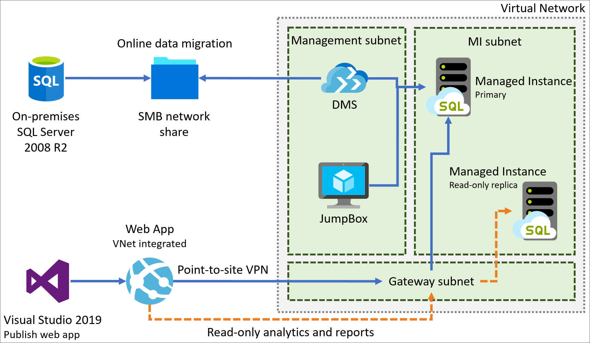

# Secure SQL with Microsoft defender

## Overall Estimated Duration: 4 hours

## Overview

In this hands-on lab, you will implement a proof of concept (PoC) for migrating an on-premises SQL Server 2008 R2 database to Azure SQL Managed Instance (SQL MI). You will conduct assessments to identify any feature parity or compatibility issues between the on-premises SQL Server 2008 R2 database and Azure's managed database offerings. Next, you will migrate the customer's on-premises gamer information web application and database to Azure with minimal downtime. Finally, you will enable advanced SQL MI features to enhance the security and performance of the customer's application.

## Objective

## Architecture

In this hands-on lab, you will follow a structured architecture that begins with provisioning an Azure SQL Managed Instance (SQL MI) for migrating an on-premises SQL Server 2008 R2 database. The process starts by performing a database assessment to identify compatibility issues, followed by an online data migration using the Azure Data Migration Service (DMS). You will then configure a secure virtual network, deploy the customer’s web application to Azure, and integrate it with the managed instance. The lab concludes with enabling advanced SQL MI features for optimizing performance and security, offering a complete solution for migrating and modernizing SQL Server workloads in Azure.

## Architecture Diagram:

## Explanation of Components

- Azure Portal:  Centralized web interface for managing Azure resources. It allows users to provision services like SQL Managed Instances, configure networks, monitor performance, and troubleshoot issues. With its intuitive platform, users can easily manage and adjust settings for cloud resources, making it essential for efficient Azure operations.

- Visual Studio 2019: Visual Studio 2019 is used to deploy and publish the customer's web application to Azure. It supports continuous development and integration practices, enabling developers to push updates to the cloud-hosted web app that interacts with SQL MI.

## Getting Started with the Lab
Once the environment is provisioned, a virtual machine (JumpVM) and lab guide will get loaded in your browser. Use this virtual machine throughout the workshop to perform the lab. You can see the number on the bottom of the Lab guide to switch to different exercises of the lab guide.

## Accessing Your Lab Environment
Once you're ready to dive in, your virtual machine and lab guide will be right at your fingertips within your web browser.

## Virtual Machine & Lab Guide
Your virtual machine is your workhorse throughout the workshop. The lab guide is your roadmap to success.

## Exploring Your Lab Resources
To get a better understanding of your lab resources and credentials, navigate to the Environment Details tab.

## Utilizing the Split Window Feature
For convenience, you can open the lab guide in a separate window by selecting the Split Window button from the Top right corner.

## Managing Your Virtual Machine
Feel free to start, stop, or restart your virtual machine as needed from the Resources tab. Your experience is in your hands!

## Let's Get Started with Azure Portal
 
1.  In the JumpVM, click on Azure portal shortcut of Microsoft Edge browser which is created on desktop.
 
     .png)
 
2. You'll see the **Sign into Microsoft Azure** tab. Here, enter your credentials:
 
   - **Email/Username:** <inject key="AzureAdUserEmail"></inject>
 
       
 
3. Next, provide your password:
 
   - **Password:** <inject key="AzureAdUserPassword"></inject>
 
       
 
4. If prompted to stay signed in, you can click "No."
 
5. If a **Welcome to Microsoft Azure** pop-up window appears, simply click "Maybe Later" to skip the tour.
 
## Support Contact
 
The CloudLabs support team is available 24/7, 365 days a year, via email and live chat to ensure seamless assistance at any time. We offer dedicated support channels tailored specifically for both learners and instructors, ensuring that all your needs are promptly and efficiently addressed.

Learner Support Contacts:

- Email Support: labs-support@spektrasystems.com
- Live Chat Support: https://cloudlabs.ai/labs-support

### Happy learning !
