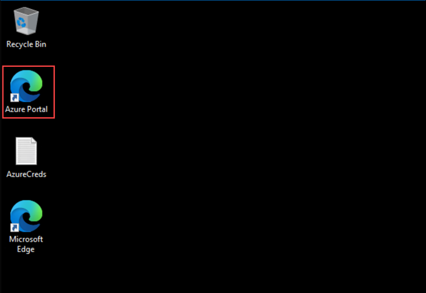
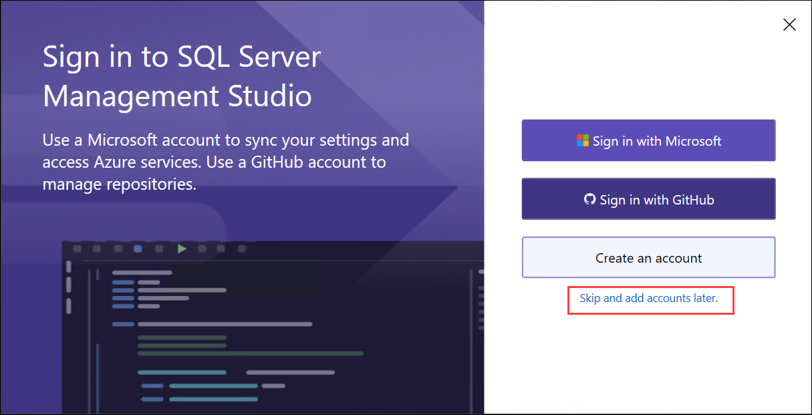
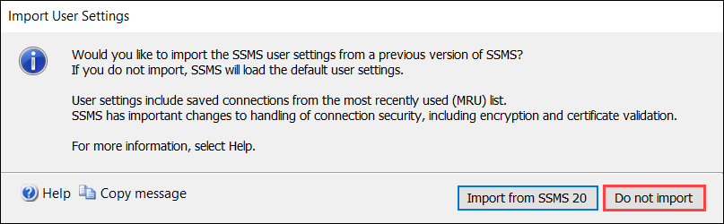
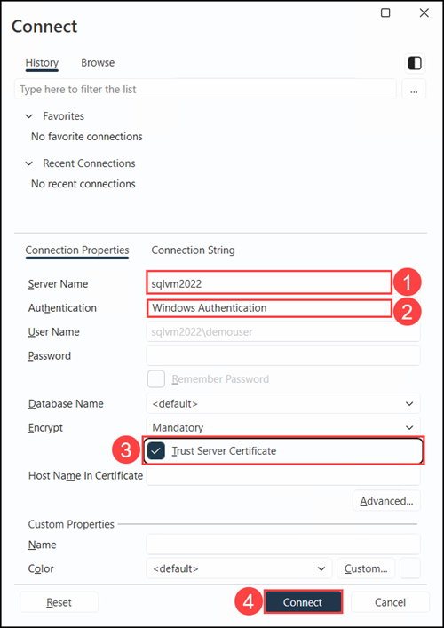
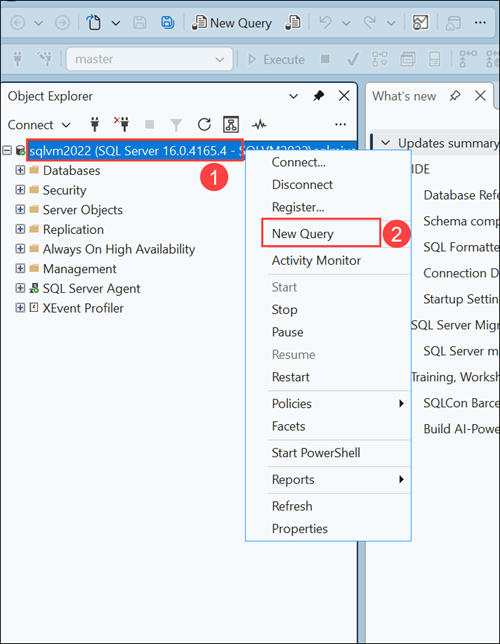
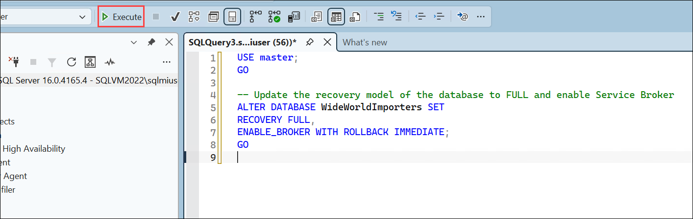

# Exercise 1: Perform database assessments

### Estimated Duration: 30 Minutes

## Lab Scenario

In this exercise, you will connect to the WideWorldImporters database on the SQL Server 2022 VM and perform assessments for migration to Azure SQL Database and Azure SQL Managed Instance. These assessments will help you understand the compatibility and readiness of your database for migration to Azure. You will evaluate the database schema, data, and performance to identify any potential issues and determine the best migration strategy. This process ensures a smooth transition to Azure’s cloud services, leveraging their scalability, security, and advanced features.

## Lab Objectives

In this exercise, you will complete the following tasks:

- Task 1: Connect to the WideWorldImporters database on the SQL Server 2022 VM
- Task 2: Perform assessment for migration to Azure SQL Database

## Task 1: Connect to the WideWorldImporters database on the SQL Server 2022 VM

In this task, you perform some configuration for the `WideWorldImporters` database on the SQL Server 2022 instance to prepare it for migration.

1. Click on the Azure portal icon in the lab VM.

    

1. On the **Azure portal**, in the **Search resources** box at the top, search for **Resource groups (1)** and then select **Resource groups (2)** from the results.

   

1. On the **Resource groups** page, select the resource group **<inject key="Resource Group Name" enableCopy="false"/>** from the list.

   

1. In the list of resources for your resource group, select the **sql2022-<inject key="Suffix" enableCopy="false"/>** Virtual Machine.

    

1. On the **sql2022-<inject key="Suffix" enableCopy="false"/>** virtual machine **Overview** page, click **Connect (1)** and then select **Connect (2)** from the drop-down menu.

    

1. On the **sql2022-<inject key="Suffix" enableCopy="false"/> | Connect** page, click on **Download RDP file** under **Native RDP**. 
  
    

1. Click on **Keep**, on the Downloads pop-up. 

    

1. Click on **Open file** to open the RDP session.

    

1. On the RDP pop-up, **check (1)** "I understand and want to allow RDP files to open on this device for my account" and then click **OK (2)**.

    

1. Next, on RDP tab, ensure that the **Clipboard** option is enabled, and then select **Connect**.

   

1. Enter the following credentials when prompted, and then select **OK**:

   - **Username**: `sqlmiuser`
   - **Password**: `Password.1234567890`

      

1. On **The identity of the remote computer cannot be verified** pop-up window, click **Yes** to confirm and proceed with connecting to your virtual machine.

    

### Task 2: Perform assessment for migration to Azure SQL Database

**WideWorldImporters** requires an assessment to identify any potential issues that must be addressed before migrating their database to Azure SQL Database. In this task, you will use **SQL Server Management Studio 22(SSMS)** to perform a compatibility pre-check on the PartsUnlimited database against Azure SQL Database. This assessment confirms migration readiness by reviewing the database's compatibility level and auditing all schema objects for known unsupported features.

> **Note**: The **SQL Server Management Studio 22 (SSMS)** is already installed on your Lab (Web) VM. If not found, it can be downloaded from the official [Microsoft SSMS download page](https://learn.microsoft.com/en-us/ssms/install/install) as well.

1. Click the **Start** button on the SQLVM. In the search box, type **SSMS**, then select **SQL Server Management Studio 22 (SSMS)** from the search results.

    

1. On the **Sign in to SQL Server Management Studio** Screen please choose **Skip and add accounts later.**

    

1. On the Import User Settings popup please click on **Do not import option.**

    

1. On the Connect popup enter the following details:

    - Server name: **sqlvm2022**
    - Authentication: **Windows Authentication**
    - Trust Server Certificate: **Ticked**
    - Then click on: **Connect**

        

1. In **Object Explorer**, right-click the **SQL Server instance (1)** (for example, `sqlvm2022`) and select **New Query (2)** from the context menu.

    

1. Next, copy and paste the following SQL script in the new query window. This script enables the **Service Broker** and changes the database recovery model to **FULL**.

    ```sql
    USE master;
    GO

    -- Update the recovery model of the database to FULL and enable Service Broker
    ALTER DATABASE WideWorldImporters SET
    RECOVERY FULL,
    ENABLE_BROKER WITH ROLLBACK IMMEDIATE;
    GO
    ```
1. To run the script, click on **Execute** from the **SQL Server Management Studio 22 (SSMS)** toolbar.

    

1. close the **SQL Server Management Studio 22 (SSMS)** by clicking **X** in the top right corner.

    > **Assessment Summary:** The WideWorldImporters database is confirmed as a strong candidate for migration to Azure SQL Database. No unsupported features or blocking compatibility issues were found. You may proceed to the next task.

## Summary

In this exercise, you connected to the WideWorldImporters database on the SQL Server 2022 VM, performed an assessment for migration to Azure SQL Database. This process involved evaluating the current database setup, identifying potential compatibility issues, and determining the best migration strategy to ensure a smooth transition to Azure's cloud services.

### You have successfully completed the exercise. Now click on **Next >>** from the lower right corner to move on to the next exercise.


