# Exercise 1: Perform database assessments

### Estimated Duration: 90 Minutes

In this exercise, you will connect to the WideWorldImporters database on the SQL Server 2022 VM and perform assessments for migration to Azure SQL Database and Azure SQL Managed Instance. These assessments will help you understand the compatibility and readiness of your database for migration to Azure. You will evaluate the database schema, data, and performance to identify any potential issues and determine the best migration strategy. This process ensures a smooth transition to Azure’s cloud services, leveraging their scalability, security, and advanced features.

## Objective

In this exercise, you will complete the following tasks:

- Task 1: Connect to the WideWorldImporters database on the SQL Server 2022 VM
- Task 2: Perform assessment for migration to Azure SQL Database
- Task 3: Perform assessment for migration to Azure SQL Managed Instance

### Task 1: Connect to the WideWorldImporters database on the SQL Server 2022 VM

In this task, you perform some configuration for the `WideWorldImporters` database on the SQL Server 2022 instance to prepare it for migration.

1. Navigate to the Azure portal: [https://portal.azure.com](https://portal.azure.com)

1. On the Azure portal home page, in the **Search resources** box at the top, type **Resource groups (1)** and then select **Resource groups (2)** from the search results.

   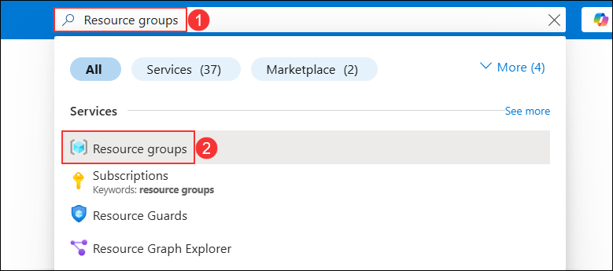

1. On the **Resource groups** page, select the resource group **hands-on-lab-<inject key="Resource Group Name" enableCopy="false"/>** from the list.

   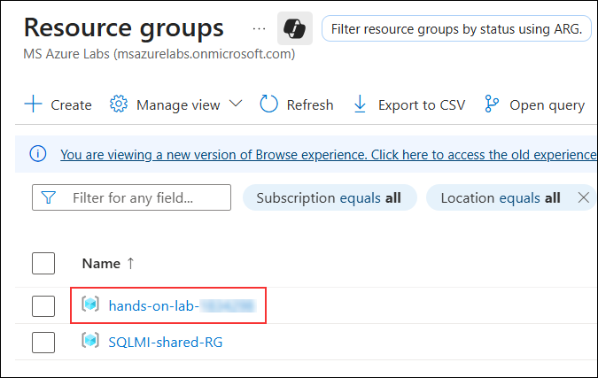

1. In the list of resources for your resource group, select the **sql2022-<inject key="Suffix" enableCopy="false"/>** Virtual Machine.

    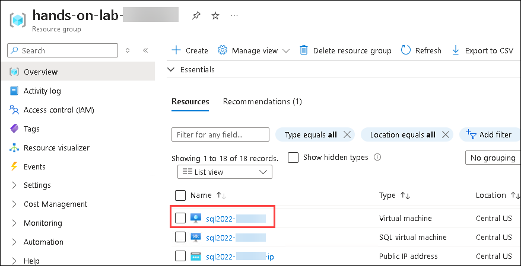

1. On the **sql2022-<inject key="Suffix" enableCopy="false"/>** virtual machine **Overview** page, click **Connect (1)** and then select **Connect (2)** from the drop-down menu.

    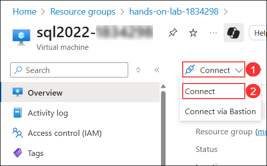

1. On the **sql2022-<inject key="Suffix" enableCopy="false"/> | Connect** page, click on **Download RDP file (2)** under **Native RDP**. 
  
    

1. Click on **Keep**, on the Downloads pop-up. 

    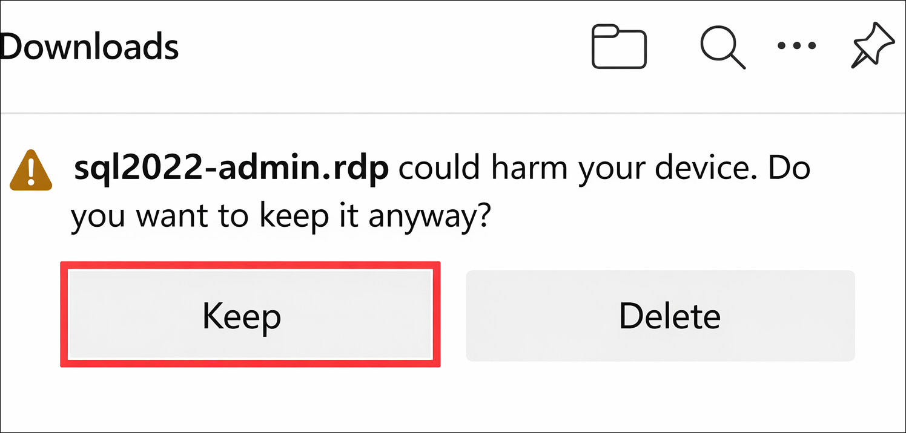

1. Click on **Open file**.

    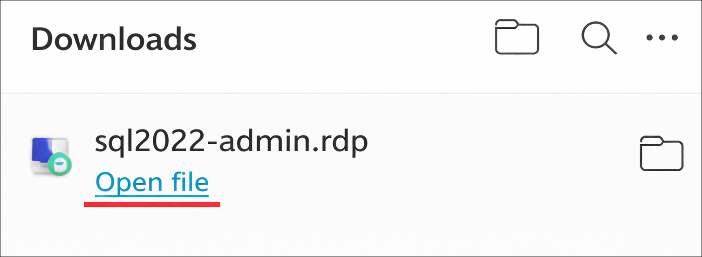

1. Next, on the RDP tab, click on **Connect**.

   

1. Enter the following credentials when prompted, and then select **OK**:

   - **Username**: `sqlmiuser`
   - **Password**: `Password.1234567890`

      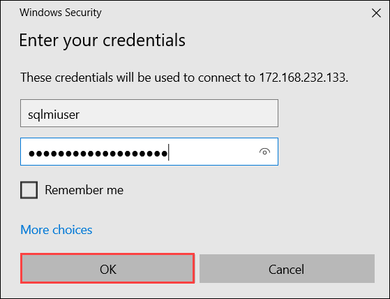

1. Select **Yes** to connect if prompted that the remote computer's identity cannot be verified.

    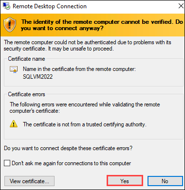

1. Click on **Azure Data Studio** from the Desktop.

    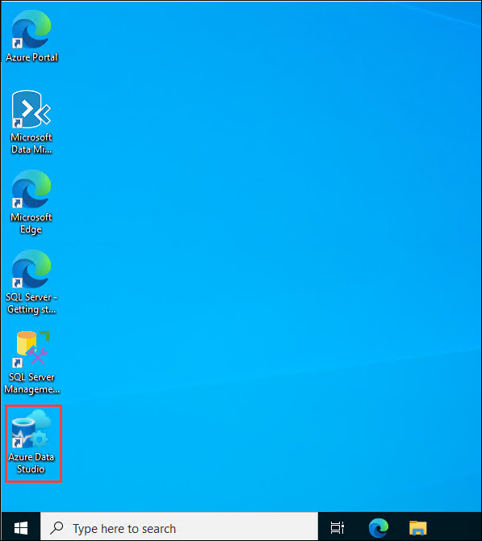

   >**Note**: Within **Azure Data Studio**, if prompted with any pop-ups related to updates, kindly disregard them and proceed with tasks.

1. In the Azure Data Studio select **Extensions (1)** from the Activity Bar, enter **SQL Migration (2)** into the search bar, select **Azure SQL Migration (3)**, and click on **Install (4)**.  

    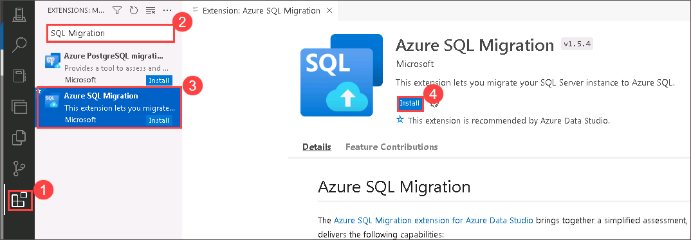

1. In the Azure Data Studio select **Connections (1)** from the Activity Bar and click on **New Connection (2)**.
  
    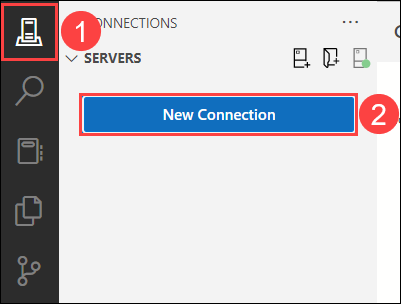

1. Enter **SQLVM2022 (1)** into the Server name box, ensure **Windows Authentication (2)** is selected, and then click on **Connect (3)**.

     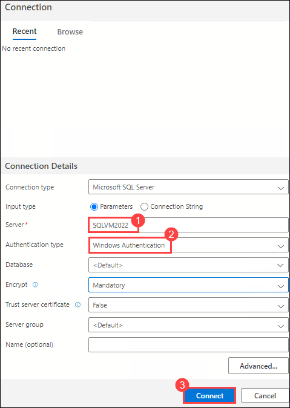

     > **Note**: If you see **Connection error** pop-up click on **Enable Trust server certificate**.

     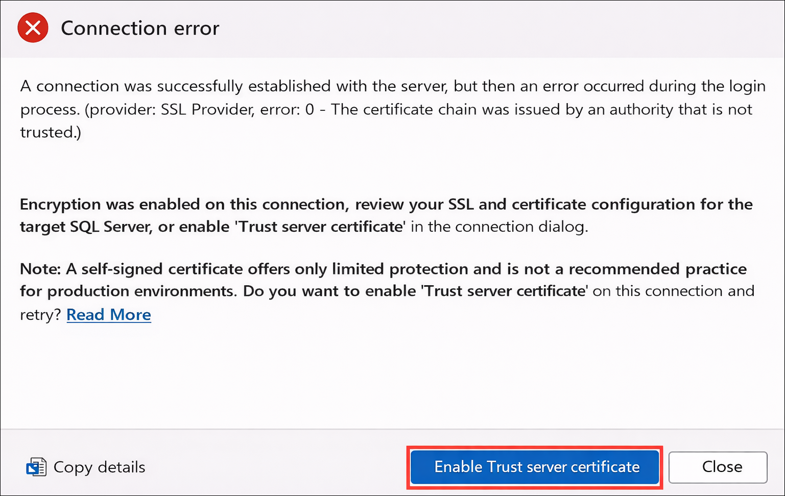

1. Once connected, verify you see the **WideWorldImporters** database listed under databases.

    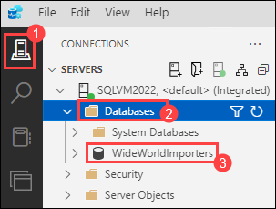

1. Right click on **SQLVM2022**, click on **Manage (1)**, and select **New Query (2)** from the Azure Data Studio toolbar.

    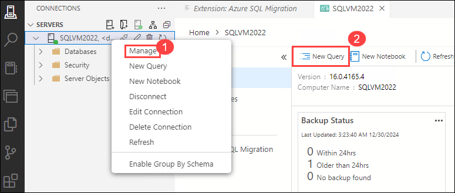

1. Next, copy and paste the SQL script below into the new query window. This script enables the Service Broker and changes the database recovery model to FULL.

    ```sql
    USE master;
    GO

    -- Update the recovery model of the database to FULL and enable Service Broker
    ALTER DATABASE WideWorldImporters SET
    RECOVERY FULL,
    ENABLE_BROKER WITH ROLLBACK IMMEDIATE;
    GO
    ```

1. To run the script, select **Run** from the Azure Data Studio toolbar.

    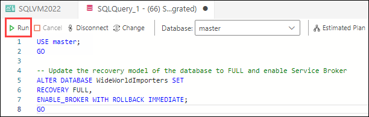

### Task 2: Perform assessment for migration to Azure SQL Database

In this task, you use the Microsoft Data Migration Assistant (DMA) to assess the `WideWorldImporters` database against the Azure SQL Database (Azure SQL DB). The assessment provides a report about any feature parity and compatibility issues between the on-premises database and the Azure SQL DB service.

1. In Azure Data Studio click on **SQLVM2022 (1)** > **Azure SQL migration (2)** and select **+ New migration (3)**.

    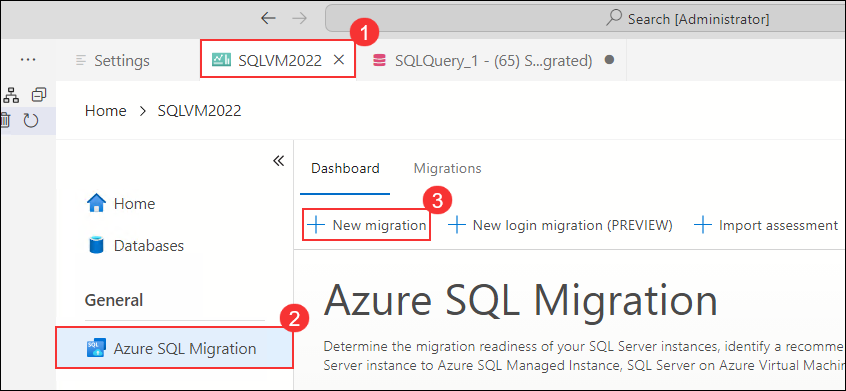

1. In **Step 1: Databases for assessment**, select **No (1)** for both tracking options. Choose the database **WideWorldImporters (2)** and then click **Next (3)** to continue.

    

1. In **Step 2: Assessment summary and SKU recommendations (1)**, review the assessment results and recommended configurations for **Azure SQL Database, Azure SQL Managed Instance, and SQL Server on Azure Virtual Machine**. Click **Next (2)** to proceed.

    

1. In **Step 3: Target Platform and Assessment Results**, Select **Azure SQL Database (1)** from the drop down. Then select **WideWorldImporters (2)** under the database, review the migration assessment to determine the possibility of migrating to Azure SQL DB, and Click on the **Cancel (3)** button.

   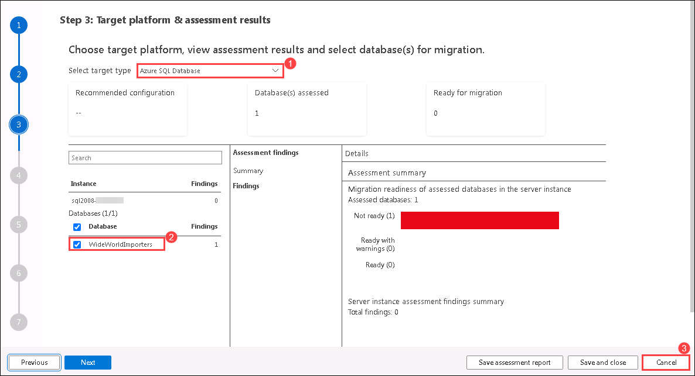

1. Click on **Yes** when prompted to Cancel Migration.

    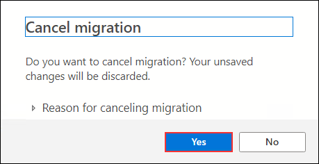

### Task 3: Perform assessment for migration to Azure SQL Managed Instance

In this task, you use the Microsoft Data Migration Assistant (DMA) to assess the `WideWorldImporters` database against the Azure SQL Managed Instance (SQL MI).

With one PaaS offering ruled out due to feature parity, perform a second DMA assessment against Azure SQL Managed Instance (SQL MI). The assessment provides a report about any feature parity and compatibility issues between the on-premises database and the SQL MI service.

1. In Azure Data Studio click on >  **SQLVM2022** > **Azure SQL migration (1)** and select **+ New migration (2)**.

    

1. In **Step 1: Databases for assessment**, select **No (1)** for both tracking options. Choose the database **WideWorldImporters (2)** and then click **Next (3)** to continue.

    

1. In **Step 2: Assessment summary and SKU recommendations (1)**, review the assessment results and recommended configurations for **Azure SQL Database, Azure SQL Managed Instance, and SQL Server on Azure Virtual Machine**. Click **Next (2)** to proceed.

    

1. In **Step 3: Target Platform and Assessment Results**, Select **Azure SQL Managed Instance (1)** from the drop down. Then select **WideWorldImporters (2)** under the database, review the migration assessment to determine the possibility of migrating to Azure SQL DB, and click on the **Cancel (3)** button.

     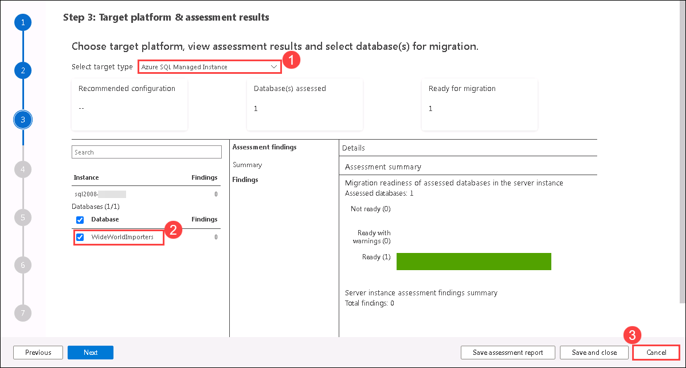

   >**Note**: The database, including the Service Broker feature, can be migrated as is, providing an opportunity for WWI to have a fully managed PaaS database running in Azure. Previously, their only option for migrating a database using features incompatible with Azure SQL Database, such as Service Broker, was to deploy the database to a virtual machine running in Azure (IaaS) or modify the database and associated applications to remove the use of the unsupported features. The introduction of Azure SQL MI, however, provides the ability to migrate databases into a managed Azure SQL database service with _near 100% compatibility_, including the features that prevented them from using Azure SQL Database.

1. Click on **Yes** when prompted to Cancel Migration.

    

## Summary

In this exercise, you connected to the WideWorldImporters database on the SQL Server 2022 VM, performed an assessment for migration to Azure SQL Database, and conducted an assessment for migration to Azure SQL Managed Instance. This process involved evaluating the current database setup, identifying potential compatibility issues, and determining the best migration strategy to ensure a smooth transition to Azure's cloud services.

### You have successfully completed the exercise. Please click on **Next >>** to continue to the next exercise.


