# Exercise 2: Migrate the database to SQL MI

### Estimated Duration: 120 Minutes

## Lab Scenario

In this lab, you will migrate the WideWorldImporters database from a SqlServer2022 to Azure SQL Managed Instance. You'll start by setting up an SMB network share and configuring the MSSQLSERVER service to run under the demouser account. Then, you will back up the database, gather connection information, upload the backup to Azure Blob Storage, and create an online data migration project. Finally, you'll perform the migration cutover and verify the database and transaction log migration. These steps ensure a smooth transition to Azure's cloud services.

## Lab Objectives

In this lab, you will complete the following tasks:

- Task 1: Create an SMB network share on the SQL VM
- Task 2: Change MSSQLSERVER service to run under demouser account
- Task 3: Create a backup of the WideWorldImporters database
- Task 4: Retrieve SQL MI and SqlServer2022 connection information
- Task 5: Upload the backup to Azure Blob Storage and assign the Storage Blob Data Reader permission to the SQL Managed Instance and the ODL user
- Task 6: Create and run an online data migration project
- Task 7: Perform migration cutover
- Task 8: Verify database and transaction log migration

## Task 1: Create an SMB network share on the SQL VM

In this task, you create a new SMB network share on the **sql2022-<inject key="Suffix" enableCopy="false"/>** VM. DMS uses this shared folder for retrieving backups of the `WideWorldImporters` database during the database migration process.

1. On the **sql2022-<inject key="Suffix" enableCopy="false"/>** VM, open **Windows Explorer** by selecting its icon on the Windows Taskbar.

   

1. In the Windows Explorer window, expand **This PC** in the tree view, select **Windows (C:) (1)**, and then select **dms-backups (2)**. Right-click on the folder and select **Give access to (3)** and select **Specific people... (4)** in the context menu.

   

   > **Note:** If the folder doesn't exist, create a new folder with the name **dms-backups**.

1. In the File Sharing dialog, ensure the **sqlmiuser** is listed with a **Read/Write** permission level, and then select **Share**.

   

1. Back on the File Sharing dialog, note the shared folder's path, ```\\SQLVM2022\dms-backups``` and select **Done** to complete the sharing process.

   

### Task 2: Change MSSQLSERVER service to run under demouser account

In this task, you use the SQL Server Configuration Manager to update the service account used by the SQL Server (MSSQLSERVER) service to the `demouser` account. Changing the account used for this service ensures it has the appropriate permissions to write backups to the shared folder.

1. On your **sql2022-<inject key="Suffix" enableCopy="false"/>** VM, select the **Start menu**, enter **sql Server (1)** into the search bar, and then select **SQL Server 2022 Configuration Manager (2)** from the search results.

   

1. In the SQL Server Configuration Managed dialog, select **SQL Server Services (1)** from the tree view on the left, then right-click **SQL Server (MSSQLSERVER) (2)** in the list of services and select **Properties (3)** from the context menu.

   

1. In the SQL Server (MSSQLSERVER) Properties dialog, select **This account** under Log on as, and enter the following and click on **OK (4)**:

   - **Account name**: `sqlmiuser` **(1)**
   - **Password**: `Password.1234567890` **(2)**
   - **Confirm Password**: `Password.1234567890` **(3)**

     

1. Select **Yes** in the Confirm Account Change dialog.

   
   
1. Click on **OK**.
 
1. Observe that the **Log On As** value for the SQL Server (MSSQLSERVER) service changed to `./sqlmiuser`.

   

    >**Note**: If the change doesn't occur immediately, wait 1 to 2 minutes for the Log On As value for the SQL Server (MSSQLSERVER) service to change to `./sqlmiuser`.
    
1. Close the SQL Server Configuration Manager.

### Task 3: Create a backup of the WideWorldImporters database

To perform online data migrations, DMS restores database and transaction log backups from an Azure Blob Storage container. In this task, you create a backup of the `WideWorldImporters` database using SSMS and write it to the ```\\sqlvm2022\dms-backups``` SMB network share you made in a previous task; you will upload this backup to Blob Storage in a later task. The backup file needs to include a checksum, so you add that during the backup steps.

1. On the **SqlServer2022** VM, open **Microsoft SQL Server Management Studio 22** by entering **SSMS** into the search bar in the Windows Start menu.

   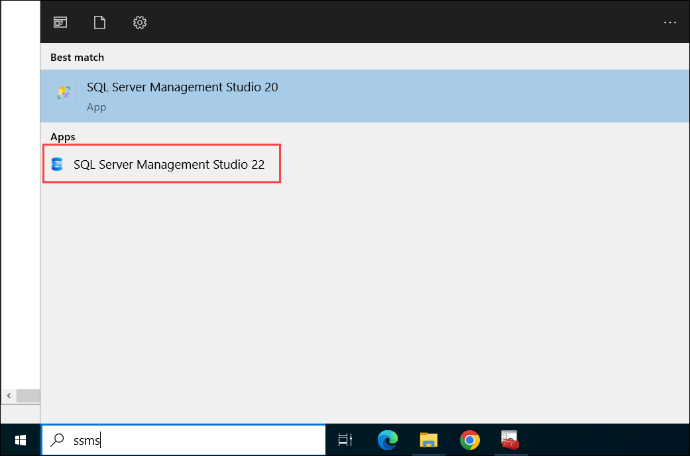

2. In the SSMS **Connect to Server** dialog, enter `sqlvm2022`(1) into the Server name box, ensure **Windows Authentication (2)** is selected, and tick the **Trust Server Certificate (3)** then select **Connect (4)**.

   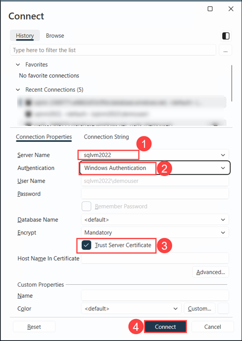

3. Once connected, expand **Databases** under **sqlvm2022** in the Object Explorer, and then right-click the **WideWorldImporters (1)** database. In the context menu, select **Tasks (2)** and then **Back Up... (3)**

   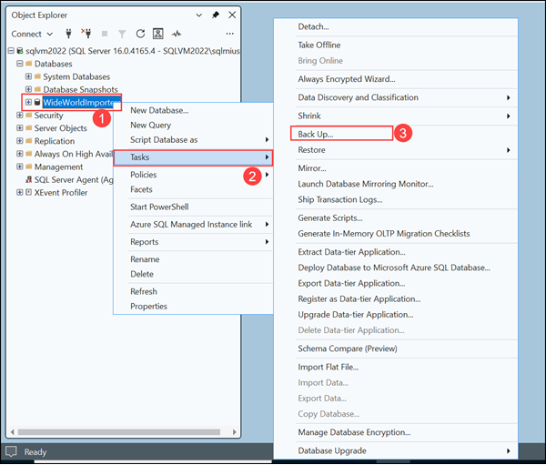

4. In the Back Up Database dialog, you should see `C:\WideWorldImporters.bak` listed in the Destinations box. This device is no longer needed, so select it and then select **Remove**.

   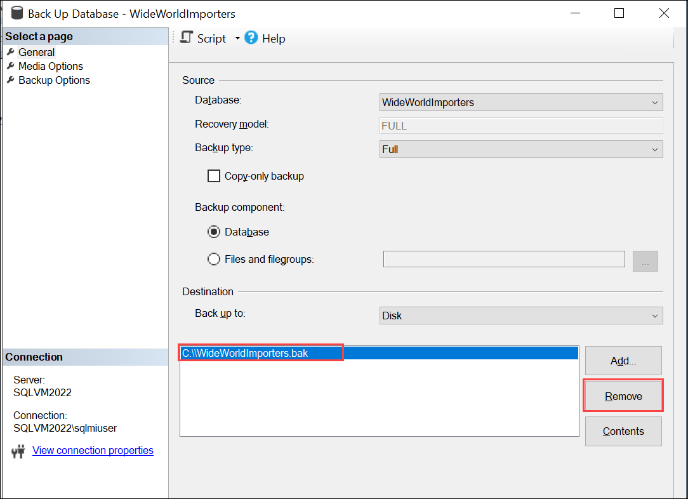

5. Next, select **Add** to add the SMB network share as a backup destination.

   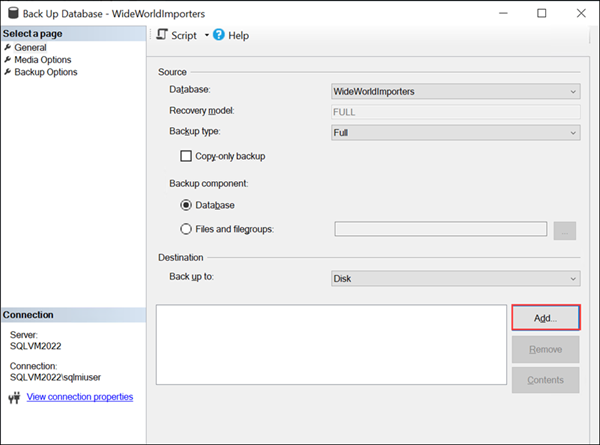

6. In the Select Backup Destination dialog, select the Browse **(`...`)** button.

   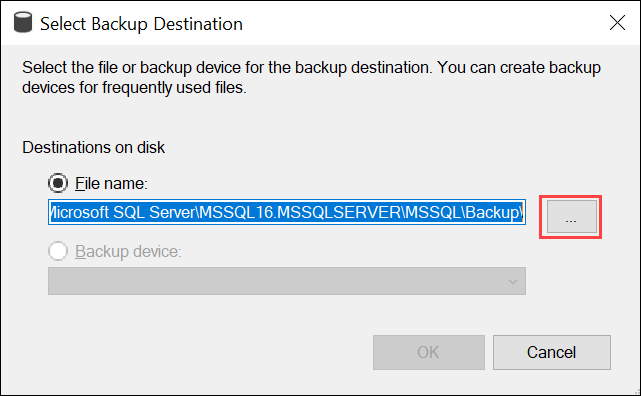

7. In the Location Database Files dialog, select the `C:\dms-backups` **(1)** folder, enter `WideWorldImporters.bak`**(2)** into the **File name** field, and then select **OK** **(3)**.

   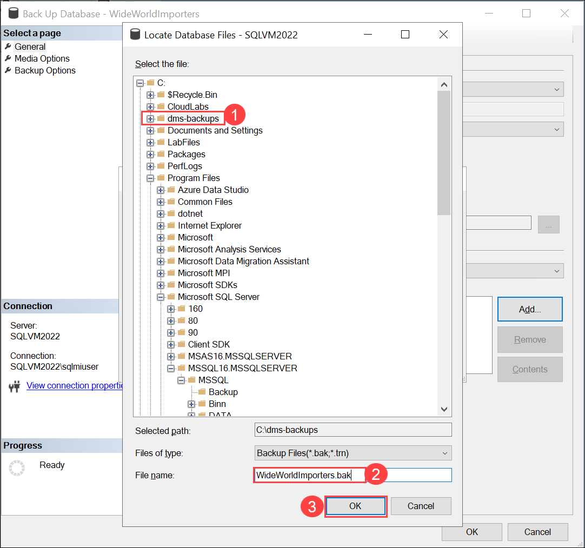

8. Select **OK** to close the Select Backup Destination dialog.

   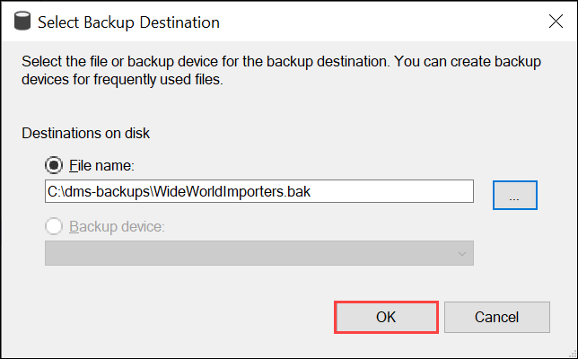

9. In the **Back Up Database** dialog, select **Media Options (1)** under Select a page pane, and then set the following:

   - Select **Back up to the existing media set** and then select **Overwrite all existing backup sets (2)**.
   
   - Under Reliability, check the box for **Perform checksum before writing to media (3)**. A checksum is required by DMS when using the backup to restore the database to SQL MI.

   - Select **OK (4)** to perform the backup.

     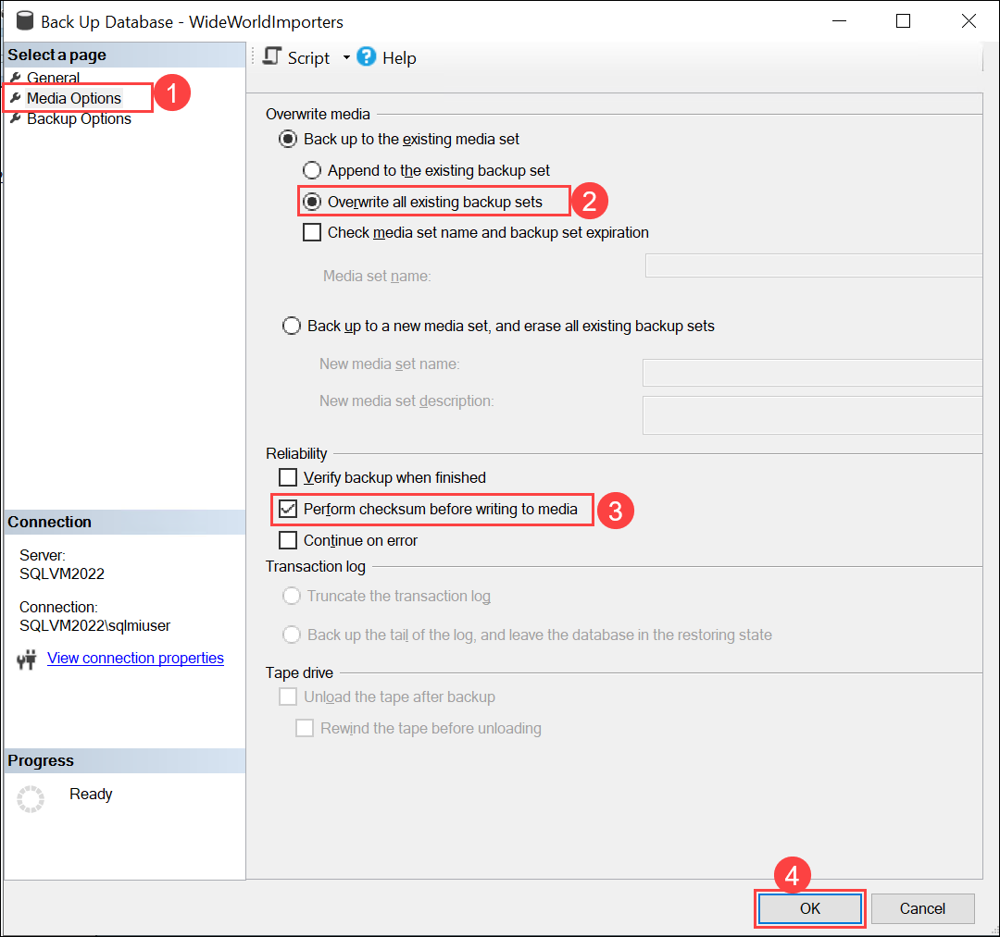

10. You will receive a message when the backup is complete. Select **OK**.

    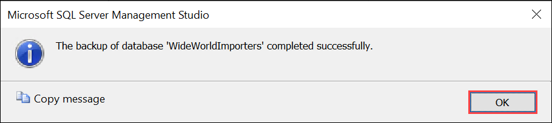

## Task 4: Retrieve SQL MI and SQL Server 2022 VM connection information

In this task, you use the Azure Cloud shell to retrieve the information necessary to connect to your sql2022-<inject key="Suffix" enableCopy="false"/> VM from DMS.

1. Open **Azure Portal** in the desktop.  

   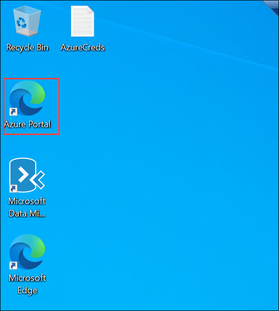

1. You'll see the **Sign into Microsoft Azure** tab. Here, enter your credentials and click **Next**
 
   - **Email/Username:** **<inject key="AzureAdUserEmail"></inject>**
 
        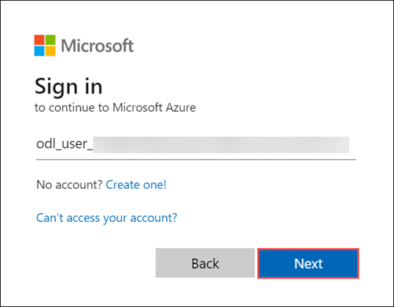
 
1. Next, provide your **temporary password** and select **Sign in**.
 
   - **Temporary Access Pass:** **<inject key="AzureAdUserPassword"></inject>**
 
        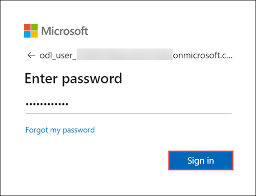
 
1. If prompted to stay signed in, you can click **No**.

    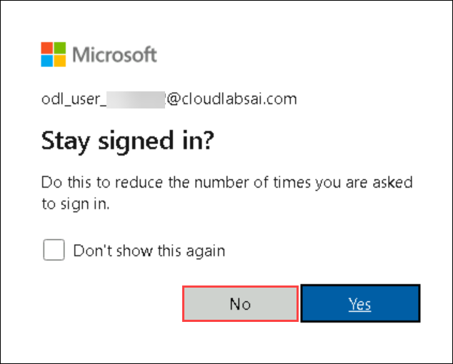

1. In the **Azure Portal**, select the **Azure Cloud Shell** icon from the top menu.

   

1. In the **Welcome to Azure Cloud Shell** window that opens at the bottom of your browser window, select **PowerShell**.

   

1. On the Getting Started , choose **Mount a storage account (1)**, select the **exisitng subscription (2)** then click on **Apply (3)**.

   

1. Choose **I want to create a storage account (1)** and click on **Next (2)**.

   

1. Specify the following values and click on **Create (6)** to create a storage account: 
      - Subscription: Accept the **default (1)**

      - Resource Group: Select **<inject key="Resource Group Name" enableCopy="false"/>** **(2)**

      - Region: **Central US (3)**

      - Storage account: **storage<inject key="Suffix" enableCopy="false"/>** **(4)**

      - File Share: **blob (5)**
      
         

1. After a moment, a message is displayed that you have successfully requested a Cloud Shell, and you are presented with a PS Azure prompt.

   

1. At the prompt, run the below command to retrieve information about SQL MI in the SQLMI-Shared-RG resource group by entering the following PowerShell command.

   ```PowerShell
   $resourceGroup = "SQLMI-Shared-RG"
   az sql mi list --resource-group $resourceGroup
   ```

   

1. Within the above command's output, locate and copy the value of the **`fullyQualifiedDomainName`** property. Paste the value into a text editor such as Notepad.exe, which will be used in later steps, for reference below.

   

### Task 5: Upload the backup to Azure Blob Storage and assign the Storage Blob Data Reader permission to the SQL Managed Instance and the ODL user

In this task, you will upload the database backup file to an Azure Blob Storage container, since Azure Database Migration Service (DMS) reads backup files from Blob Storage rather than directly from a local folder. You will then assign the **Storage Blob Data Reader** role so the SQL Managed Instance and your ODL user account are allowed to read the file.

> **Why this matters:** The **Storage Blob Data Reader** role gives an identity permission to *read* files (blobs) inside a storage container, without allowing it to delete or change anything. Both the Managed Instance and your account need this permission-without it, the migration wizard cannot detect or restore your backup file, even if it is already uploaded.

1. In the Azure portal search bar, type **storage (1)** and select **Storage accounts (2)** from the results.

   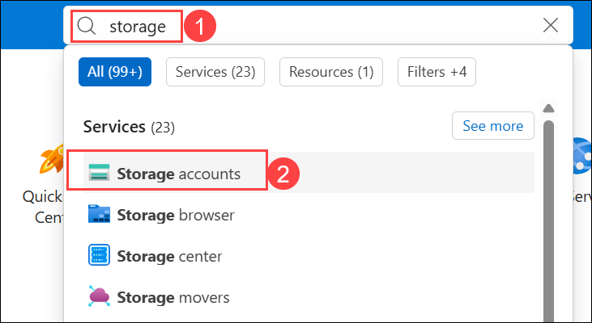

1. From the list of storage accounts, select your storage account named **storage<inject key="DeploymentID"></inject>**.

   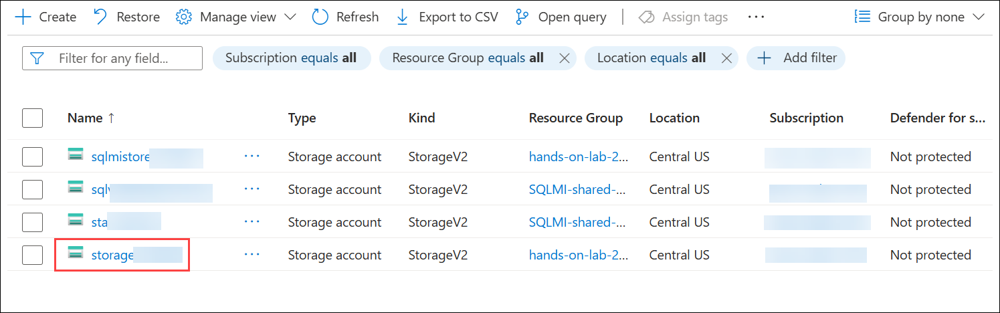

1. On the storage account page, expand the **Data storage** section in the left-hand menu, select **Containers (1)**, and then click **+ Container (2)**.

   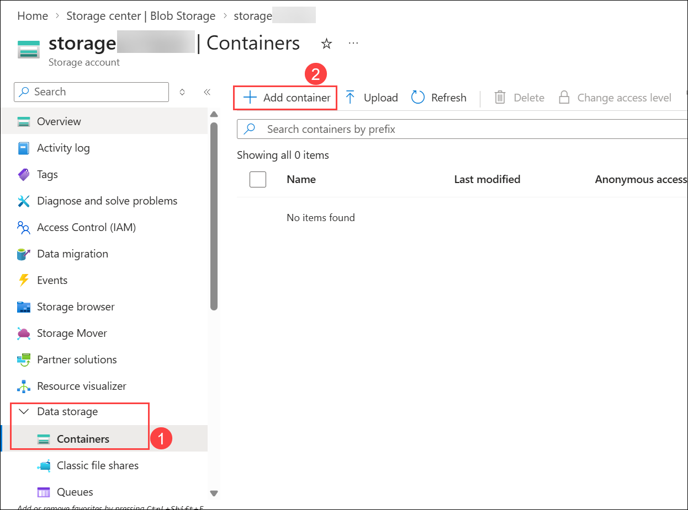

1. In the **New container** pop-up, enter the name **dms-backup (1)**, then click **Create (2)** and open the newly created container.

   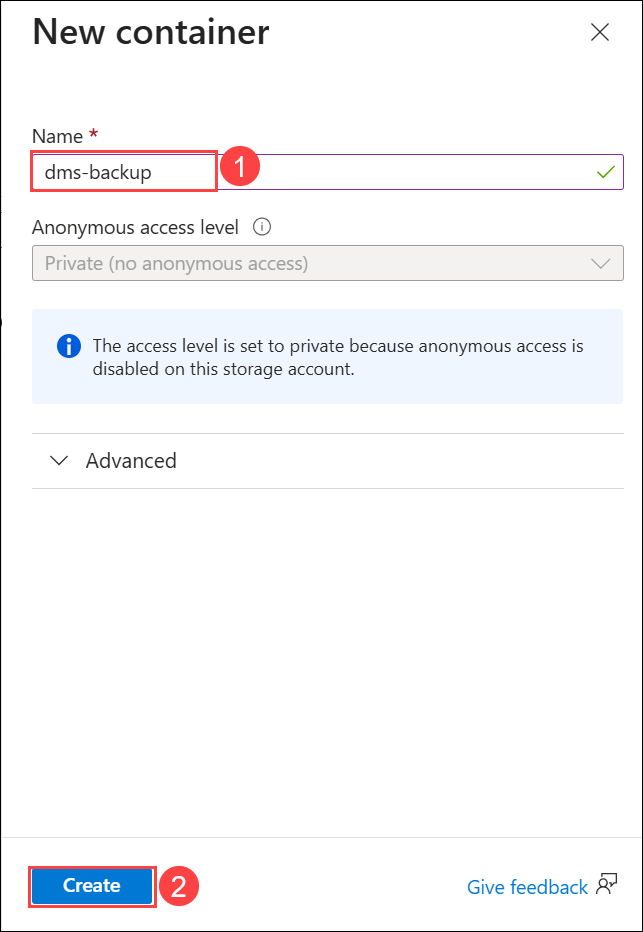

   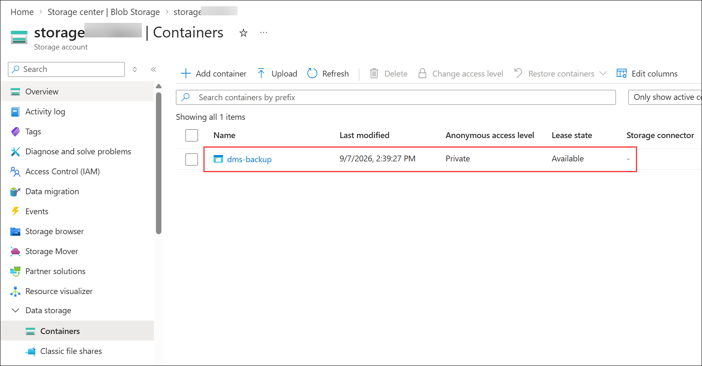

1. Inside the container, click **Upload (1)**, then click **Browse for files (2)**.

   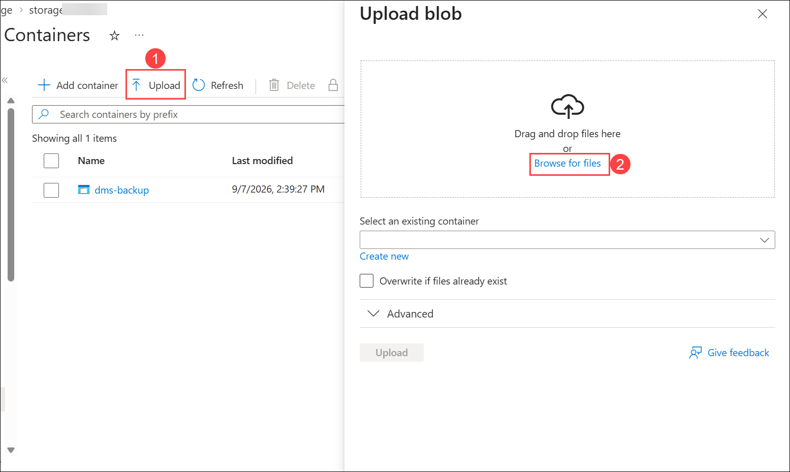

1. In the file explorer window, navigate to **``C:\``**, then drag and drop the dms-backups folder to the **upload blob** popup.

   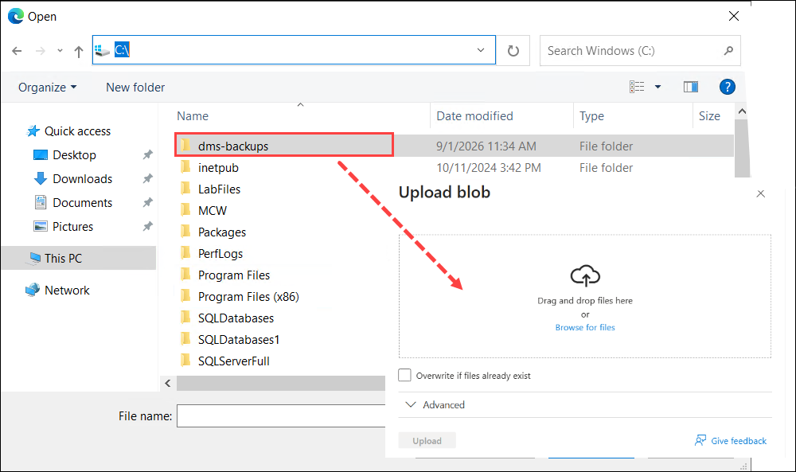

1. Once the upload completes, your `dms-backups` folder should be listed inside the container, similar to the image below.

   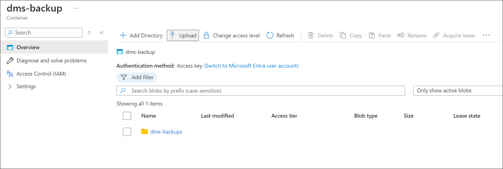

1. On the storage account page, select **Access Control (IAM) (1)** from the left navigation pane, then select **+ Add (2)**, and click on **Add role assignment (3)**.

   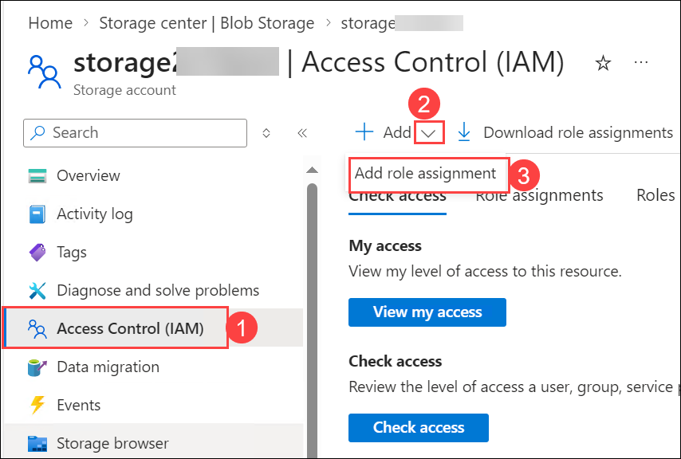

1. On the **Role** tab of the **Add role assignment** page, enter **storage blob data reader (1)** in the search box, select **Storage Blob Data Reader (2)** from the results, and then click on **Next (3)**.

   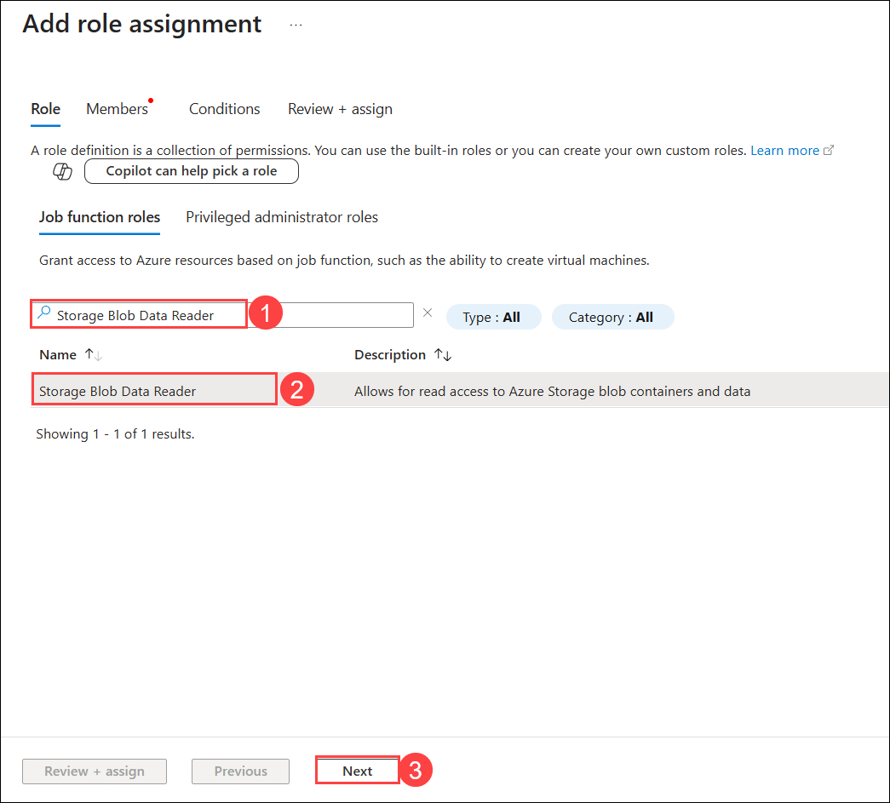

2. On the **Members** tab, ensure that **User, group, or service principal** is selected for **Assign access to**, and then click on **+ Select members (1)** On the **Select members** pane, enter **odl_user_<inject key="DeploymentID" enableCopy="false"/> (2)** in the search box, select your user account **ODL_User <inject key="DeploymentID" enableCopy="false"/> (3)** from the results, and then click on the **Select (4)** button then click on the **Review + assign (5)** button.

   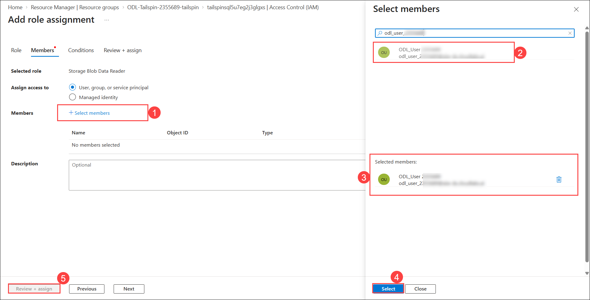

4. On the **Review + assign** tab, review the details and click on the **Review + assign** button again to confirm the assignment.
 
   

   > **Note:** A notification confirming that the role assignment was added appears in the top-right corner of the portal. Role assignments can take up to five minutes to take effect.

1. Back on the **Access Control (IAM) (1)** page of the storage account, select **+ Add (2)** and click on **Add role assignment (3)** to start a second assignment.

      

2. On the **Role** tab, enter **storage blob data reader (1)** in the search box, select **Storage Blob Data Reader (2)** from the results, and then click on **Next (3)**.

    

4.  On the **Members** tab, select **Managed identity (1)** for **Assign access to**, and then click on **+ Select members**, 
On the **Select managed identities** pane, set the following values:

    - **Subscription**: leave the default subscription selected.

    - **Managed identity (2)**: select **SQL managed instance** from the drop-down list.

    - Under **Selected members (3)**, confirm that **sqlmi--cus** is listed.

    - Click on the **Select (4)** button, and then click on the **Review + assign (5)** button.

      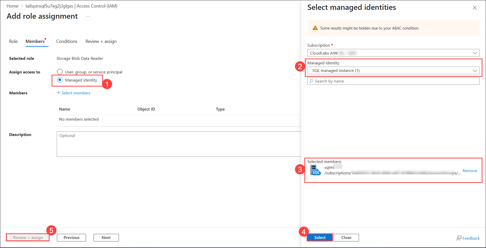

5. On the **Review + assign** tab, review the details and click on the **Review + assign** button again to confirm the assignment.

   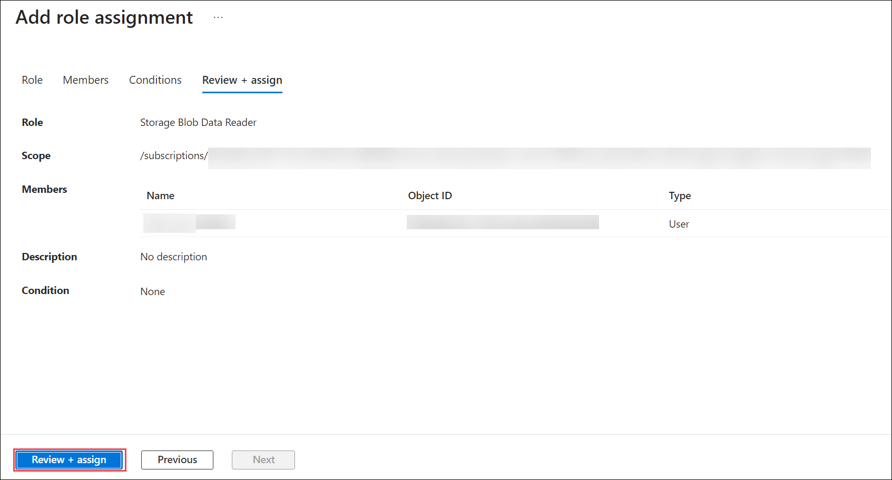

   >You have now granted both your lab user account and the SQL Managed Instance read access to the storage account. In the next task, you will create and run the online data migration project using Azure Database Migration Service.

### Task 6: Create and run an online data migration project

1. On the azure portal search for **Azure Database Migration Service(1)** and select **Azure Database Migration Services(2)**

   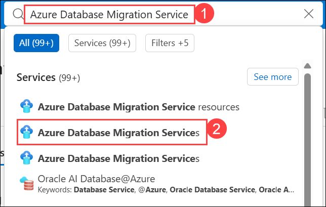

1. Select the **All resources (1)** option from the left pane and then select the migration services **wwi-dms (2)**

   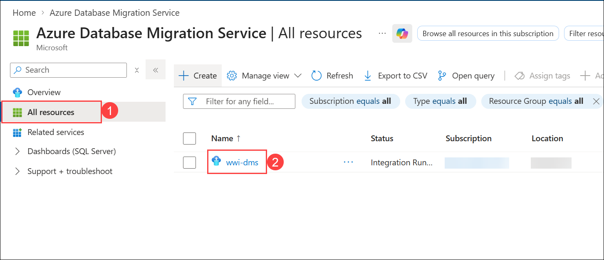

1. On the **wwi-dms** page click on **New Migration**

   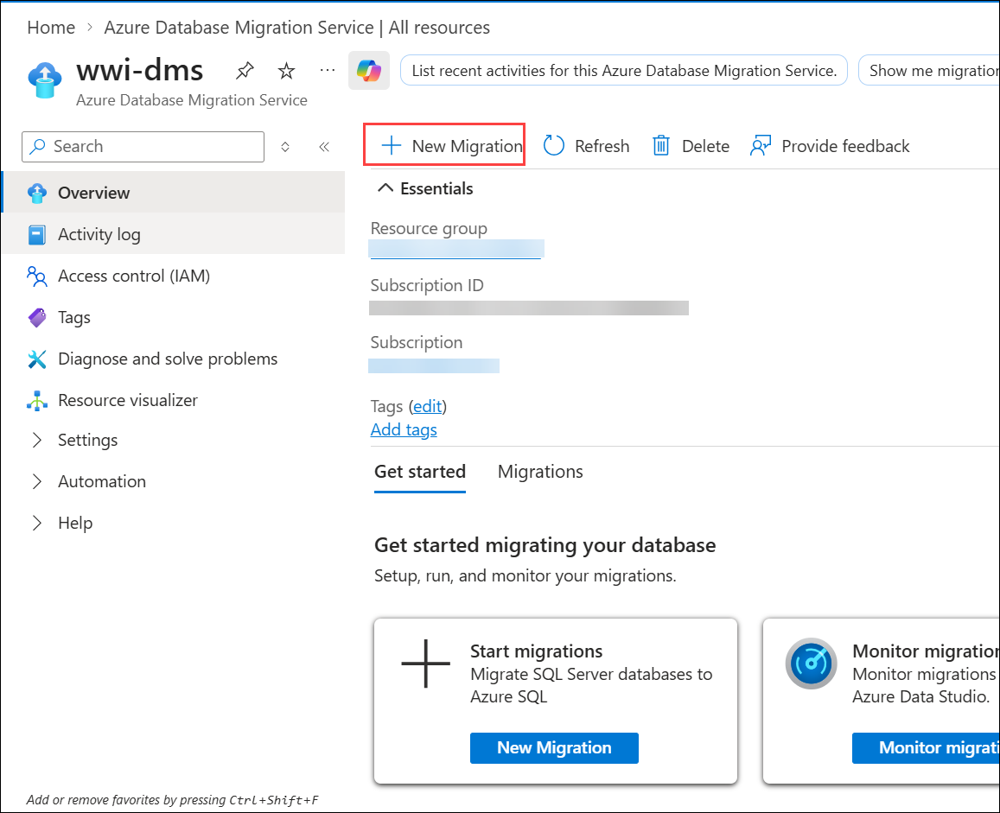

1. On the **Select new migration scenario** page, set the following, then select **Select (5)**:

   - Source server type: **SQL Server (1)**
   - Target server type: **Azure SQL Managed Instance (2)**
   - Backup file storage location: **Blob storage (3)**
   - Migration mode: **Online (4)**

      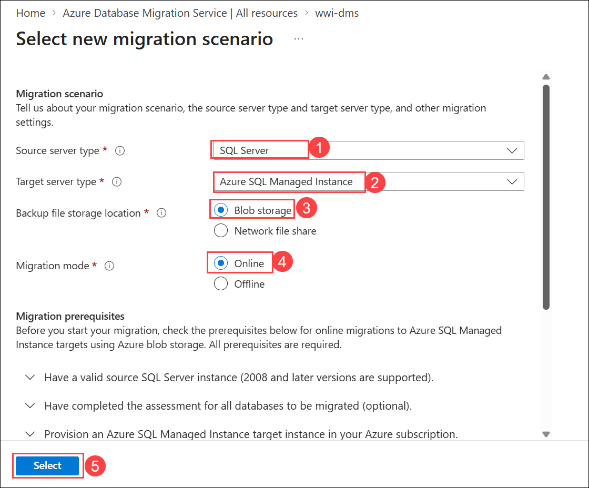

1. On the **Source details** tab, enter the details for the source SQL Server, then select **Next**:

   -  Under **Source details**, select **No** for **Is your source SQL Server instance tracked in Azure?**.

   - **Source Infrastructure Type (1)**, select **Virtual Machine**.

   - **Subscription** : Select **Default**

   - **Resource group (2)**:  select the resource group containing your source SQL Server.

   - **Location (3)** : **Central US**.

   - **SQL Server Instance Name (4)** : **wwi-dms-<inject key="DeploymentID" enableCopy="false"/>**

   -  Click **Next: Select migration target (5)**.

       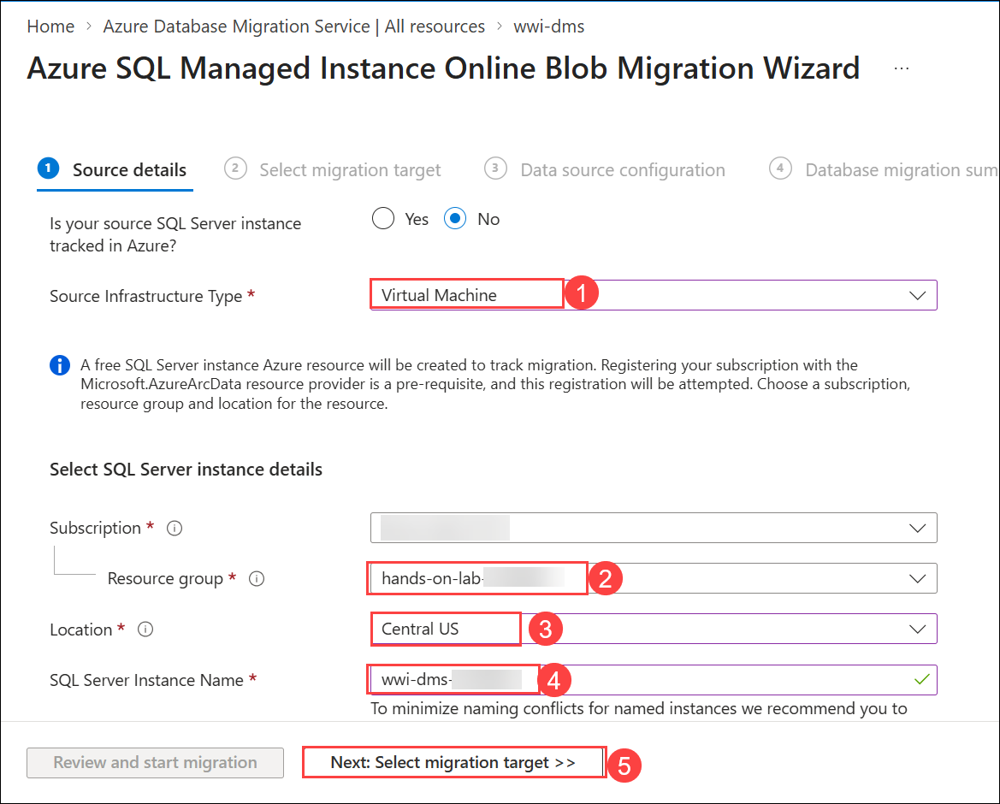

1. On the **Select migration target** tab, select the following, then select **Next**:

   - Subscription: **Keep it default**
   - Resource group: **SQLMI-shared-RG**
   - Target Azure SQL Managed Instance: **Keep it default**
   - Click on : **Next: Data source configuration >>**

      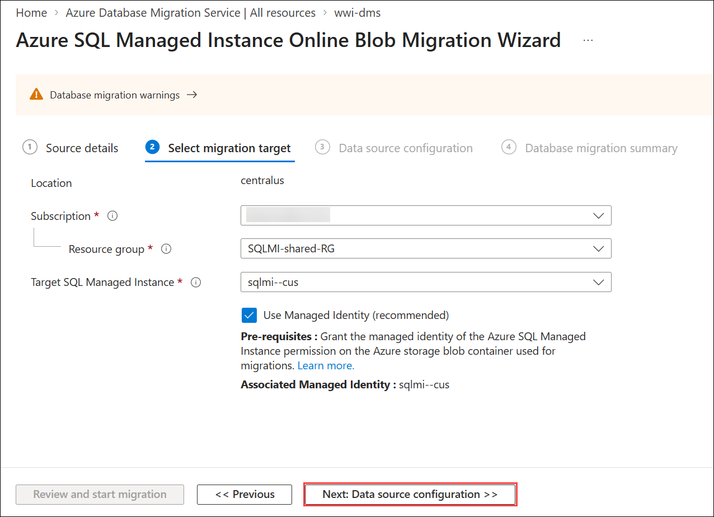

1. On the **Data source configuration** tab, provide the blob details(1) where you uploaded the backup, then select **Next: Database migration summary >> (2)**:

   - Resource group: **hands-on-lab-<inject key="deploymentID" enableCopy="false"></inject>-MigrateServers** **(1)** resource group from the dropdown.
   - Storage account: **storage-<inject key="deploymentID" enableCopy="false"></inject>**
   - Blob container: **dms-backup**
   - Folder: **dms-backups**
   - Target database: **WideWorldImporters<inject key="deploymentID" enableCopy="false"></inject>**

     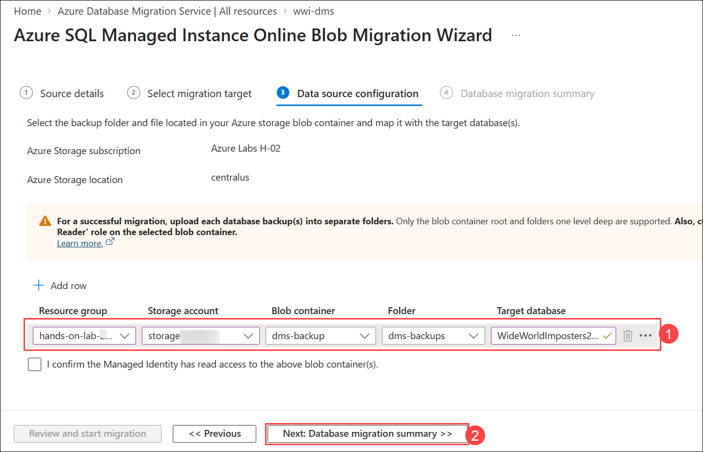 

1. On the **Database migration Summary** tab, review all settings, then select **Start migration**.

   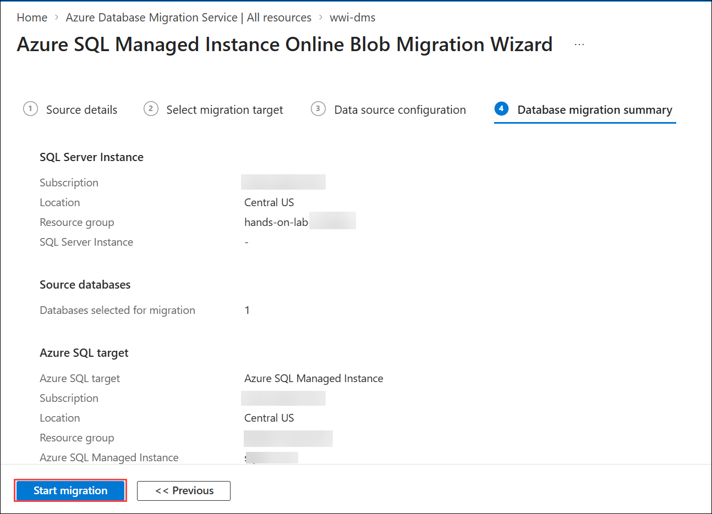 

1. The migration begins. Select the **WideWorldImporters(---)** migration to open the monitoring page and watch the progress.

   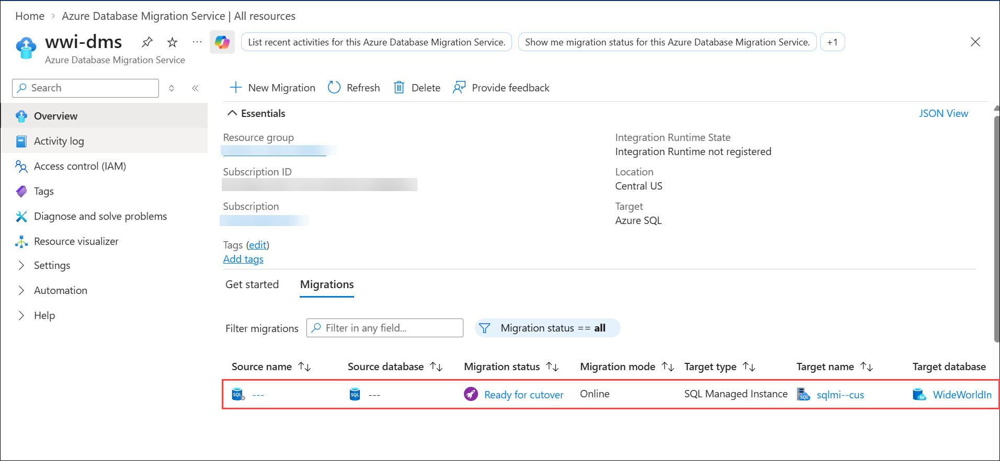

### Task 7: Perform migration cutover

Since you performed an "online data migration," the migration wizard continuously monitors the Azure Blob Storage container for newly uploaded log backup files. Online migrations enable any updates on the source database to be captured until you initiate the cutover to the SQL MI database. In this task, you add a record to one of the database tables, back up the logs, upload them to Blob Storage, and complete the migration of the `WideWorldImporters` database by cutting over to the SQL MI database.

1. Go to **Azure portal** in the browser, navigate to **hands-on-lab-<inject key="DeploymentID" enableCopy="false"/>** resource group and search for **wwi-dms** **Database Migration Services (1)** and **Select it (2)**.

   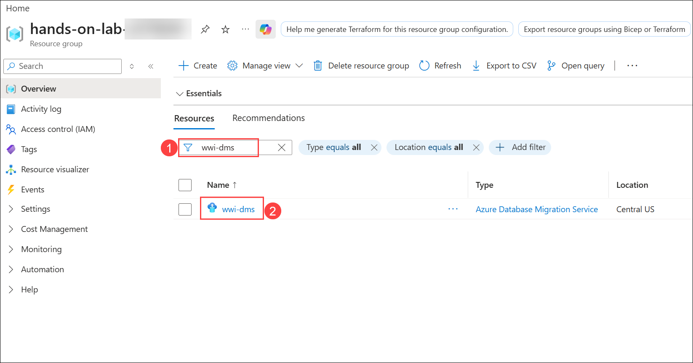

2. In **wwi-dms** balde, click on **Migrations (1)**, and select **(---) (2)** under **Source name**.
  
   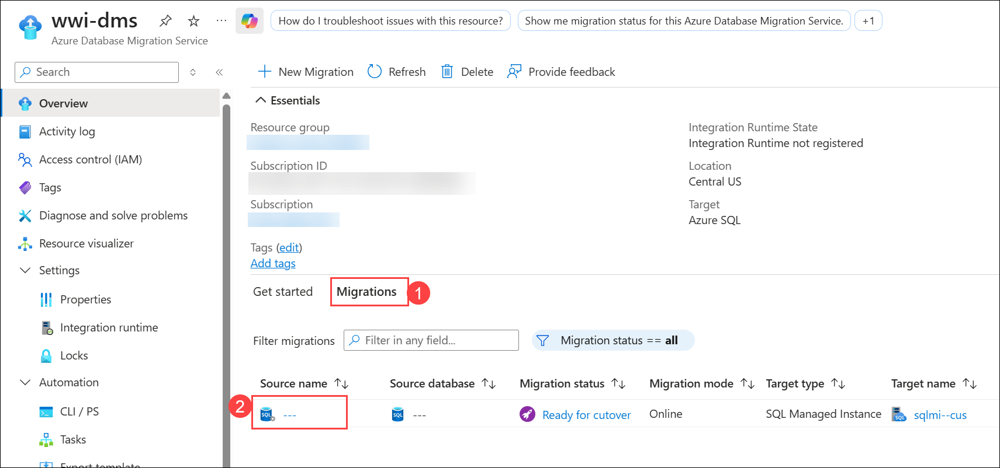

3. On the **WideWorldImporters** screen, note the status of **Restored** for the `WideWorldImporters.bak` file.

   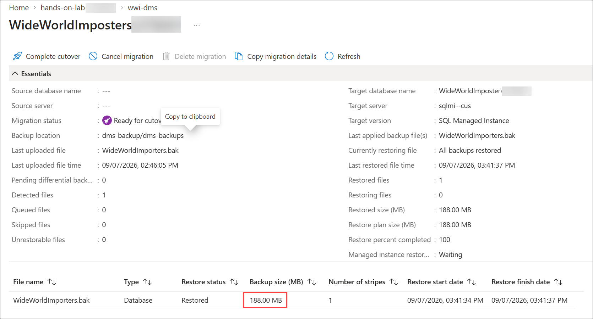
   
4. Navigate back to the **SSMS 22**, click on **New Query**.

    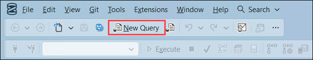 

5. In the new query window, paste the following SQL script to insert a new record named **`Space Adventure`** into the **`Game`** table:

   ```SQL
   USE WideWorldImporters;
   GO

   INSERT [dbo].[Game] (Title, Description, Rating, IsOnlineMultiplayer)
   VALUES ('Space Adventure', 'Explore the universe with our newest online multiplayer gaming experience. Build custom rocket ships and take off for the stars in an infinite open-world adventure.', 'T', 1)
   ```

6. To run the script, select **Execute** from the SSMS 22 toolbar.

    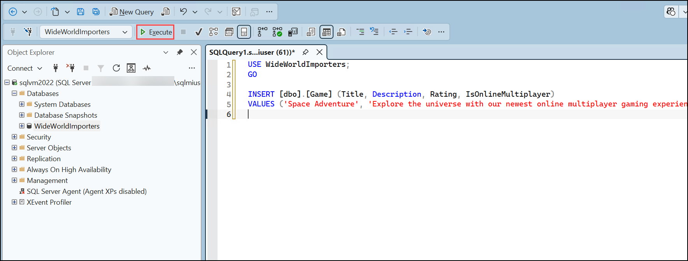

7. After adding the new record to the `Game` table, back up the transaction logs. DMS detects any new backups and ships them to the migration service. Select **New Query** again in the toolbar by selecting **Sqlvm2022** tab , and paste the following script into the new query window:

   ```SQL
   USE master;
   GO

   BACKUP LOG WideWorldImporters
   TO DISK = 'c:\dms-backups\WideWorldImportersLog.trn'
   WITH CHECKSUM
   GO
   ```
   

8. To run the script, select **Execute** from the SSMS 22 toolbar.

    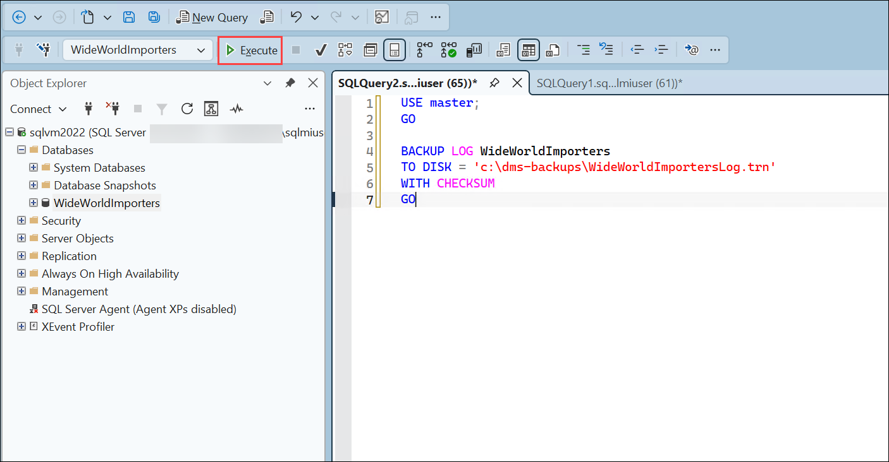

    > **What just happened?** This script creates a transaction log backup - a .trn file that records every change made to the database since the last backup (in this case, the new Space Adventure row you just inserted). Unlike a full .bak backup, a .trn file is small and quick to create, which is exactly why online migrations use it: instead of taking a brand-new full backup every time something changes, DMS keeps applying these small log backups on top of the original restore, keeping the target database in sync with the source with minimal downtime.

   > This script generates the .trn file at C:\dms-backups\WideWorldImportersLog.trn. Just like the full backup earlier, this file now needs to be uploaded to the same Azure Blob Storage container so DMS can find and apply it.

1. Open **File Explorer** on the SqlServer2022 VM and navigate to `C:\dms-backups`. Confirm that `WideWorldImportersLog.trn` is present.

   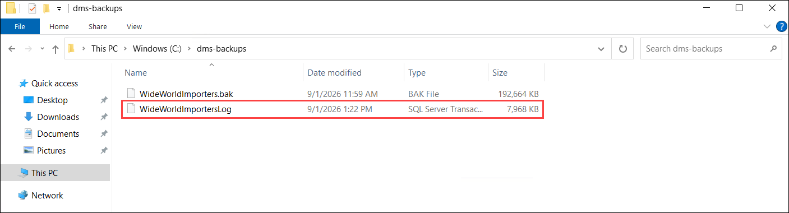

1. Switch to the Azure portal, go to your storage account (**parts-<inject key="deploymentID" enableCopy="false"></inject>**) , and open the same container/folder where you uploaded the original `.bak` file. Click **Upload**, then **Browse for files (1)**, and select **`WideWorldImportersLog` file(2)** from `C:\dms-backups` then click on **Open(3)** then click on **Upload** button on the Upload blob popup.

    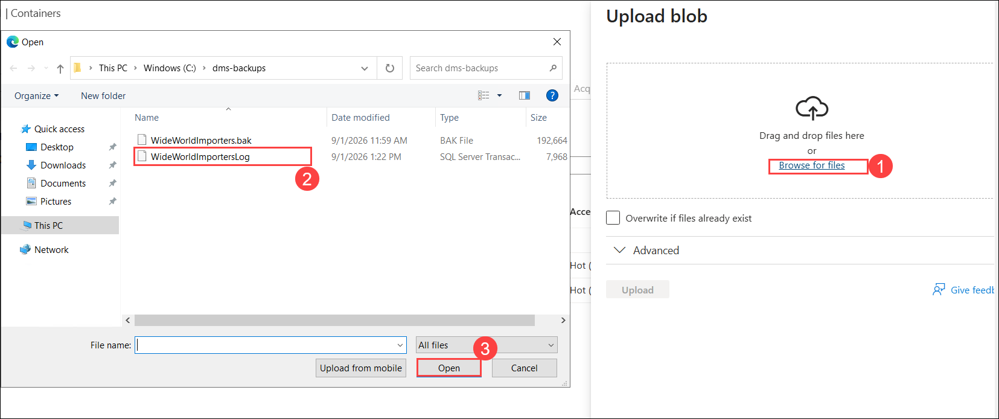

    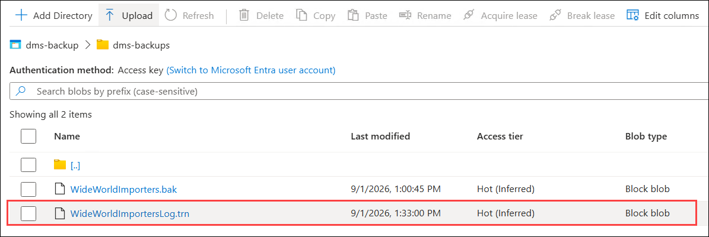

1. Once the upload finishes, navigate back to your Azure portal then **Database Migration Service resource** → **Migrations** → **your migration entry**, and click **Refresh**. You should see the `.trn` file appear in the file list with a status of **Queued** then **Restored**.
    
    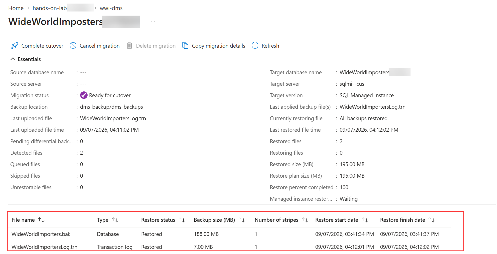

   > **Note**: If you don't see it in the transaction logs entry, continue selecting refresh every 10-15 seconds or refresh the whole page until it appears.

   > Continue selecting **Refresh**, and you should see the **WideWorldImportersLog.trn** status change to **Uploaded**.

    > After the transaction logs are uploaded, they are restored to the database. Once again, continue selecting **Refresh** every 10-15 seconds until you see the status change to **Restored**, which can take 3-5 minutes.

1. After verifying the transaction log status of **Restored (1)**, select **Complete cutover (2)**.

   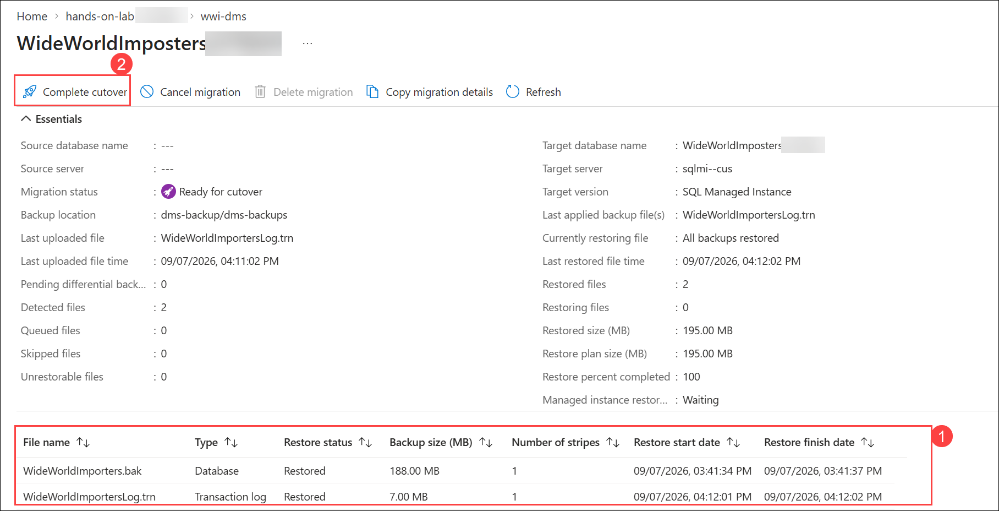

1. On the Complete cutover dialog, verify that log backups pending restore are `0`, check **I confirm there are no additional log backups to provide and want to complete cutover (1)**, and then select **Complete cutover (2)**.

    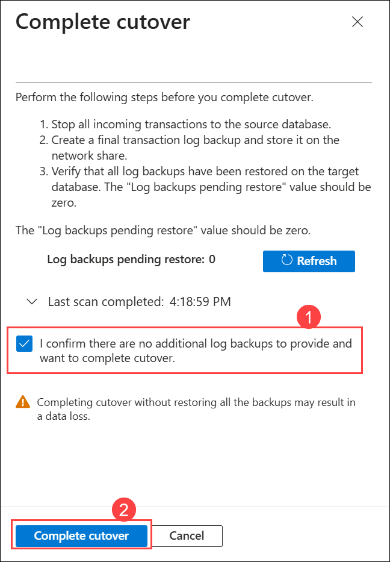

1. You can view the migration status in the Azure portal. Return to the **wwi-dms** Database Migration Services, click on **Migrations** ensure that Migration status is **Succeeded**. You might have to refresh to view the status.

   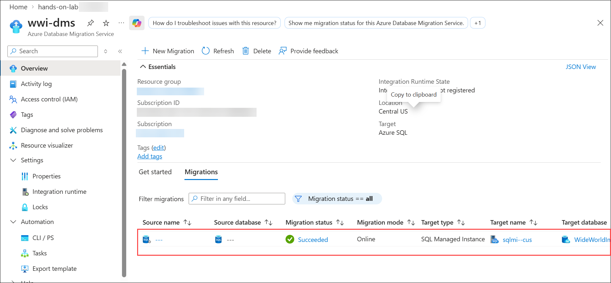

   > **Note:** The migration may take approximately 5-10 minutes to complete. Please wait and periodically refresh the page until the status changes to **Succeeded**.

1. You have successfully migrated the `WideWorldImporters` database to Azure SQL Managed Instance.

### Task 8: Verify database and transaction log migration

In this task, you connect to the SQL MI database using SSMS and quickly verify the migration.

1. Return to SSMS on your **SqlServer2022** VM, and then select **Connect (1)** and **Database Engine... (2)** from the Object Explorer menu.

   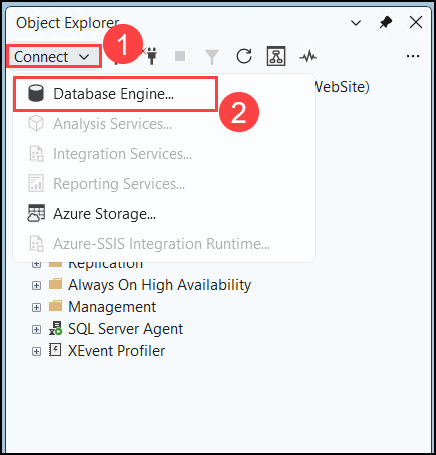

2. In the Connect to Server dialog, enter the following:

   - **Server name**: Enter the fully qualified domain name of your SQL-managed instance, which you copied from the **Azure Cloud Shell** previously in **Task 4**.**(1)**
   
   - **Authentication**: Select **SQL Server Authentication (2)** from the dropdown.
   
   - **Login**: Enter ```contosoadmin``` **(3)**
   - **Password**: Enter ```IAE5fAijit0w^rDM``` **(4)**
   
   - Check the **Remember password** box.
   
   - Check the **Trust server certificate (5)** box.

   - Select **Connect (6)**. 
      
      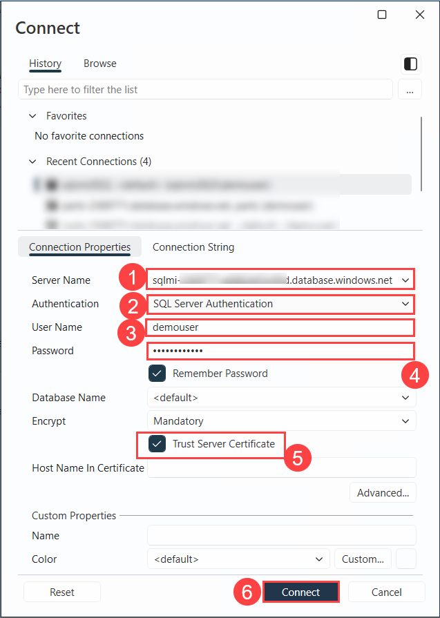

4. The **SQL MI** connection appears. Expand Databases of the **SQL MI** connection and select the **WideWorldImporters<inject key="DeploymentID" enableCopy="false"/>** database.

   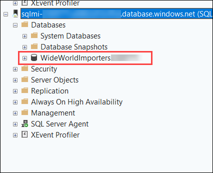

5. Right-click on `WideWorldImporters(1)` database selected, and select **New Query (2)** on the SSMS toolbar to open a new query window.

    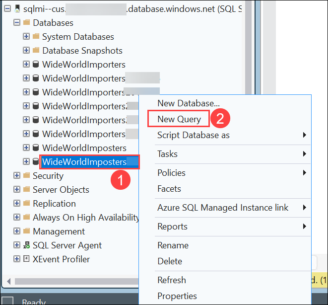

6. In the new query window, enter the following SQL script:

      ```SQL
      USE WideWorldImporters<inject key="DeploymentID" enableCopy="false"/>;
         GO

         SELECT * FROM Game
      ```

7. Select **Execute** on the SSMS toolbar to run the query. Observe the records contained within the `Game` table, including the new `Space Adventure` game you added after initiating the migration process.

     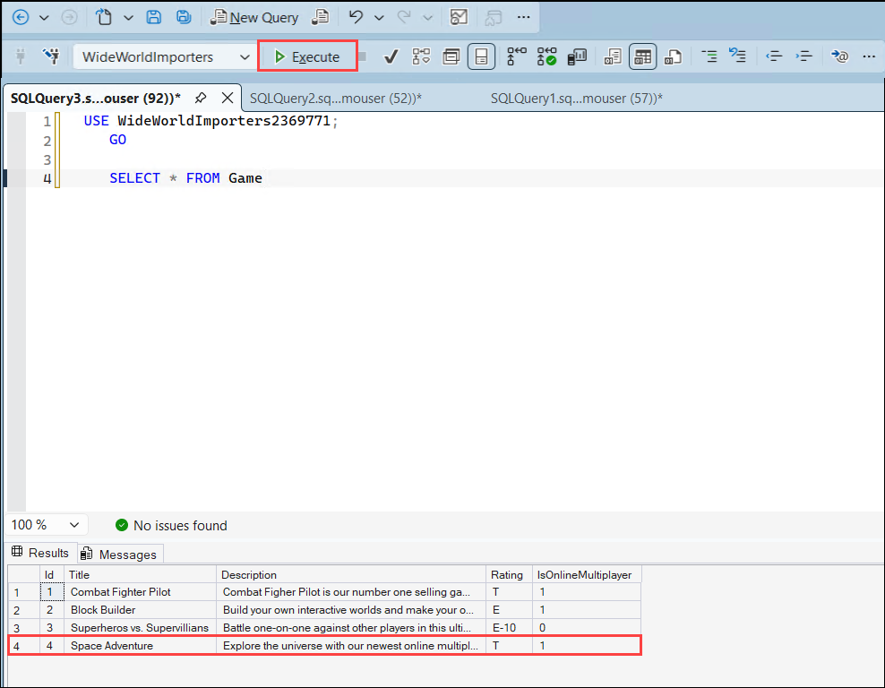

## Summary

In this hands-on lab, you have migrated the WideWorldImporters database from a SqlServer2022 to an Azure SQL Managed Instance.