# Exercise 2: Migrate the database to SQL MI

### Estimated Duration: 90 Minutes

## Lab Scenario

In this exercise, you will migrate the WideWorldImporters database from a SQL Server 2022 VM to Azure SQL Managed Instance. You’ll start by setting up an SMB network share and configuring the MSSQLSERVER service to run under the sqlmiuser account. Then, you’ll back up the database, gather connection information, and create an online data migration project. Finally, you’ll perform the migration cutover and verify the database and transaction log migration. These steps ensure a smooth transition to Azure’s cloud services.

## Lab Objectives

In this exercise, you will complete the following tasks:

- Task 1: Create an SMB network share on the SQL VM
- Task 2: Change MSSQLSERVER service to run under sqlmiuser account
- Task 3: Create a backup of the WideWorldImporters database
- Task 4: Retrieve SQL MI and SQL Server 2022 VM connection information
- Task 5: Create and run an online data migration project
- Task 6: Perform migration cutover
- Task 7: Verify database and transaction log migration

## Task 1: Create an SMB network share on the SQL VM

In this task, you create a new SMB network share on the **sql2022-<inject key="Suffix" enableCopy="false"/>** VM. DMS uses this shared folder for retrieving backups of the `WideWorldImporters` database during the database migration process.

1. On the **sql2022-<inject key="Suffix" enableCopy="false"/>** VM, open **Windows Explorer** by selecting its icon on the Windows Taskbar.

   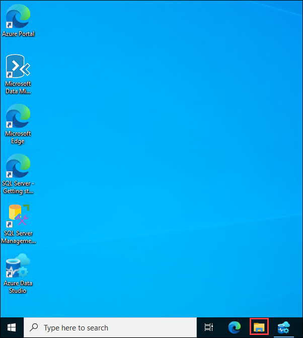

1. In the Windows Explorer window, expand **This PC** in the tree view, select **Windows (C:) (1)**, and then select **dms-backups (2)**. Right-click on the folder and select **Give access to (3)** and select **Specific people... (4)** in the context menu.

   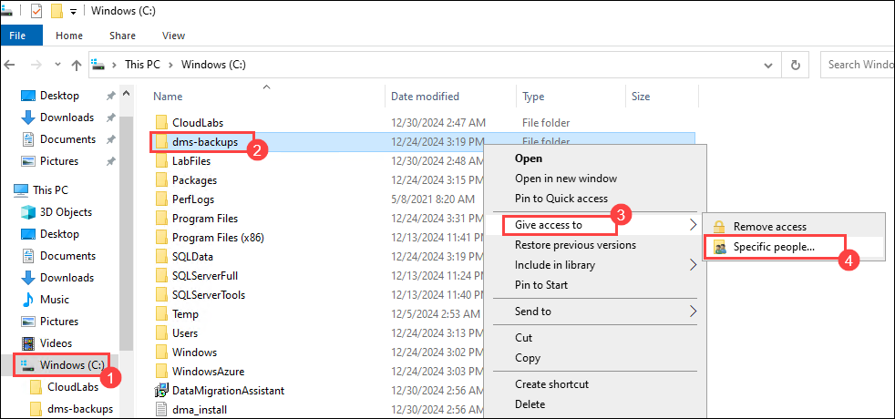

   > **Note:** If the folder doesn't exist, create a new folder with the name **dms-backups**.

1. In the File Sharing dialog, ensure the **sqlmiuser** is listed with a **Read/Write** permission level, and then select **Share**.

   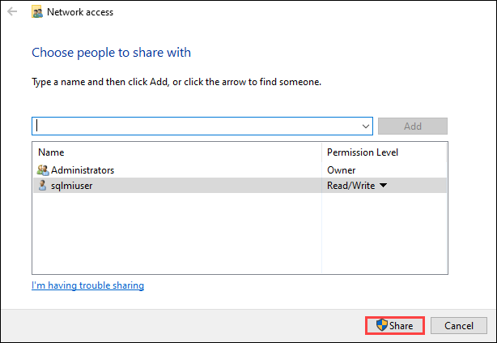

1. Back on the File Sharing dialog, note the shared folder's path, ```\\SQLVM2022\dms-backups```, and select **Done** to complete the sharing process.

   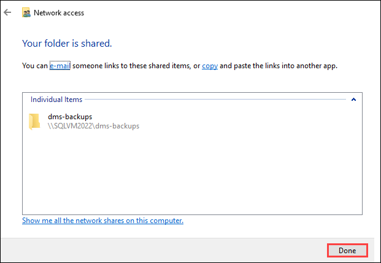

## Task 2: Change MSSQLSERVER service to run under sqlmiuser account

In this task, you use the SQL Server Configuration Manager to update the service account used by the SQL Server (MSSQLSERVER) service to the `sqlmiuser` account. Changing the account used for this service ensures it has the appropriate permissions to write backups to the shared folder.

1. On your **sql2022-<inject key="Suffix" enableCopy="false"/>** VM, select the **Start menu**, enter **sql Server (1)** into the search bar, and then select **SQL Server 2022 Configuration Manager (2)** from the search results.

   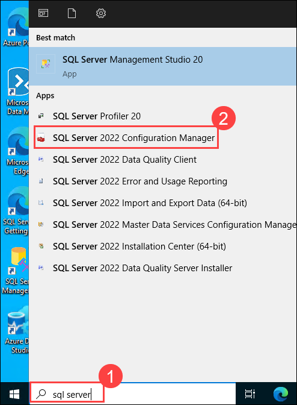

1. In the SQL Server Configuration Managed dialog, select **SQL Server Services (1)** from the tree view on the left, then right-click **SQL Server (MSSQLSERVER) (2)** in the list of services and select **Properties (3)** from the context menu.

   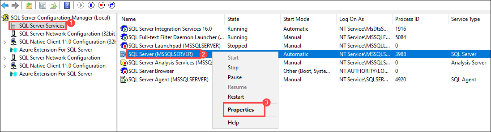

1. In the SQL Server (MSSQLSERVER) Properties dialog, select **This account** under Log on as, and enter the following and click on **OK (4)**:

   - **Account name**: `sqlmiuser` **(1)**
   - **Password**: `Password.1234567890` **(2)**
   - **Confirm Password**: `Password.1234567890` **(3)**

     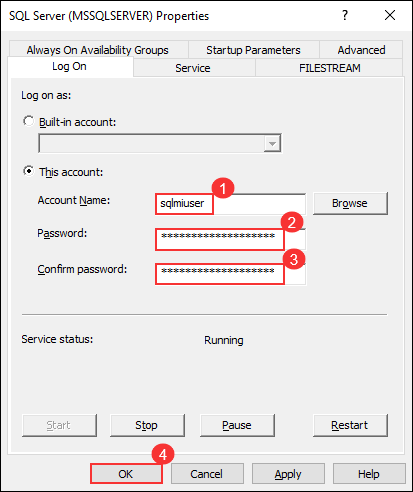

1. Select **Yes** in the Confirm Account Change dialog.

   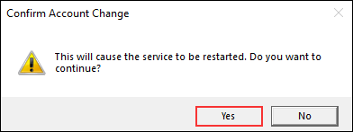
   
1. Click on **OK**.
 
1. Observe that the **Log On As** value for the SQL Server (MSSQLSERVER) service changed to `./sqlmiuser`.

   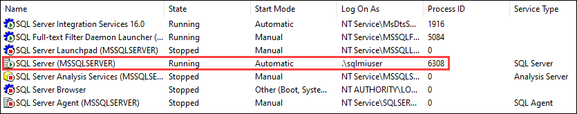

    >**Note**: If the change doesn't occur immediately, wait 1 to 2 minutes for the Log On As value for the SQL Server (MSSQLSERVER) service to change to `./sqlmiuser`.
    
1. Close the SQL Server Configuration Manager.

## Task 3: Create a backup of the WideWorldImporters database

In this task, you create a full backup of the `WideWorldImporters` database using SQL Server Management Studio (SSMS) and write it to the SMB network share you created in Task 1.

To perform online data migrations, DMS looks for database and transaction log backups in the shared SMB backup folder on the source database server. In this task, you create a backup of the `WideWorldImporters` database using SSMS and write it to the ```\\SQL2022\dms-backups``` SMB network share you made in a previous task. The backup file needs to include a checksum, so you add that during the backup steps.

1. On your **sql2022-<inject key="Suffix" enableCopy="false"/>** VM, select the **Start menu**, enter **sql server management (1)** in the search bar, and then select **SQL Server Management Studio 20 (2)** from the search results.

   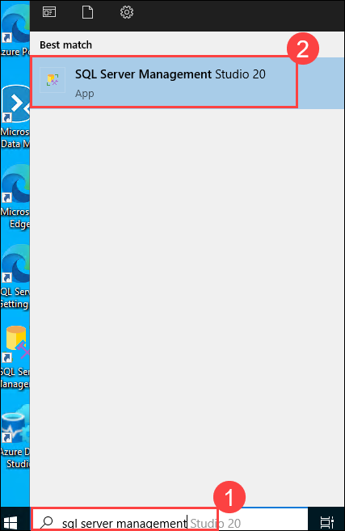

1. In the SSMS **Connect to Server** dialog, enter **SQLVM2022 (1)** into the Server name box, ensure **Windows Authentication (2)** is selected, check the box for **Trust server certificate (3)** and then select **Connect (4)**.

   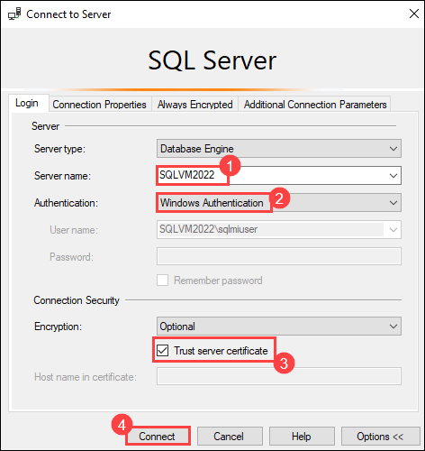

1. Once connected, expand **Databases** under **SQLVM2022** in the Object Explorer, and then right-click the **WideWorldImporters (1)** database. In the context menu, select **Tasks (2)** and then click on **Back Up... (3)**

   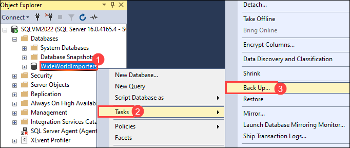

1. In the Back Up Database dialog, you should see `C:\WideWorldImporters.bak` listed in the Destinations box. This device is no longer needed, so select it and click **Remove**.

   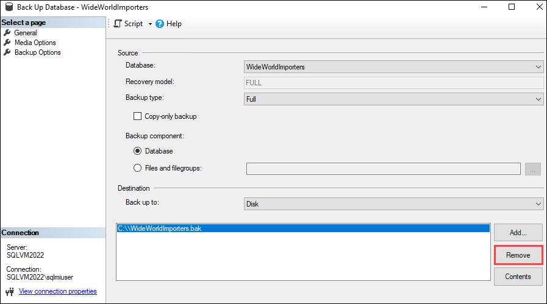

1. Next, select **Add** to add the SMB network share as a backup destination.

   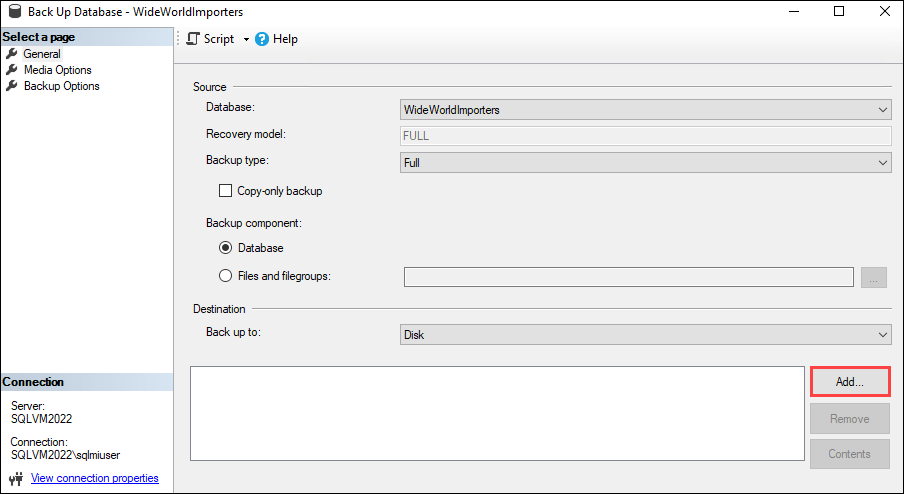

1. In the Select Backup Destination dialog, select the Browse **(`...`)** button.

   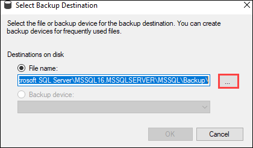

1. In the Location Database Files dialog, select the **`C:\dms-backups` (1)** folder, enter **WideWorldImporters.bak (2)** into the File name field, and then select **OK (3)**.

   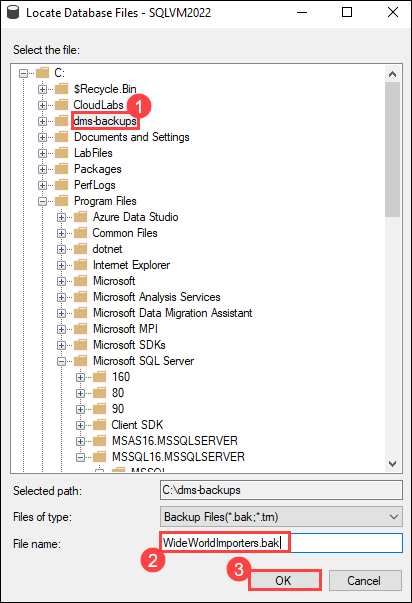

1. Select **OK** to close the Select Backup Destination dialog.

   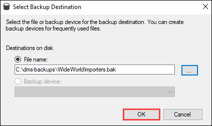

1. In the Back Up Database dialog box, select **Media Options (1)** in the Select a page pane, and then set the following:

   - Select **Back up to the existing media set** and then choose **Overwrite all existing backup sets (2)**.
   - Under **Reliability**, check the box for **Perform checksum before writing to media (3)**. A checksum is required by DMS when using the backup to restore the database to SQL MI. Then select **OK (4)** to perform the backup.

       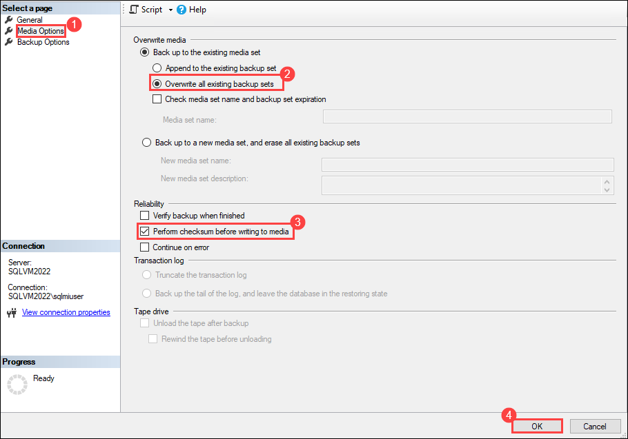

1. You will receive a message when the backup is complete. Select **OK**.

   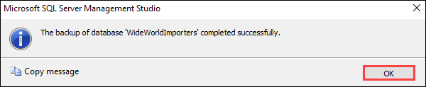

## Task 4: Retrieve SQL MI and SQL Server 2022 VM connection information

In this task, you use the Azure Cloud shell to retrieve the information necessary to connect to your sql2022-<inject key="Suffix" enableCopy="false"/> VM from DMS.

1. Navigate back to **Azure Portal**, select the **Azure Cloud Shell** icon from the top menu.

   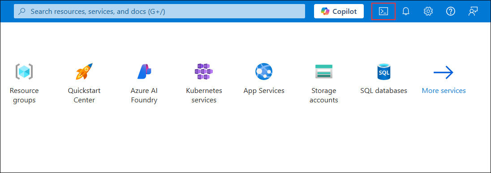

1. In the **Welcome to Azure Cloud Shell** window that opens at the bottom of your browser window, select **PowerShell**.

   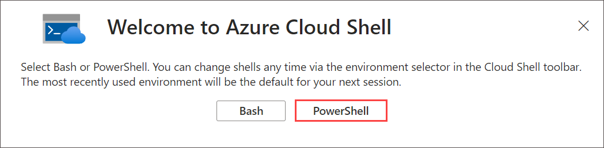

1. On the Getting Started , choose **Mount a storage account (1)**, select the **exisitng subscription (2)** then click on **Apply (3)**.

   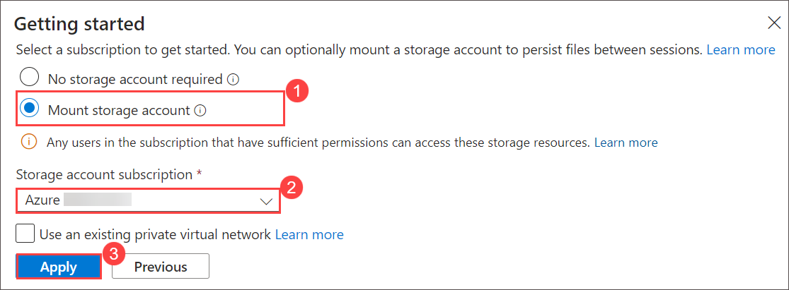

1. Choose **I want to create a storage account (1)** and click on **Next (2)**.

   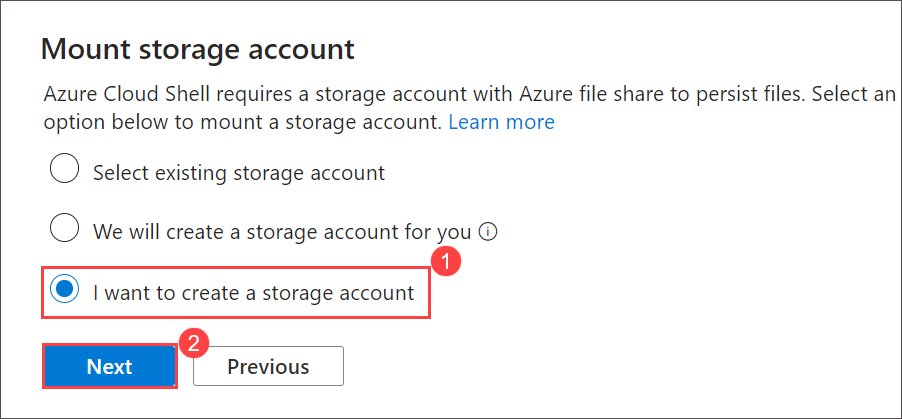

1. Specify the following values and click on **Create (6)** to create a storage account: 
      - Subscription: Accept the **default (1)**
      - Resource Group: Select **<inject key="Resource Group Name" enableCopy="false"/>** **(2)**
      - Region: **Central US (3)**
      - Storage account: **storage<inject key="Suffix" enableCopy="false"/>** **(4)**
      - File Share: **blob (5)**
      
         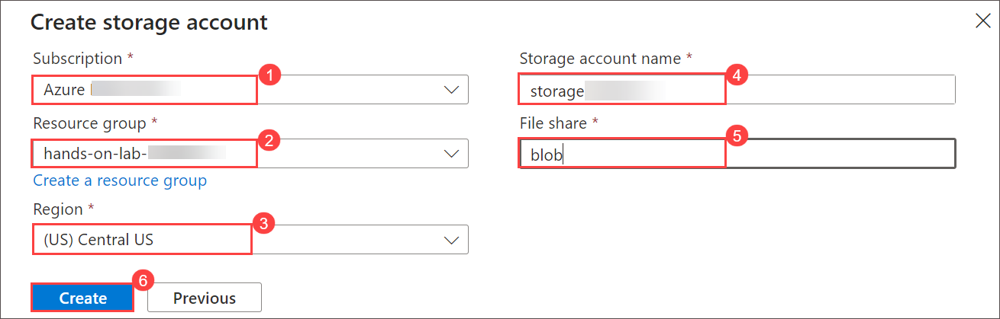

1. After a moment, a message is displayed that you have successfully requested a Cloud Shell, and you are presented with a PS Azure prompt.

   

1. At the prompt, run the below command to retrieve information about SQL MI in the SQLMI-Shared-RG resource group by entering the following PowerShell command.

   ```PowerShell
   $resourceGroup = "SQLMI-Shared-RG"
   az sql mi list --resource-group $resourceGroup
   ```

   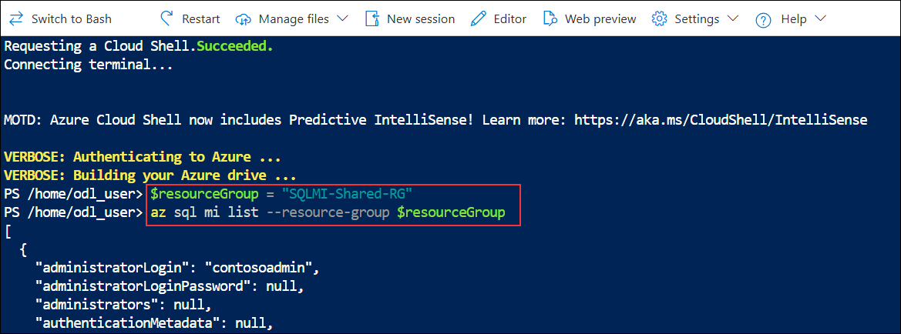

1. Within the above command's output, locate and copy the value of the **`fullyQualifiedDomainName`** property. Paste the value into a text editor such as Notepad.exe, which will be used in later steps, for reference below.

   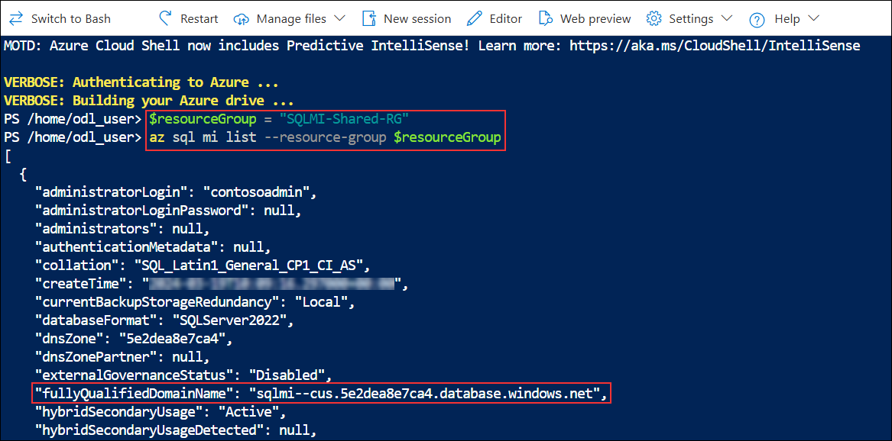

## Task 5: Create and run an online data migration project

In this task, you create a new online data migration project in DMS for the `WideWorldImporters` database.

To run the migration, you must first enable a system-assigned managed identity on the machine hosting the Integration Runtime, and then assign the Storage Blob Data Contributor role to that managed identity on the storage account. 

1. Navigate to the Azure Portal: [https://portal.azure.com](https://portal.azure.com). Search for **Virtual machines (1)** in te search bar and select **Virtual machines (2)** from the search results.

   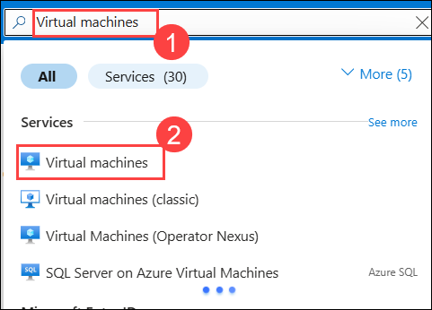

1. In the list of Virtual Machines, select the **JumpBox-<inject key="Suffix" enableCopy="false"/>** VM.

   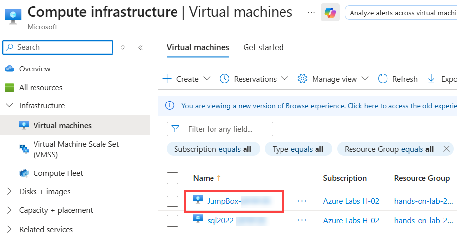

1. Go to **Identity (1)** under the **Settings** section in the left pane. Then, under the **System assigned** tab, select **On (2)** and click on **Save (3)** to enable the system-assigned managed identity.

   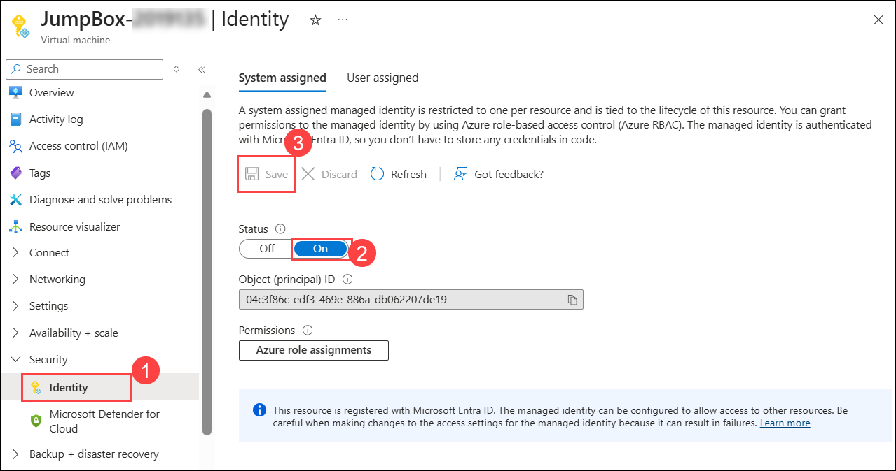

1. In the **Enable system assigned managed identity** pop up, click on **Yes**.

   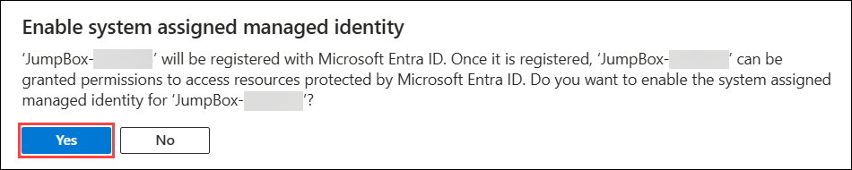

1. In the search bar, search for **Storage accounts (1)** and select **Storage accounts (2)** from the search results.

   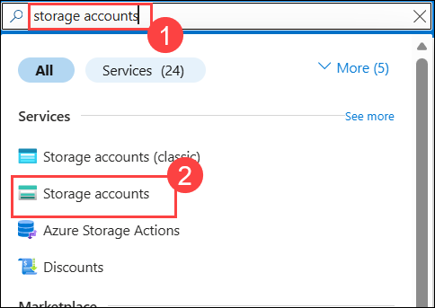

1. From the list of storage account, select **sqlmistore<inject key="Suffix" enableCopy="false"/>**.

   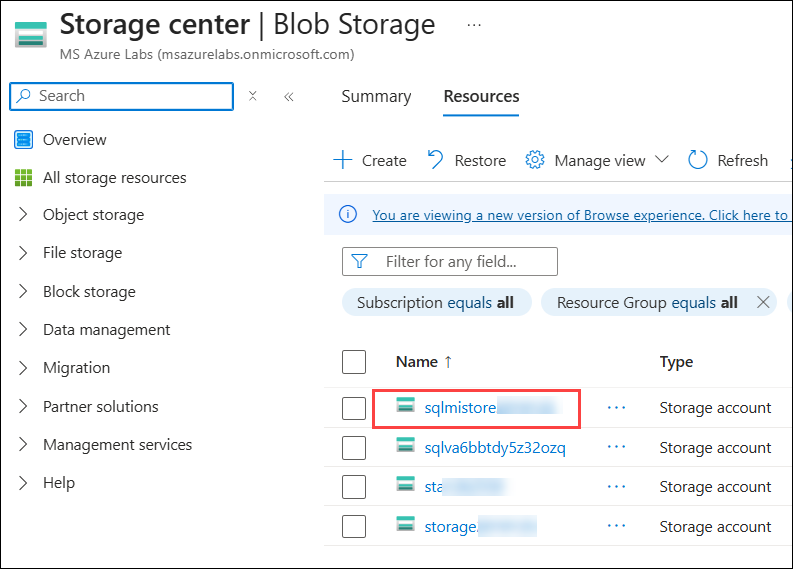

1. Select **Access control (IAM) (1)** from the left pane, and then select the **+ Add (2)** button and choose **Add role assignment (3)** from the drop-down menu.

   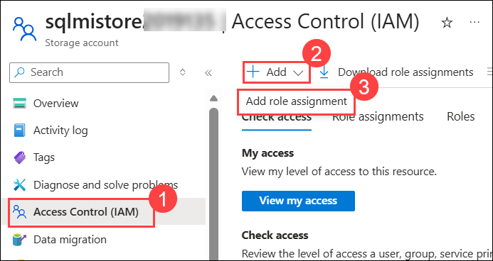

1. In the **Add role assignment** pane, set the following:

   - **Role**: Search for **Storage Blob Data Contributor (1)** and select the **Storage Blob Data Contributor (2)** and click on **Next (3).**
   - **Members**: Select **Managed identity (4)** and click on **Select members (5)**. Select **Virtual Machine (6)** and click on **JumBox-<inject key="Suffix" enableCopy="false"/> (7)** VM and click on **Select (8)**.
   - Click on **Review + assign (9)** and then click on **Review + assign** again to complete the role assignment.

      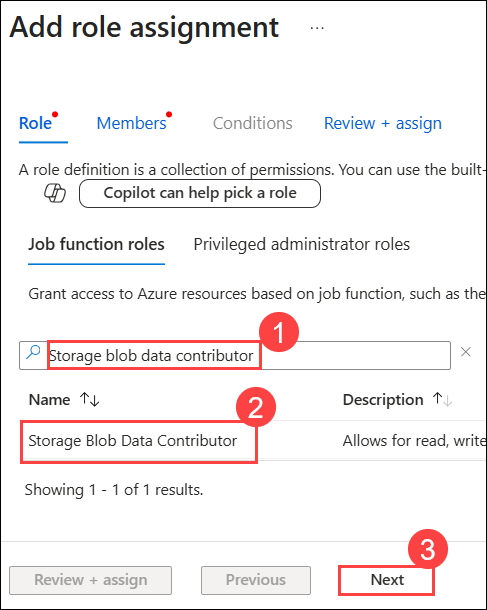

      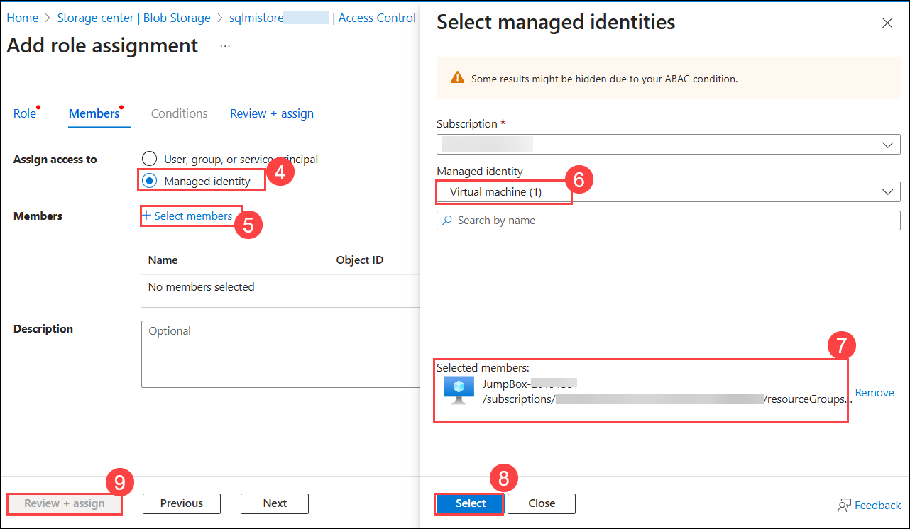      

1. Navigate back to **Azure Data Studio** in the **SQL VM**. Click on >  **SQLVM2022** **Azure SQL migration (1)** and select **+ New migration (2)**.

   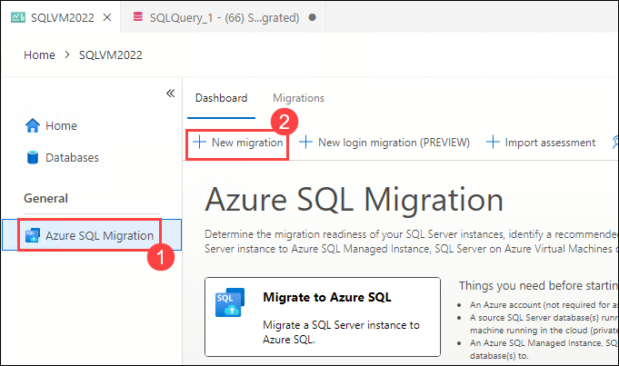

1. In **Step 1: Databases for assessment**, select **No (1)** for both tracking options. Choose the database **WideWorldImporters (2)** and then click **Next (3)** to continue.

   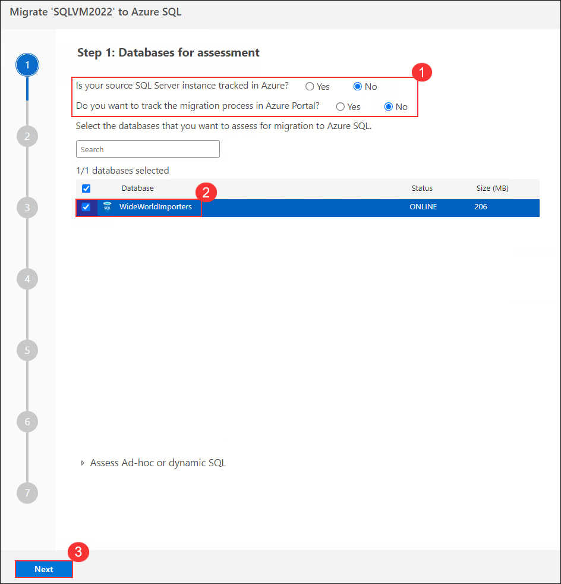

1. In **Step 2: Assessment summary and SKU recommendations (1)**, review the assessment results and recommended configurations for **Azure SQL Database, Azure SQL Managed Instance, and SQL Server on Azure Virtual Machine**. Click **Next (2)** to proceed.

   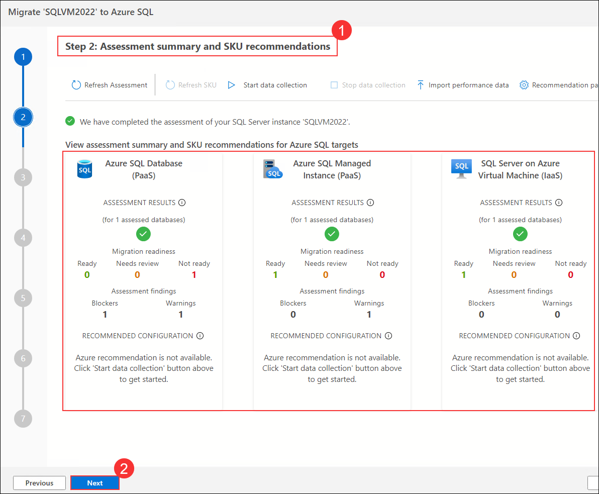

1. In **Step 3: Target Platform and Assessment Results**, Select **Azure SQL Managed Instance (1)** from the drop down. Ensure the **WideWorldImporters (2)** is selected under the Database option and click on the **Next**.

   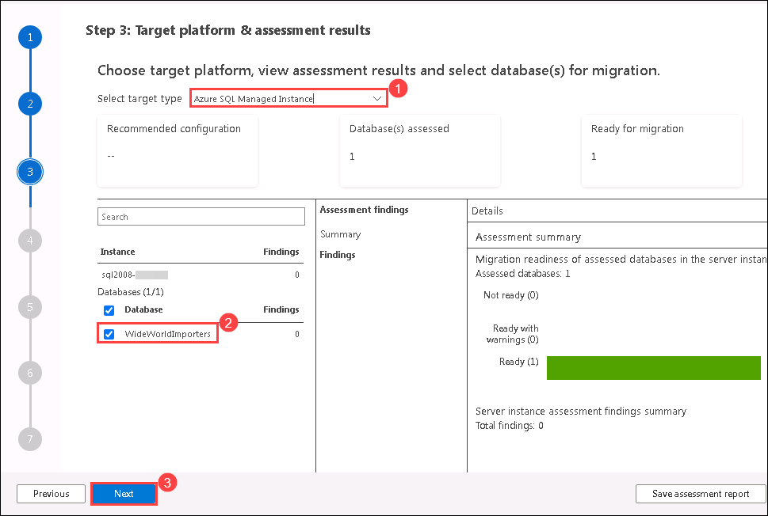

1. In **Step 4: Azure SQL target**, click **Link account** to add your Azure account.

   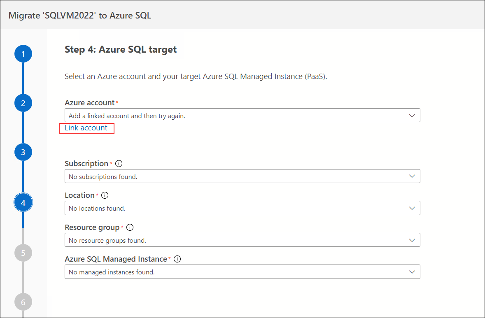

1. On the **Linked accounts** window, click **Add an account** to link your Azure account.

   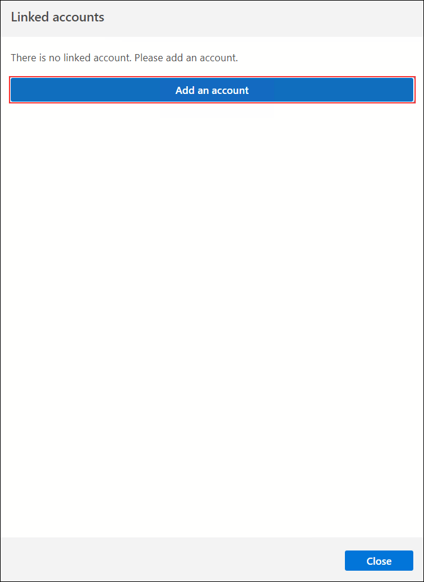
   
1. You'll be redirected to a web page, log in using your below **Azure credentials**. Once your account has been added successfully. go back to the Azure Data Studio, and click on **close**. 

   - **Email/Username**: <inject key="AzureAdUserEmail"></inject>
   - **Password**: <inject key="AzureAdUserPassword"></inject>

   >**Note:** If you receive any pop-up messages in the **Internet Explorer** window, click **OK** to dismiss them. Then, select the **Sign In** tab and enter your **Azure credentials**.  

1. Once your Azure account is listed under **Linked accounts**, click **Close** to return to the migration wizard.

   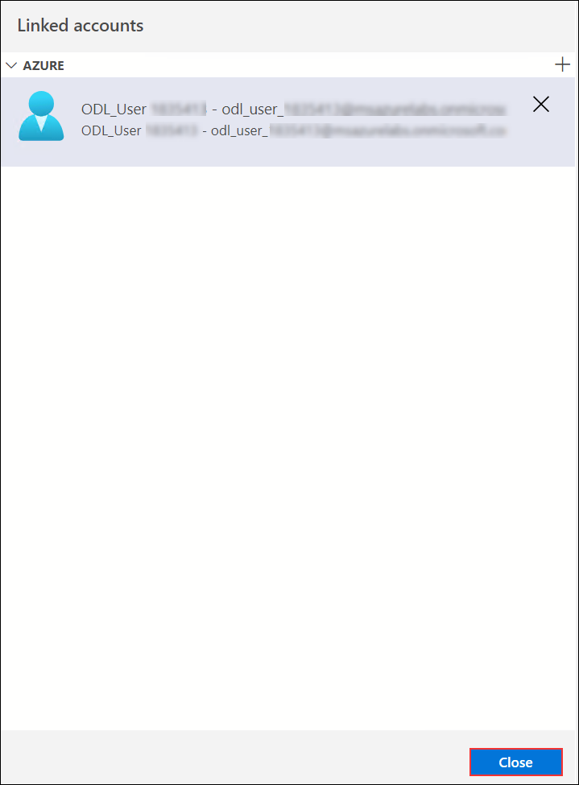

1. The field will be populated with the details, and click on **Next**. 

   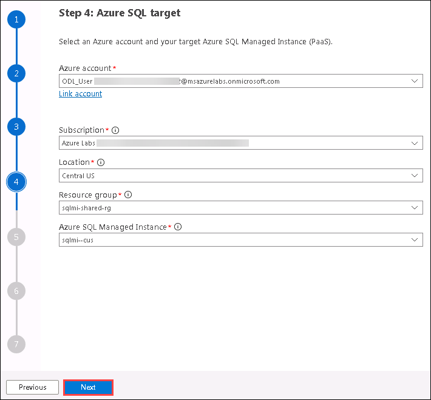

      > **Note**: If you encounter an error indicating that the **Azure SQL Managed Instance** is in a stopped state, please navigate to the Azure Portal, search for **Azure SQL Managed Instance**, and start the instance.

1. In **Step 5: Azure Database Migration Service** blade, select the following details:
   
   - Select **Online migration** **(1)**, 
   - Select the location of the database backups to use during migration: **My database backups are on a network share** **(2)**.
   - **Subscription**: Select the available Subscription **(3)**.
   - Click on **Create new (4)** under Azure Database Migration Service.

      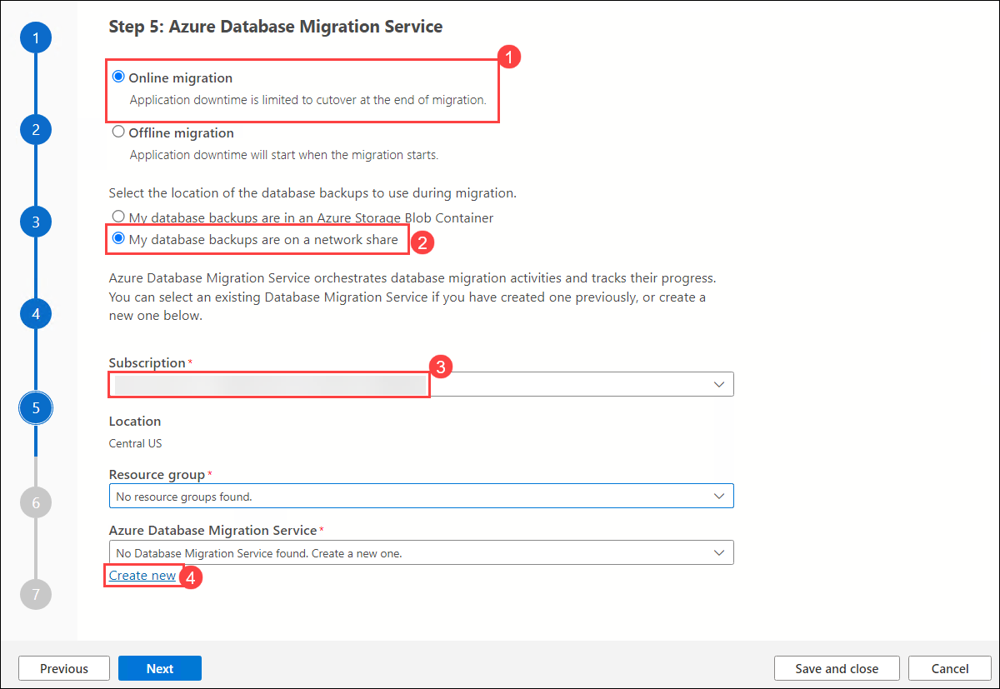 

      > **Note:** Continue creating a new Azure Database Migration Service even if a pre-existing one is already populated. The pre-existing service will not include the Deployment ID.
   
1. On the **Create Azure Database Migration Service** window, enter the following details and click on **Create (3)**:

   - **Resource Group:** Select **hands-on-lab-<inject key="Suffix" enableCopy="false"/>** **(1)**
   - **Name:** Enter **wwi-dms-<inject key="Suffix" enableCopy="false"/>** **(2)**

      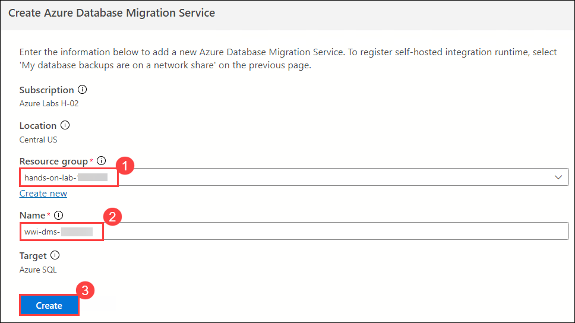

1. On the **Create Azure Database Migration Service** widnow, scroll down to **Configure integration Runtime** select **I want to set up self-hosted integration runtime on another Windows machine that is not my local machine** **(1)** scroll down till Configure manually expand **Configure manually** **(2)**, copy any of the **Authentication keys** **(3)** to the notepad as it will be used later in the task, and minimize the **Azure Data Studio**.  

   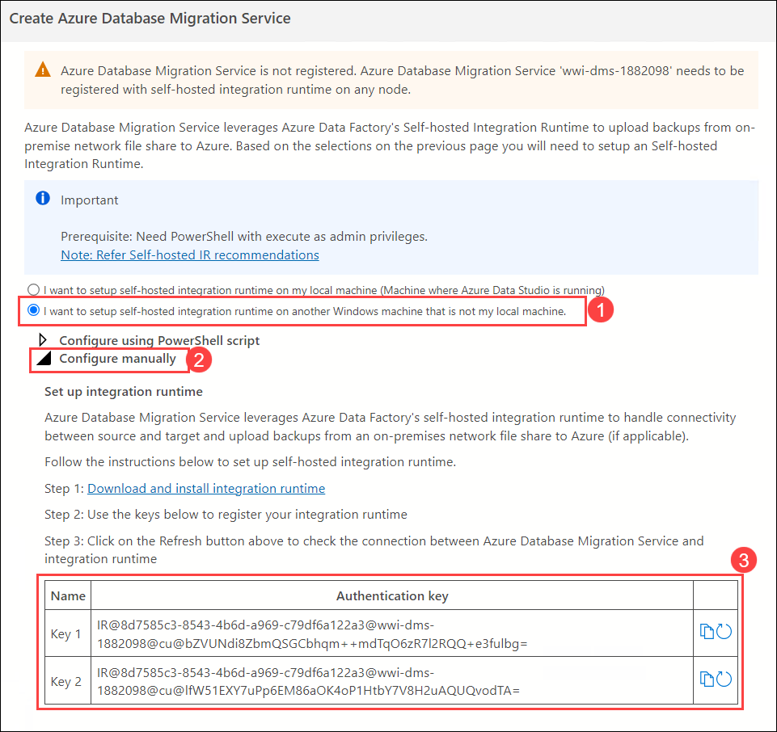
   
    >**Note**: Don't close/cancel Azure Data Studio.

1. Navigate to the **Lab VM**, in the search bar, search for **Microsoft Integration Runtime (1)** and select **Microsoft Integration Runtime (2)**.
   
   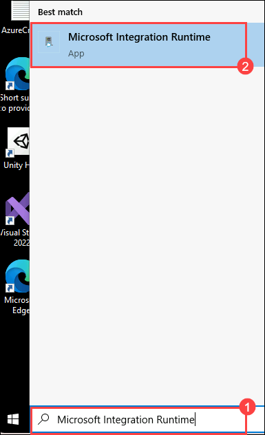

1. In the **Register Integration Runtime (Self-hosted)** window, paste any one of the **Authentication Keys (Key 1 or Key 2) (1)** that you copied earlier, and then click **Register (2)**.

   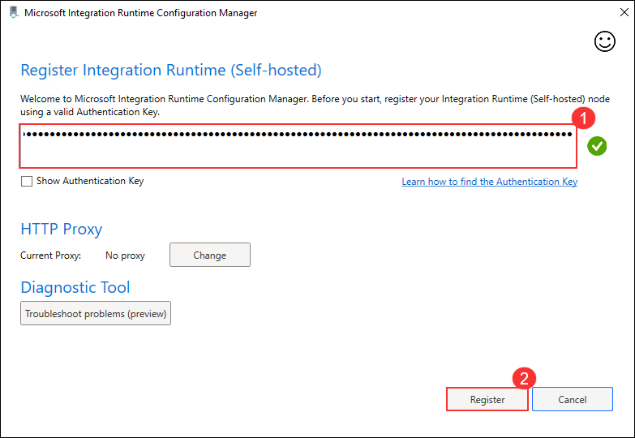

1. In the New Integration Runtime (Self-hosted) Node, leave the default and click on **Finish**.

   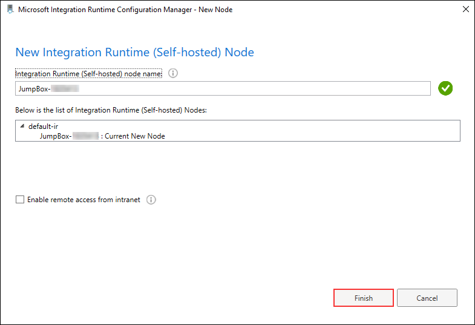

1. Wait for the **Register Integration Runtime** to be successful before continuing further.

   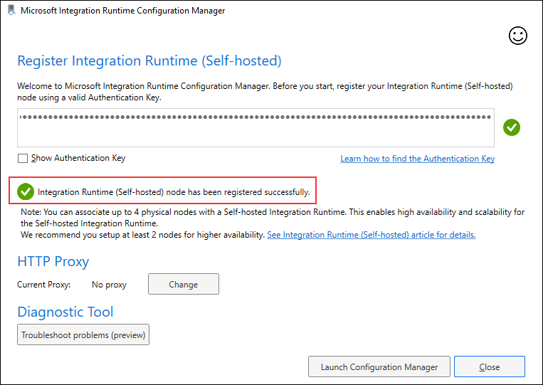

1. Navigate back to the **Azure Data Studio** in **SQL VM**, click on **Done** on the **Create Azure Database Migration Service** window. 

   

1. In the **Step 5: Azure Database Migration Service** notice the **Resource group (1)** name and the **Azure Database Migration Service (2)** name will be selected. Click on **Refresh** **(3)** button you can view the **connected nodes** **(4)** and click on **Next** **(5)**. 

   

1. In **Step 6: Data source configuration** blade, enter the following details and click on **Run Validation** **(8)**:

      - **Password**: Enter **Password.1234567890** **(1)**
      - **Windows user account with read access to the network share location**: Enter **SQL2022-<inject key="Suffix"  enableCopy="false"/>\sqlmiuser** **(2)** 
      - **Password**: Enter **Password.1234567890** **(3)**
      - **Resource Group**: Select **hands-on-lab-<inject key="Suffix"  enableCopy="false"/>** **(4)**
      - **Storage account**: Select the **sqlmistore<inject key="Suffix"  enableCopy="false"/>** **(5)** storage account. 
      - **Target database name**: Enter **WideWorldImporters<inject key="Suffix"  enableCopy="false"/>** **(6)**.
      - **Network share path**: Enter **\\\SQLVM2022\dms-backups** **(7)**.

         

         

1. On the **Running Validation** window, wait till all the validation steps are successful, then click on **Done**.

   

   >**Note**: If any of the validations fails, recheck all the provided configurations and rerun the validation again.

1. Once you back to **Step 6: Data source configuration** blade, click on **Next**.

   

1. In **Step 7: Summary** blade, click on **Start migration** .

   

1. Click on **Migrations (1)**, from the dropdown menu set Status to **Status: All (2)**, feel free to **Refresh (3)** till the migration status is **Ready for cutover (4)**. 
    
    

   >**Note**: It may take 10 to 15 minutes , please wait till the migration status is **Ready for cutover**.

## Task 6: Perform migration cutover

Since you performed an "online data migration," the migration wizard continuously monitors the SMB network share for newly added log backup files. Online migrations enable any updates on the source database to be captured until you initiate the cutover to the SQL MI database. In this task, you add a record to one of the database tables, backup the logs, and complete the migration of the `WideWorldImporters` database by cutting over to the SQL MI database.

1. From the **Azure portal**, navigate to **hands-on-lab-<inject key="Suffix" enableCopy="false"/>** resource group and search for **wwi-dms-<inject key="Suffix" enableCopy="false"/>** Database Migration Services and select.

   

1. In **wwi-dms-<inject key="Suffix" enableCopy="false"/>** Overview page, click on **Migrations (1)**, and selct **SQLVM2022 (2)** under **Source name**.
  
   

1. On the WideWorldImporters screen, note the status of **Restored** for the `WideWorldImporters.bak` file.

   
   
1. Navigate back to the **Azure Data studio**, right click on **SQLVM2022 (1)**, select **New Query (2)**.

   

1. Paste the following SQL script, which inserts a record into the `Game` table, into the new query window:

   ```SQL
   USE WideWorldImporters;
   GO

   INSERT [dbo].[Game] (Title, Description, Rating, IsOnlineMultiplayer)
   VALUES ('Space Adventure', 'Explore the universe with our newest online multiplayer gaming experience. Build custom rocket ships and take off for the stars in an infinite open-world adventure.', 'T', 1)
   ```

1. To run the script, select **Run** from the Azure Data Studio toolbar.

1. Click on **SQLVM2022**, select **New Query** again in the toolbar, and paste the following script into the new query window. It creates a backup of the 
   transaction logs for the WideWorldImporters database, verifies data integrity with a checksum, and stores the backup file at the specified location, while also allowing the Data 
   Migration Service (DMS) to detect the new backup for potential transfer and migration.

   ```SQL
   USE master;
   GO

   BACKUP LOG WideWorldImporters
   TO DISK = 'c:\dms-backups\WideWorldImportersLog.trn'
   WITH CHECKSUM
   GO
   ```

1. To run the script, select **Run** from the Azure Data Studio toolbar.

1. Return to the migration status page in the Azure portal. On the WideWorldImporters screen, select **Refresh**, and you should see the **WideWorldImportersLog.trn** file appear with a status of **Queued**.

   

   > **Note**: It can take few minutes to show the transaction logs entry. Try refreshing every 10-15 seconds until it appears.

1. Continue selecting **Refresh**, and you should see the **WideWorldImportersLog.trn** status change to **Uploaded**.

   
     
1. After the transaction logs are uploaded, they are restored to the database. Once again, continue selecting **Refresh** every 10-15 seconds until you see the status change to **Restored**, which can take a minute or two.

   
     
1. Navigate back to the **Azure Data studio**, click on **SQLVM2022 (1)**, select **Azure SQL Migration (2)**, click on **Migrations (3)** and select **WideWorldImporters (4)** under source database. 

   

1. After verifying the transaction log status of **Restored (1)**, select **Complete cutover (2)**.

   

1. On the Complete cutover dialog box, verify that log backups pending restore is `0`, check **I confirm there are no additional log backups to provide and want to complete cutover**, and then select **Complete cutover**.

   .png)

   > **Note:** It may take about 5 minutes to complete the cutover process.

1. Move back to the Migration blade, and verify that the migration status of WideWorldImporters has changed to **Succeeded**. You should refresh a couple of times to see the status as Succeeded.

   

1. You can also view the migration status in the Azure portal. Return to the wwi-sqldms blade of Azure Database Migration Service, click on **Migrations** ensure that Migration status is **Succeeded**. You might have to refresh to view the status.

   

1. You have successfully migrated the `WideWorldImporters` database to Azure SQL Managed Instance.

> **Congratulations** on completing the task! Now, it's time to validate it. Here are the steps:
- If you receive a success message, you can proceed to the next task.
- If not, carefully read the error message and retry the step, following the instructions in the lab guide.
- If you need any assistance, please contact us at cloudlabs-support@spektrasystems.com. We are available 24/7 to help you out.
    
<validation step="4ed94186-c596-4679-9454-3df0065f9ca3" />

## Task 7: Verify database and transaction log migration

In this task, you connect to the SQL MI database using SSMS and quickly verify the migration.

1. Return to SSMS on your **sql2022-<inject key="Suffix" enableCopy="false"/>** VM, select **Connect (1)** and click on **Database Engine... (2)** from the Object Explorer menu.

   

1. In the Connect to Server dialog, enter the following and click on **Connect** **(6)**:

   - **Server name** **(1)**: Enter the fully qualified domain name of your SQL-managed instance, which you copied from the **Azure Cloud Shell** previously in **Task 4**.
   - **Authentication**: Select **SQL Server Authentication (2)**.
   - **Login**: Enter `contosoadmin` **(3)**
   - **Password**: Enter `IAE5fAijit0w^rDM` **(4)**
   - Check the **Remember password** **(5)** box.

      
 
1. The **SQL MI** connection appears below the sql2022-<inject key="Suffix" enableCopy="false"/> connection. Expand Databases the SQL MI connection and select the **<inject key="Database Name" /> (1)** database.

1. With the **<inject key="Database Name" enableCopy="false"/>** database selected, select **New Query (2)** on the SSMS toolbar to open a new query window. and enter the following SQL script **(3)**:

   > **Note**: Make sure to replace the **SUFFIX** value with **<inject key="Suffix" />**

      ```SQL
      USE WideWorldImportersSUFFIX;
         GO

         SELECT * FROM Game
      ```  

   

1. Select **Execute** on the SSMS toolbar to run the query. Observe the records contained within the `Game` table, including the new `Space Adventure` game you added after initiating the migration process.

   

> **Congratulations** on completing the task! Now, it's time to validate it. Here are the steps:
- If you receive a success message, you can proceed to the next task.
- If not, carefully read the error message and retry the step, following the instructions in the lab guide.
- If you need any assistance, please contact us at cloudlabs-support@spektrasystems.com. We are available 24/7 to help you out.

<validation step="55806acb-164b-484c-a078-c15995984e0a" />

## Summary

In this exercise, you migrated the `WideWorldImporters` database from a SQL Server 2022 VM to Azure SQL Managed Instance using Azure Database Migration Service (DMS). You created an SMB network share, configured the SQL Server service to run under a specific user account, backed up the database, and set up an online data migration project. After performing the migration cutover, you verified that the database and transaction logs were successfully migrated to SQL MI.

### You have successfully completed the exercise. Now click on **Next >>** from the lower right corner to move on to the next exercise.


