# Exercise 3: Update the web application to use the new SQL MI database

### Estimated Duration: 30 Minutes

## Lab Scenario

In this exercise, you will deploy a web app to Azure and update its App Service configuration. This process involves setting up the web app in the Azure environment and configuring the necessary settings to ensure it runs smoothly. By the end of this lab, you will have a fully deployed and configured web app on Azure, ready for use.

## Lab Objectives

In this exercise, you will complete the following tasks:

- Task 1: Deploy the web app to Azure
- Task 2: Update App Service configuration

    > **Note**: Azure SQL Managed Instance has a private IP address in a dedicated VNet, so to connect an application, you must configure access to the VNet where the Managed Instance is deployed. To learn more, read Connect your application to Azure SQL Managed Instance `https://docs.microsoft.com/azure/azure-sql/managed-instance/connect-application-instance`.

## Task 1: Deploy the web app to Azure

1. Navigate to your **Lab VM** desktop.

1. In the File Explorer dialog, navigate to the `C:\hands-on-lab\MCW-Migrating-SQL-databases-to-Azure-master\Hands-on lab\lab-files`. In the **lab-files** folder, double-click **WideWorldImporters.sln** to open the solution in **Visual Studio**.

   

1. If prompted **How you want to open the file?**, select **Visual Studio 2022 (1)** and then click **OK (2)**.

    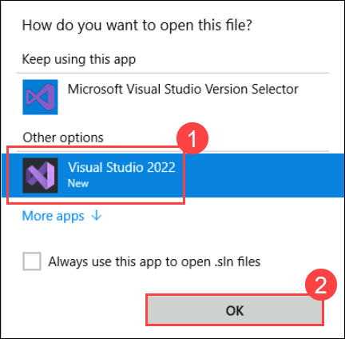

1. Select **Sign in with Microsoft** and choose **Work or school account (1)**, click **Continue (2)** and enter the following **Azure account** credentials if prompted:
   
   * Email/Username: <inject key="AzureAdUserEmail"></inject>
   * Password: <inject key="AzureAdUserPassword"></inject>

     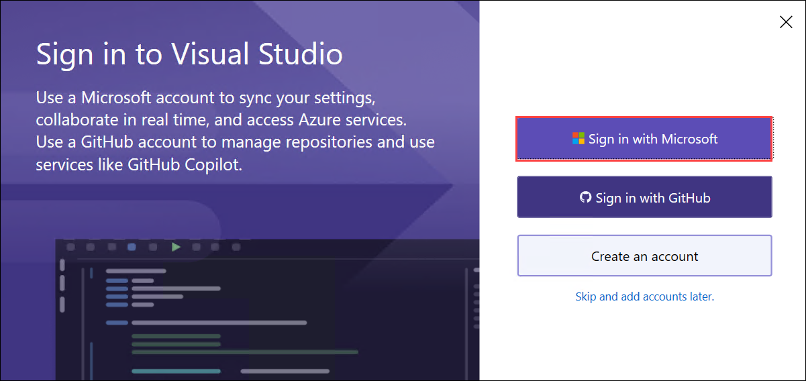

     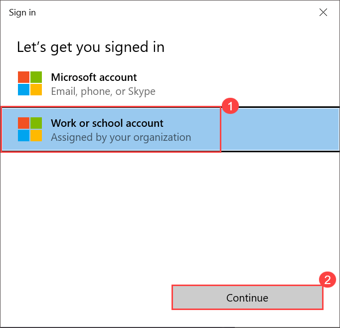

1. On the **Sign in to app apps, websites, and services on this device?** pop-up, click on **No**. Then, on the **Account added to this device** page, select **Done**. 

    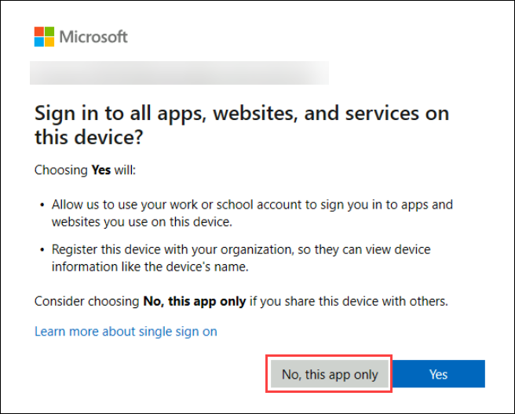

1. Once you sign in, click on **Start Visual Studio**.

    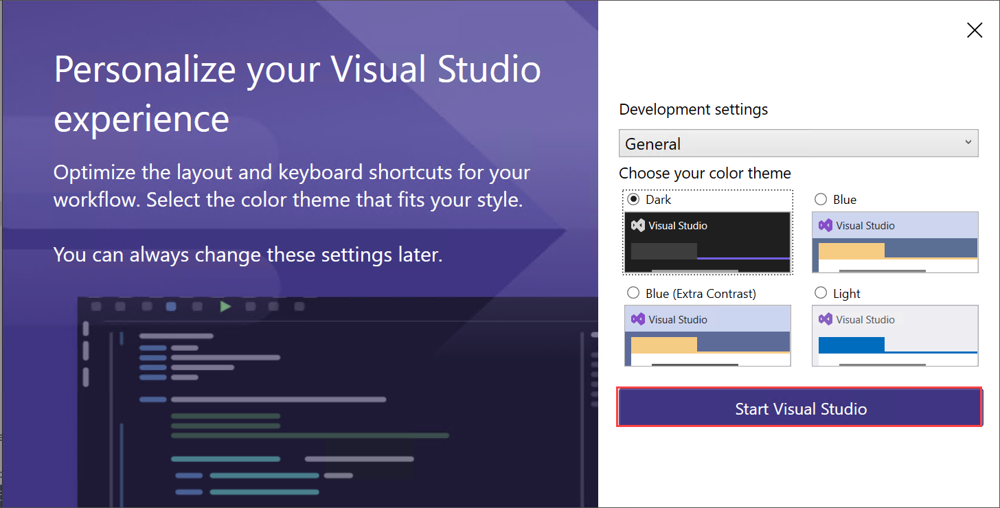

    >**Note:** If you are prompted with **ASP.Net and Web development** installer, select **Install**. This process may take a few minutes and open Visual Studio once the installation is complete.

    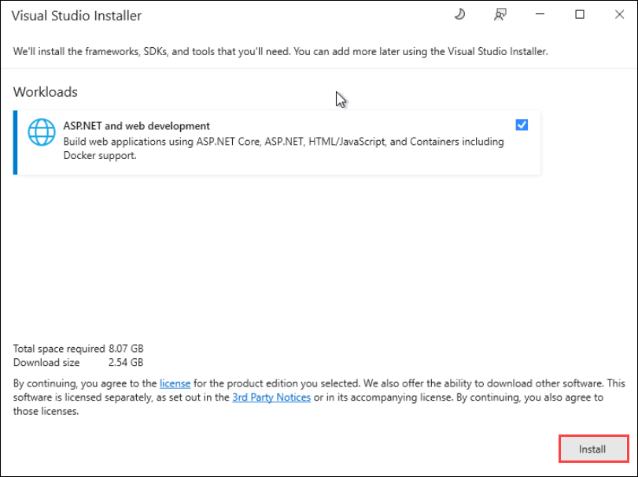

1. If you are prompted with a security warning, uncheck **Ask me for every project in this solution (1)**, and then select **OK (2)**.

    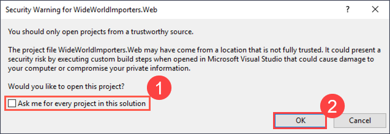

1. Once logged into **Visual Studio**, in the **Solution Explorer** on the right side, right-click the **WideWorldImporters.Web (1)** project, and then select **Publish (2)** from the context menu.

    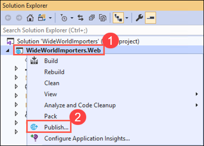

    >**Note:** If you see the **WideWorldImporters.Web (unloaded)** project, right-click on it and select **Reload Project**.

    > **Note:** If the project does not load even after clicking **Reload Project**, click **Install** under the prompt to install the required extra components and .NET framework (this process may take about 5 minutes). After installation, retry loading the project by right-clicking it and selecting **Reload Project**.

1. On the **Publish** dialog box, select **Azure (1)** in the **Target** box, and click **Next (2)**.

    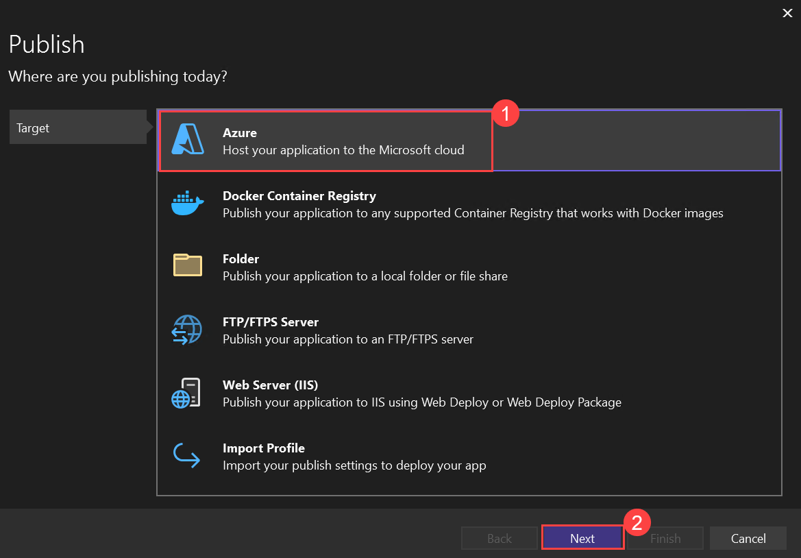

1. Next, in the **Specific target** box, select **Azure App Service (Windows) (1)** and click **Next (2)**.

    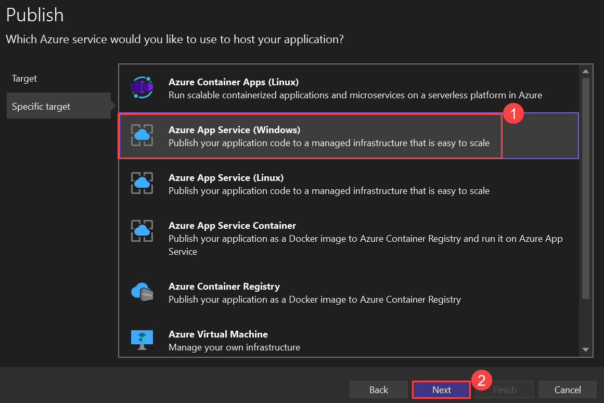

1. Finally, in the **App Service** box, select your **subscription (1)**, expand the **hands-on-lab-<inject key="Suffix" enableCopy="false"/>** resource group, and select the **wwi-web-<inject key="Suffix" enableCopy="false"/> (2)** Web App then click on **Finish (3)**.

    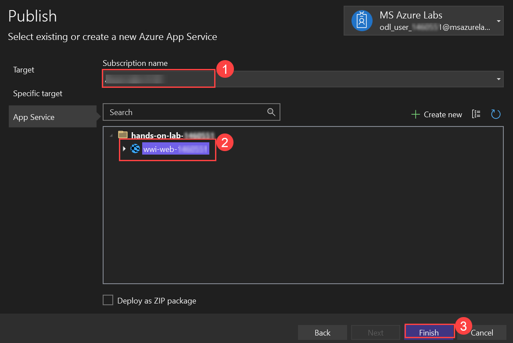

1. Once completed, click on **Close**.

    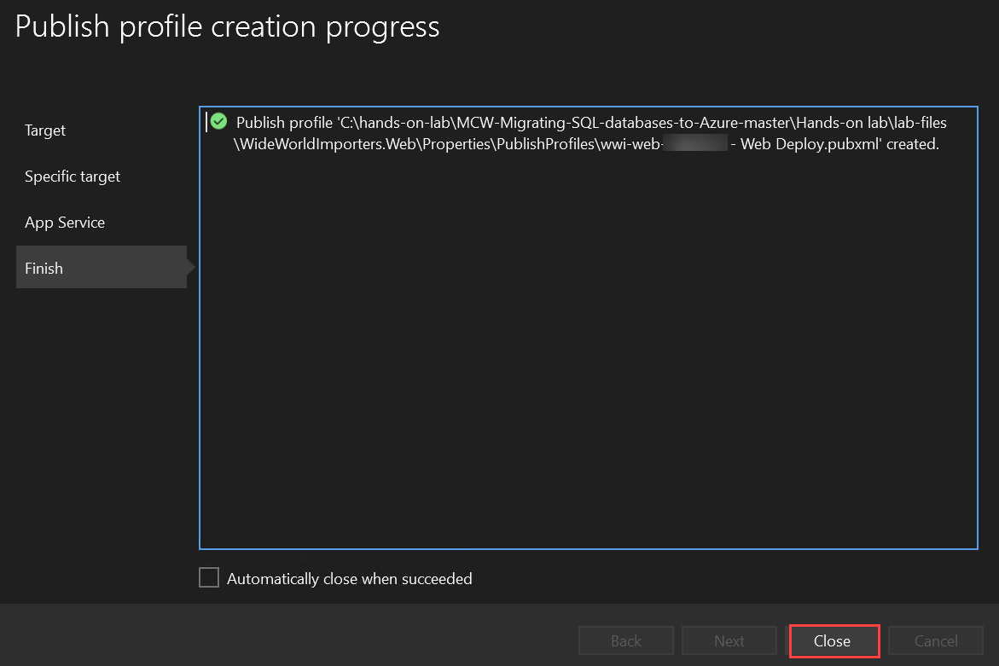

1. Back on the Visual Studio Publish page for the `WideWorldImporters.Web` project, select **Publish** to start the process of publishing your Web API to your Azure API App.

    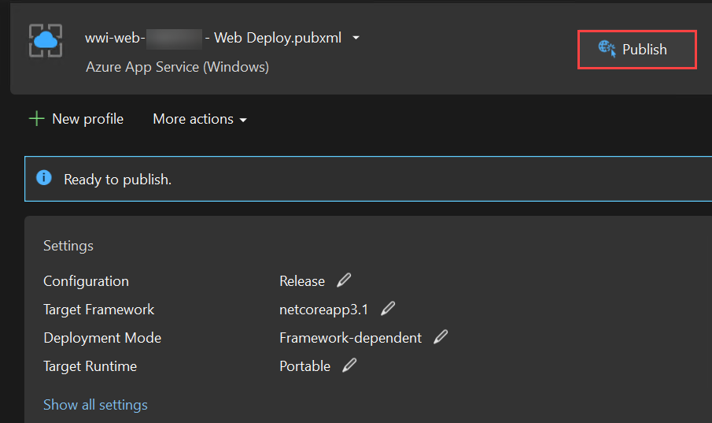

1. When the publish completes, you will see a message on the Visual Studio Output page that the **Publish Succeeded**.

    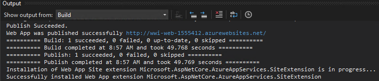

1. If you select the link of the published web app from the Visual Studio output window, an error page is returned because the database connection strings have not been updated to point to the SQL MI database. You address this in the next task.

    

## Task 2: Update App Service configuration

In this task, you update the WWI gamer info web application to connect to and utilize the SQL MI database.

1. Navigate back to the Azure portal, search for **Resource groups (1)** and select **Resource groups (2)** from the results.

   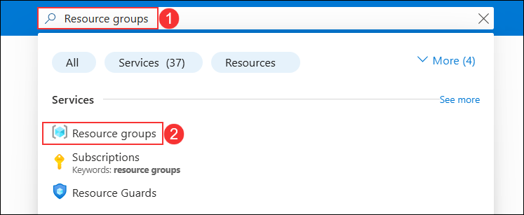

1. Select the **<inject key="Resource Group Name" enableCopy="false"/>** resource group from the list.

     .png)
 
1. Select the **wwi-web-<inject key="Suffix" enableCopy="false"/>** App Service from the list of resources.

   

1. From the left navigation pane, select **Environment variables** **(1)** under Settings, select **Connection strings** **(2)** and click on **Advanced edit** **(3)**.

   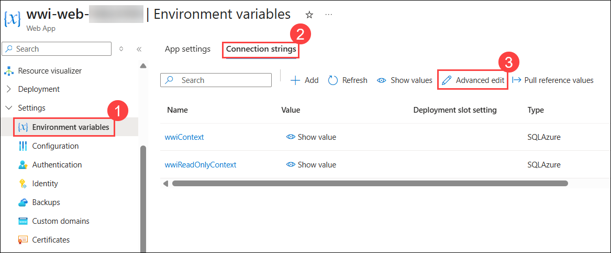

1. Replace the **value** of the connection string of both `wwiContext` and `WwiReadOnlyContext` with the below-mentioned **value**: 

    ``
    Server=tcp:your-sqlmi-host-fqdn-value,1433;Database=WideWorldImportersSuffix;User ID=contosoadmin;Password=IAE5fAijit0w^rDM;Trusted_Connection=False;Encrypt=True;TrustServerCertificate=True;
    ``
1. Now, replace `your-sqlmi-host-fqdn-value` with the fully qualified domain name for your **SQL MI** that you copied to a text editor earlier from the **Azure Cloud Shell**, and replace the `Suffix` with value: **<inject key="suffix" />** and select **OK**.

    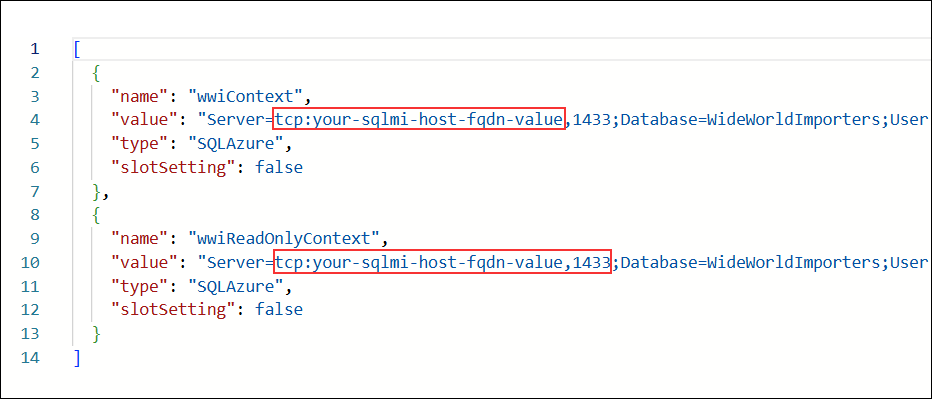

    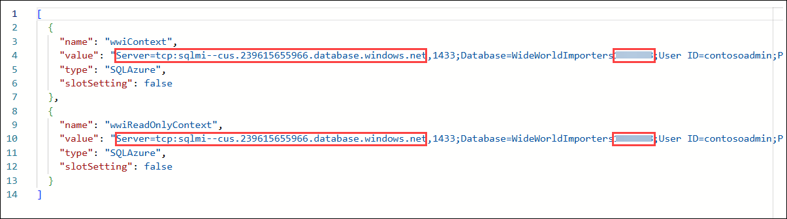

    >**Note**: Copy the name and value of both **`wwiContext`** and **`WwiReadOnlyContext`** and paste them into a text editor; they will be used in a later step.
   
1. Click on **Apply** and then select **Confirm**. 

   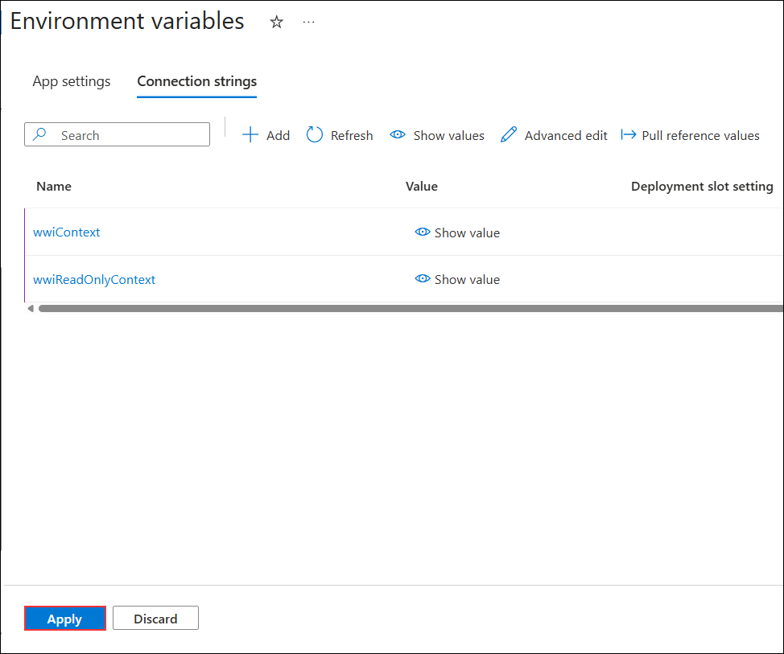

   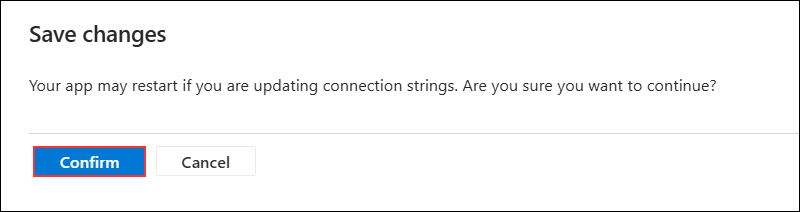
     
1. Back on **wwi-web-<inject key="Suffix" enableCopy="false"/>**, select **Environment variables** **(1)** under Settings, select **App settings** **(2)** and click on **+ Add** **(3)**.

      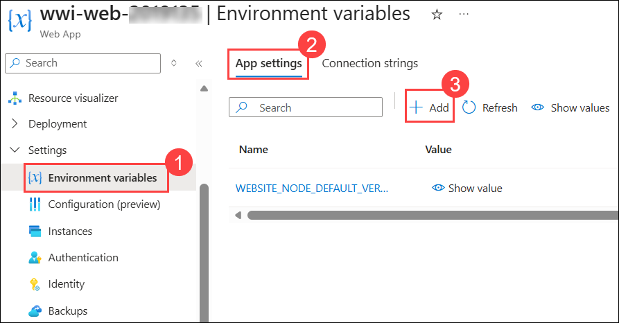
    
1. Add the **Name** as `wwiContext` and **Value** which you recorded in Notepad and click on **Apply**.

    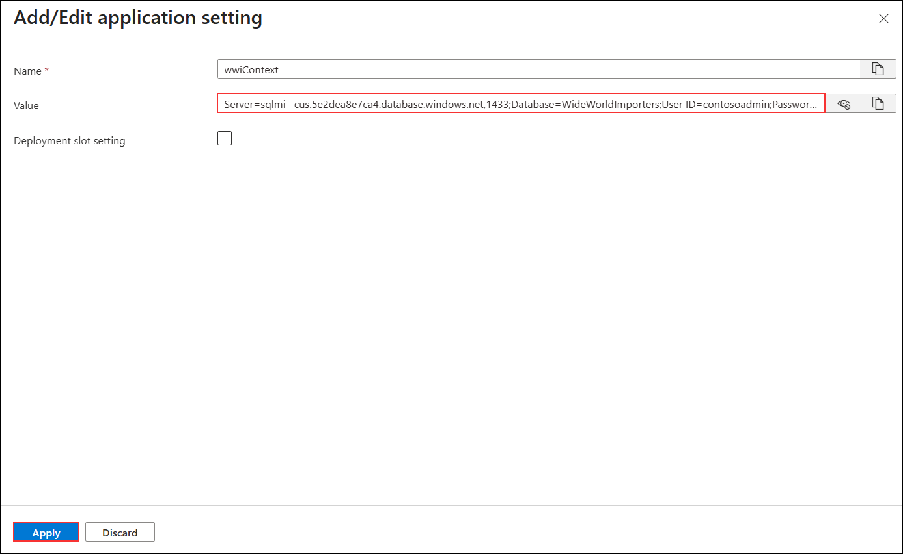

1. Repeat above step for `wwiReadOnlyContext` and paste the **Name** and **Value** which you recorded in notepad and click on **Apply**.

      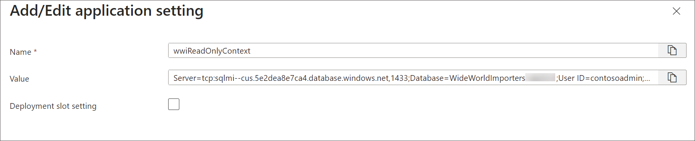

1. Click on **Apply**.

1. When prompted that your app may restart if you are updating connection strings. Are you sure you want to continue?, Select **Confirm**.

     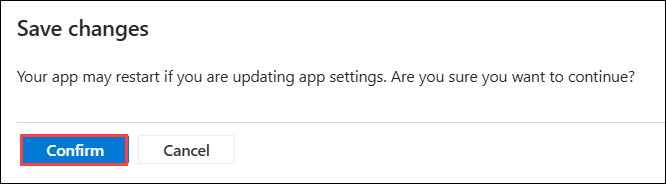

1. From the left menu, select **Overview** to return to the **Overview** blade of your **App Service**. Then, click on **Default Domain** in the Overview blade. Still result in an error being returned. The error occurs because the SQL Managed Instance has a private IP address in its VNet. To connect an application, you need to configure access to the VNet where the Managed Instance is deployed, which you handle in the next exercise.

    
    
    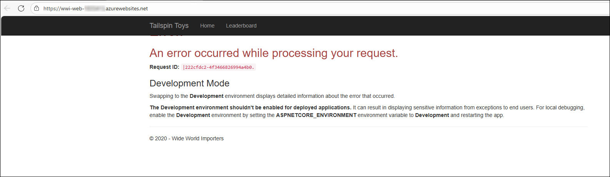

> **Congratulations** on completing the task! Now, it's time to validate it. Here are the steps:
- If you receive a success message, you can proceed to the next task.
- If not, carefully read the error message and retry the step, following the instructions in the lab guide.
- If you need any assistance, please contact us at cloudlabs-support@spektrasystems.com. We are available 24/7 to help you out.
    
<validation step="f23ada59-1fcd-4778-a213-dd10679a3f43" />

## Summary

In this exercise, you have deployed a web app to Azure and updated its App Service configuration.

### You have successfully completed the exercise. Now click on **Next >>** from the lower right corner to move on to the next exercise.

