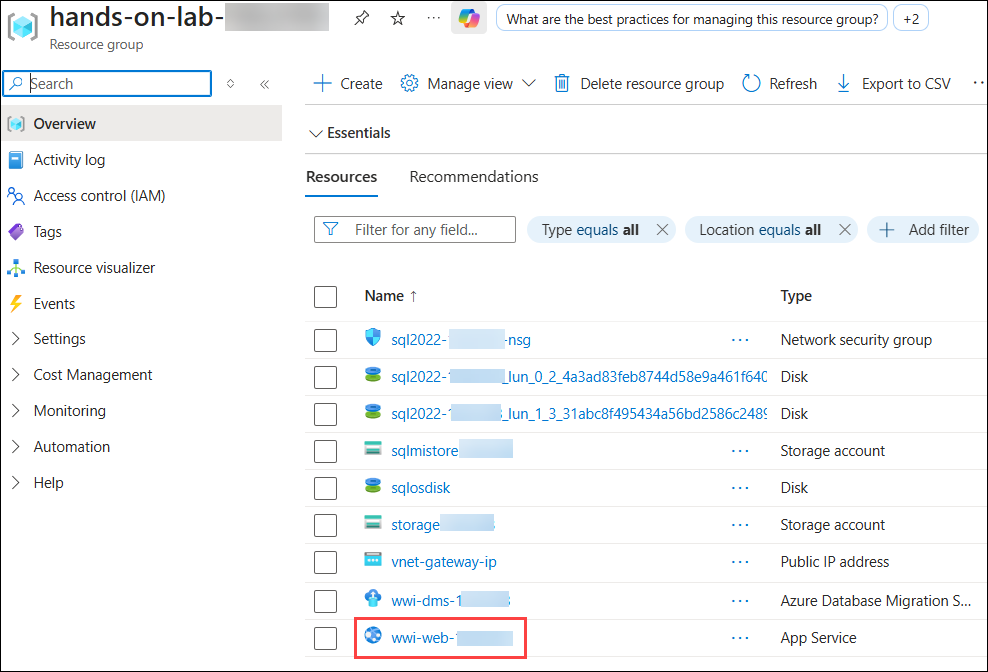
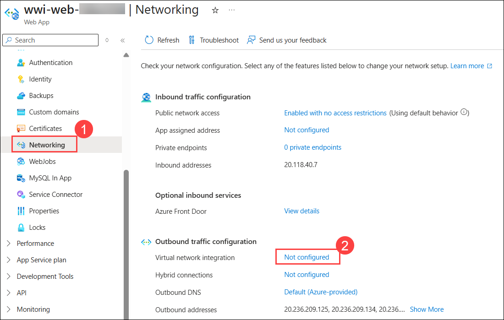
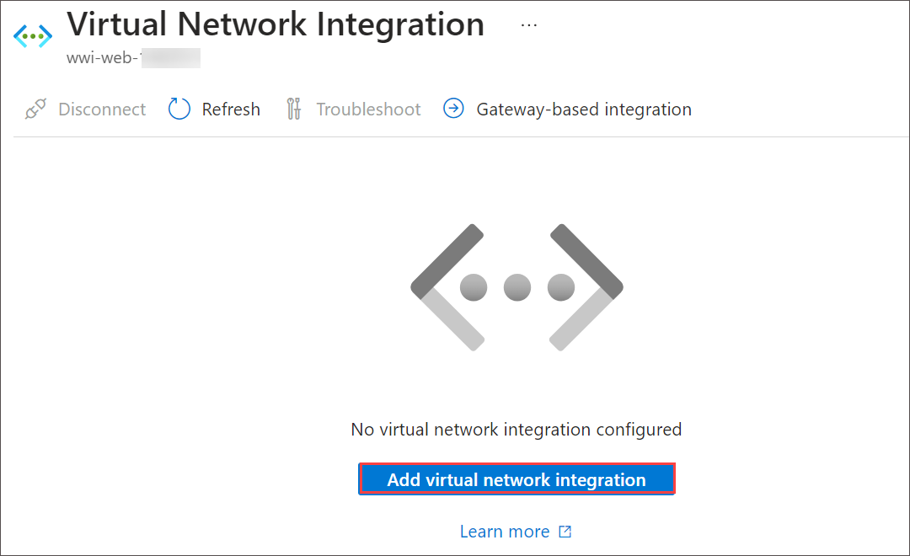
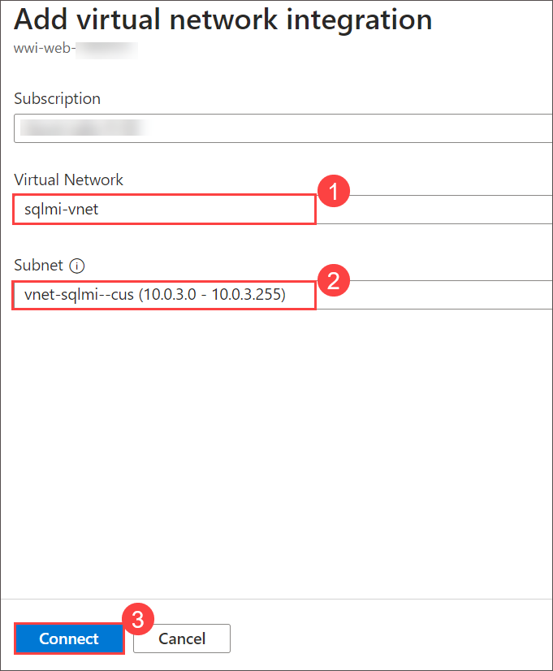
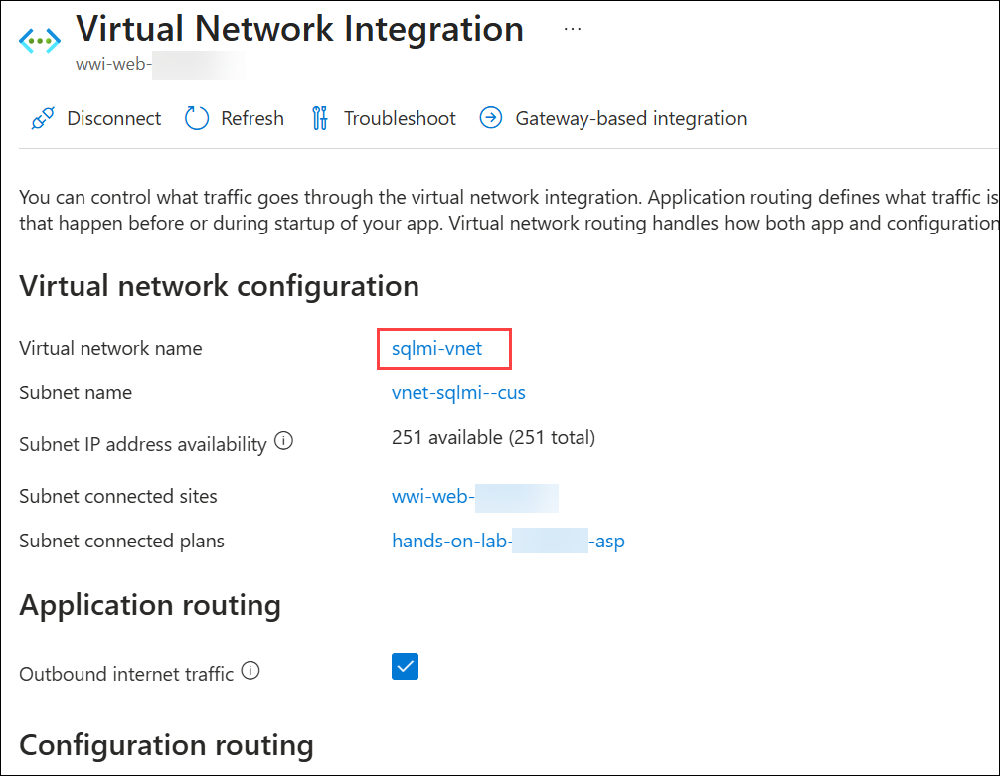
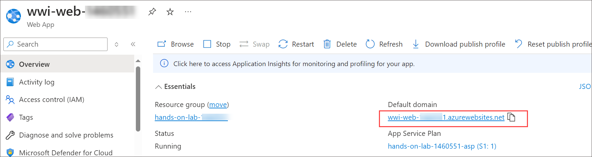
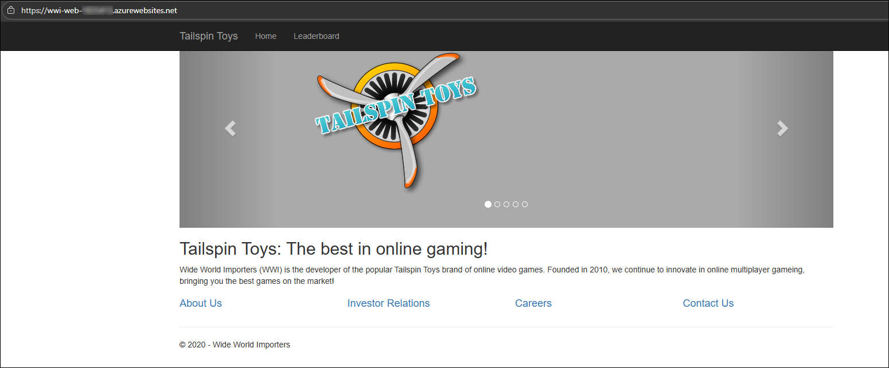

# Exercise 4: Integrate App Service with the virtual network

### Estimated Duration: 30 Minutes

## Lab Scenario

In this exercise, you will configure VNet integration with Azure App Services and open the web application. This setup allows your web app to securely communicate with resources in your virtual network. By the end of this lab, your web application will be integrated with the VNet and accessible for use.

## Lab Objectives

In this exercise, you will complete the following tasks:

- Task 1: Configure VNet integration with App Services
- Task 2: Open the web application

## Task 1: Configure VNet integration with App Services

In this task, you add the networking configuration to your App Service to enable communication with resources in the VNet.

1. In the Azure portal, search and select **Resource groups** from the list select the **<inject key="Resource Group Name" enableCopy="false"/>** and then click on **wwi-web-<inject key="Suffix" enableCopy="false"/>** App Service from the list of resources.

   

1. From the left navigation pane, select **Networking (1)** under **Settings**, then under **Outbound Traffic Configuration**, click **Not Configured (2)** under **Virtual Network Integration**.

   

1. Now click on **Add virtual network integration** under **Virtual Network Integration**.

   

1. On the Network Feature Status dialog, enter the following and click **Connect**.

   - **Virtual Network**: Select the `sqlmi-vnet`.
   - **Subnet**: Select any existing subnet from the drop-down menu.

      

1. Within a few minutes, the VNet is added, and your App Service is restarted to apply the changes. Select Refresh to confirm whether the Vnet is connected or not.

   

   > **Note**: If you receive a message that adding the Virtual Network to the Web App fails, select **Disconnect** on the VNet Configuration blade, and repeat steps 3 - 5 above.

## Task 2: Open the web application

In this task, you verify that your web application now loads, and you can see the home page of the web app.

1. Select **Overview** in the left-hand menu of your App Service and select the **URL** of your App Service to launch the website. This link opens the URL in a browser window.

   

2. Verify that the website and data are loaded correctly. The page should look similar to the following:

   

   > **Note**: It can often take several minutes for the network configuration to be reflected in the web app. If you get an error screen, try selecting Refresh a few times in the browser window. If that does not work, try selecting **Restart** on the Azure Web App's toolbar.

3. Congratulations, you successfully connected your application to the new SQL MI database.

> **Congratulations** on completing the task! Now, it's time to validate it. Here are the steps:
- If you receive a success message, you can proceed to the next task.
- If not, carefully read the error message and retry the step, following the instructions in the lab guide.
- If you need any assistance, please contact us at cloudlabs-support@spektrasystems.com. We are available 24/7 to help you out.

<validation step="cdcba397-3f4f-4efe-8a59-632a5651f93b" />

## Summary

In this exercise, you have configured VNet integration with Azure App Services and accessed the web application.

## You have successfully completed the lab!

By completing this **Data Modernization** hands-on lab, you have gained the skills and experience needed to perform a full end-to-end database migration to Azure SQL Managed Instance (SQL MI). You started by running detailed database assessments to uncover and address compatibility issues, ensuring a smooth migration process. You then successfully migrated an on-premises SQL Server 2022 database to SQL MI using Azure Database Migration Service, maintaining data integrity and minimizing downtime. Following the migration, you updated a web application to connect seamlessly with the new SQL MI environment, demonstrating how applications can be modernized alongside database workloads. Finally, you integrated Azure App Service with a virtual network, improving both security and connectivity. Together, these exercises provided practical insights into leveraging Azure’s managed services to modernize data platforms, enhance application performance, and build secure, scalable cloud-based solutions.
