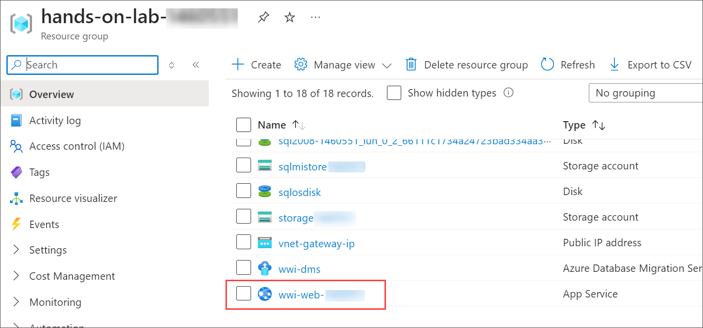
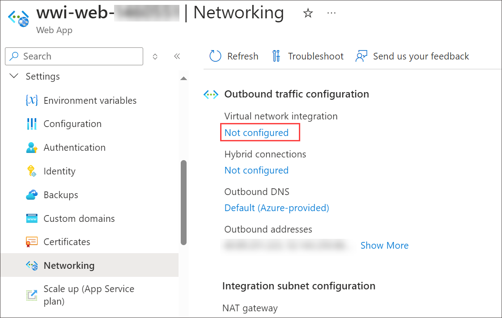
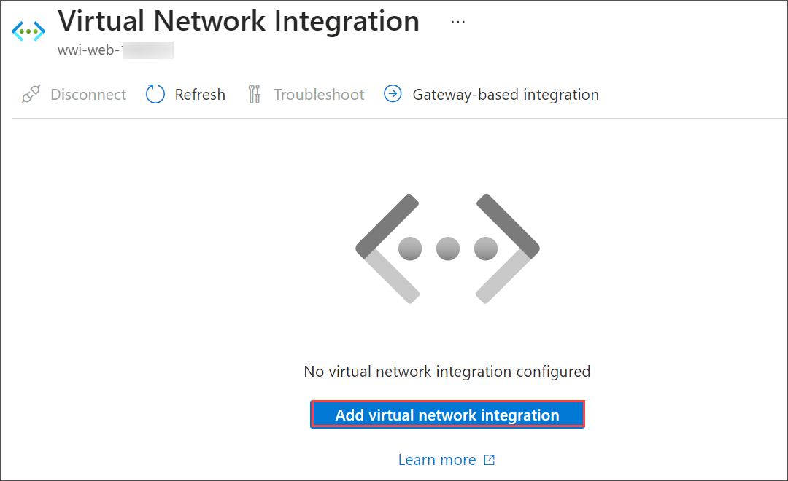
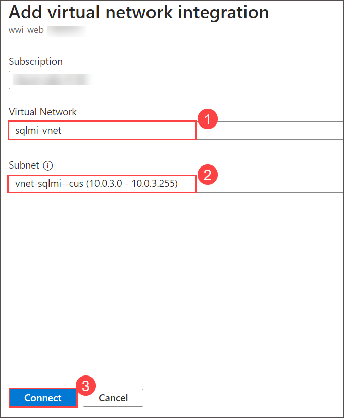
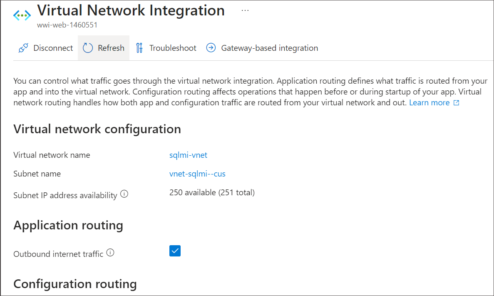
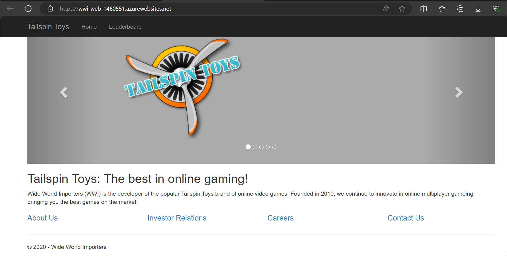

## Exercise 4: Integrate App Service with the virtual network

## Duration: 15 minutes

In this lab, you will configure VNet integration with Azure App Services and open the web application. This setup allows your web app to securely communicate with resources in your virtual network. By the end of this lab, your web application will be integrated with the VNet and accessible for use.

## Lab objectives

In this lab, you will perform the following:

- Task 1: Configure VNet integration with App Services
- Task 2: Open the web application

### Task 1: Configure VNet integration with App Services

In this task, you add the networking configuration to your App Service to enable communication with resources in the VNet.

1. In the Azure portal, search and select **Resource groups** from the list select the **<inject key="Resource Group Name" enableCopy="false"/>** and then click on **wwi-web-<inject key="Suffix" />** App Service from the list of resources.

   

2. On the App Service blade, select **Networking** from the left-hand menu.

   

3. On the **Networking** page, click on the **Not Configured** next to **Virtual network integration** under **Outbound Traffic configuration**.

    

4. Now click on **Add virtual network integration** under **Virtual Network Integration**.

   

5. On the Network Feature Status dialog, enter the following and click **Connect**.

   - **Virtual Network**: Select the `sqlmi-vnet`.
   - **Subnet**: Select any existing subnet from the drop-down menu.

      

6. Within a few minutes, the VNet is added, and your App Service is restarted to apply the changes. Select Refresh to confirm whether the Vnet is connected or not.

    

   > **Note**: If you receive a message adding the Virtual Network to the Web App fails, select **Disconnect** on the VNet Configuration blade, and repeat steps 3 - 5 above.

### Task 2: Open the web application

In this task, you verify your web application now loads, and you can see the home page of the web app.

1. Select **Overview** in the left-hand menu of your App Service and select the **URL** of your App service to launch the website. This link opens the URL in a browser window.

   

2. Verify that the website and data are loaded correctly. The page should look similar to the following:

    

    > **Note**: It can often take several minutes for the network configuration to be reflected in the web app. If you get an error screen, try selecting Refresh a few times in the browser window. If that does not work, try selecting **Restart** on the Azure Web App's toolbar.

3. Congratulations, you successfully connected your application to the new SQL MI database.

4. Please note down the Managed database name **WideWorldImporters<inject key="Suffix" enableCopy="false"/>** and fully qualified domain name of your SQL-managed instance, which you copied from the Azure Cloud Shell as you need this database name for upcoming lab.

    > **Important**: Please make a note of the managed database named **WideWorldImporters<inject key="Suffix" enableCopy="false"/>** and fully qualified domain name of your SQL-managed instance that was created in this lab, as you will require this specific database name for Lab 2, **Data Modernization: Implementing Data Discovery & Classification**.
 
>**Congratulations** on completing the Task! Now, it's time to validate it. Here are the steps:
 > - Navigate to the Lab Validation tab, from the upper right corner in the lab guide section.
 > - Hit the Validate button for the corresponding task. If you receive a success message, you have successfully validated the lab. 
 > - If not, carefully read the error message and retry the step, following the instructions in the lab guide.
 > - If you need any assistance, please contact us at labs-support@spektrasystems.com.

## Summary
In this exercise, you successfully integrated the WWI App Service with the virtual network (VNet) that was created earlier. This integration allows the App Service to securely communicate with the SQL Managed Instance (SQL MI) within the VNet.

## Review
In this lab, you have completed:

- Configure VNet integration with App Services
- Open the web application

### You have successfully completed this lab.
