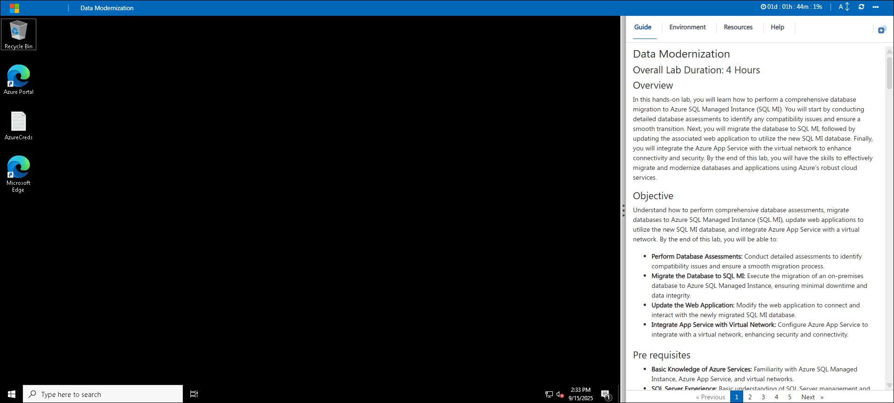
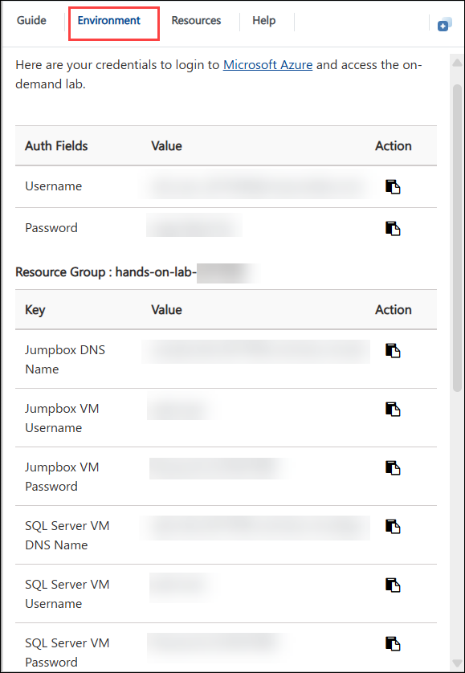
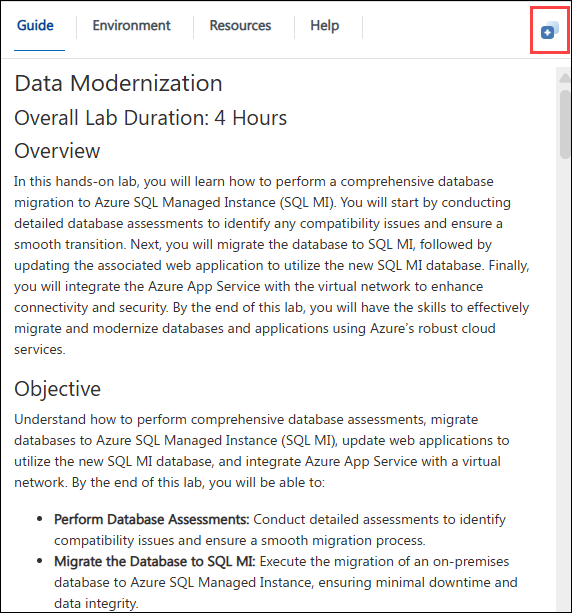
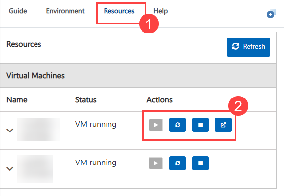
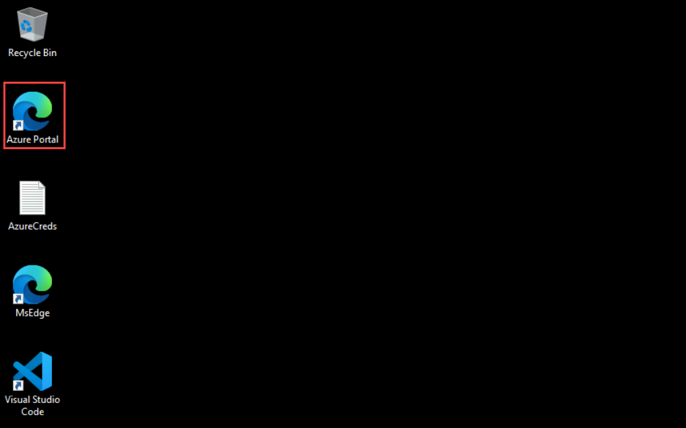

# Data Modernization

## Estimated Duration: 4 Hours

## Overview

In this hands-on lab, you will learn how to perform a comprehensive database migration to Azure SQL Managed Instance (SQL MI). You will start by conducting detailed database assessments to identify any compatibility issues and ensure a smooth transition. Next, you will migrate the database to SQL MI, followed by updating the associated web application to utilize the new SQL MI database. Finally, you will integrate the Azure App Service with the virtual network to enhance connectivity and security. By the end of this lab, you will have the skills to effectively migrate and modernize databases and applications using Azure’s robust cloud services.

## Objectives

Understand how to perform comprehensive database assessments, migrate databases to Azure SQL Managed Instance (SQL MI), update web applications to utilize the new SQL MI database, and integrate Azure App Service with a virtual network. By the end of this lab, you will be able to:

- **Perform Database Assessments:** Conduct detailed assessments to identify compatibility issues and ensure a smooth migration process.
- **Migrate the Database to SQL MI:** Execute the migration of an on-premises database to Azure SQL Managed Instance, ensuring minimal downtime and data integrity.
- **Update the Web Application:** Modify the web application to connect and interact with the newly migrated SQL MI database.
- **Integrate App Service with Virtual Network:** Configure Azure App Service to integrate with a virtual network, enhancing security and connectivity.

## Pre requisites

- **Basic Knowledge of Azure Services:** Familiarity with Azure SQL Managed Instance, Azure App Service, and virtual networks.
- **SQL Server Experience:** Basic understanding of SQL Server management and database migration concepts
- **Web Application Development:** Experience in developing and managing web applications, particularly those that interact with SQL databases.

## Architecture

This architectural diagram illustrates the integration of various Azure services for efficient data migration and management. It starts with an on-premises SQL Server 2022, which connects to an online data migration service via a secure SMB network share. The data is then migrated to Azure SQL Managed Instances, including a primary instance and a read-only replica for analytics. A web application, developed using Visual Studio 2019, is integrated with the virtual network through a point-to-site VPN, connecting to a JumpBox for secure access. This setup demonstrates how modern systems can be effectively migrated to Azure, enhancing data handling, security, and connectivity.

## Architectural Diagram

![This solution diagram includes a virtual network containing SQL MI in an isolated subnet, along with a JumpBox VM and Database Migration Service in a management subnet. The MI Subnet displays both the primary managed instance and a read-only replica, which is accessed by reports from the web app. The web app connects to SQL MI via a subnet gateway and point-to-site VPN. The web app is published to App Services using Visual Studio 2019. Online data migration is conducted from the on-premises SQL Server to SQL MI using the Azure Database Migration Service, which reads backup files from an SMB network share.](./media/arc-diag-1809.png "Preferred Solution diagram")

## Explanation of components

- **SQL Server 2022** : This is the latest version of SQL Server, offering advanced features such as built-in query intelligence, enhanced security, and improved performance. It serves as the on-premises database platform for modern applications and can be seamlessly integrated with Azure for hybrid cloud scenarios.
- **Azure Database Migration Service (DMS)** : This service facilitates the migration of data from the on-premises SQL Server to the managed instance in the cloud. It ensures data is transferred securely and efficiently.
- **Azure SQL Managed Instance** : This is the primary destination for the migrated data. It is a fully managed SQL Server instance in the cloud that provides high availability and scalability.
- **JumpBox** : A virtual machine used to manage and access the resources within the virtual network securely. It acts as a gateway for administrators.
- **Gateway Subnet** : This subnet contains the VPN gateway that facilitates the secure connection between the on-premises environment and the virtual network.
- **Visual Studio 2019** : This development environment is used for publishing web applications that may interact with the migrated data.
- **Web App** : This component represents the web applications that are integrated with the virtual network and can access the migrated data for various operations.

## Getting Started with the Lab
 
Welcome to your Data Modernization Workshop! We've prepared a seamless environment for you to explore and learn about Azure services. Let's begin by making the most of this experience:

## Accessing Your Lab Environment
 
Once you're ready to dive in, your virtual machine and **Lab Guide** will be right at your fingertips within your web browser.

   

### Virtual Machine & Lab Guide
 
Your virtual machine is your workhorse throughout the workshop. The lab guide is your roadmap to success.
 
## Exploring Your Lab Resources
 
To get a better understanding of your lab resources and credentials, navigate to the **Environment** tab.

   
 
## Utilizing the Split Window Feature
 
For convenience, you can open the lab guide in a separate window by selecting the **Split Window** button from the Top right corner.
 
   
 
## Managing Your Virtual Machine
 
Feel free to **Start, Stop, or Restart (2)** your virtual machine as needed from the **Resources (1)** tab. Your experience is in your hands!
 
  

## Lab Guide Zoom In/Zoom Out

To adjust the zoom level for the environment page, click the **A↕ : 100%** icon located next to the timer in the lab environment.

   

## Let's Get Started with Azure Portal
 
1. On your virtual machine, click on the Azure Portal icon as shown below:
 
    
 
2. You'll see the **Sign into Microsoft Azure** tab. Here, enter your credentials:
 
   - **Email/Username:** <inject key="AzureAdUserEmail"></inject>
 
      
 
3. Next, provide your password:
 
   - **Password:** <inject key="AzureAdUserPassword"></inject>
 
      

4. On **Action Required** pop-up, click on **Ask later**.

   
   
5. If you see the pop-up **Stay Signed in?**, click **No**.

   

6. If you see the pop-up **You have free Azure Advisor recommendations!**, close the window to continue the lab.

7. If a **Welcome to Microsoft Azure** popup window appears, click **Maybe Later** to skip the tour.

## Steps to Proceed with MFA Setup if "Ask Later" Option is Not Visible

1. At the **"More information required"** prompt, select **Next**.

1. On the **"Keep your account secure"** page, select **Next** twice.

1. **Note:** If you don’t have the Microsoft Authenticator app installed on your mobile device:

   - Open **Google Play Store** (Android) or **App Store** (iOS).
   - Search for **Microsoft Authenticator** and tap **Install**.
   - Open the **Microsoft Authenticator** app, select **Add account**, then choose **Work or school account**.

1. A **QR code** will be displayed on your computer screen.

1. In the Authenticator app, select **Scan a QR code** and scan the code displayed on your screen.

1. After scanning, click **Next** to proceed.

1. On your phone, enter the number shown on your computer screen in the Authenticator app and select **Next**.
       
1. If prompted to stay signed in, you can click "No."
 
1. If a **Welcome to Microsoft Azure** pop-up window appears, simply click "Maybe Later" to skip the tour.

## Support Contact

The CloudLabs support team is available 24/7, 365 days a year, via email and live chat to ensure seamless assistance at any time. We offer dedicated support channels tailored specifically for both learners and instructors, ensuring that all your needs are promptly and efficiently addressed.

Learner Support Contacts:

- Email Support: cloudlabs-support@spektrasystems.com
- Live Chat Support: https://cloudlabs.ai/labs-support

Now, click on **Next** from the lower right corner to move on to the next page.

   

### Happy Learning!!
