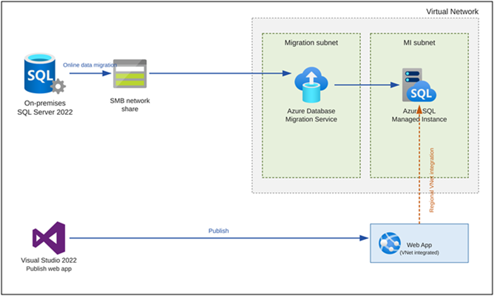
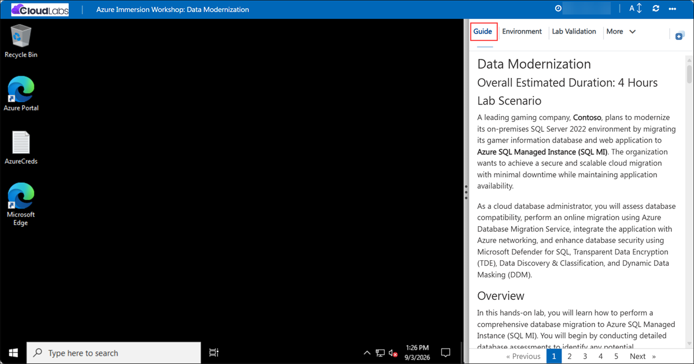
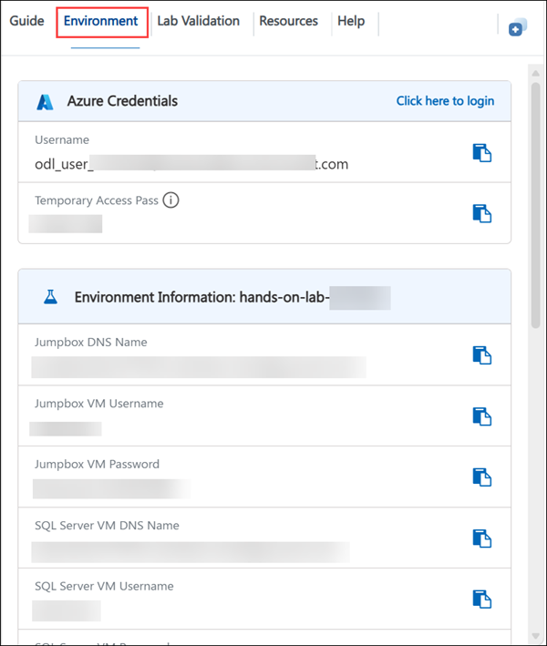
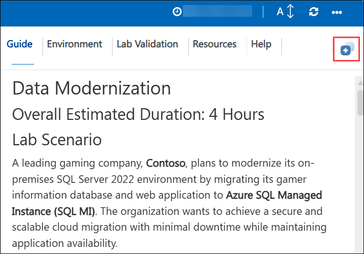
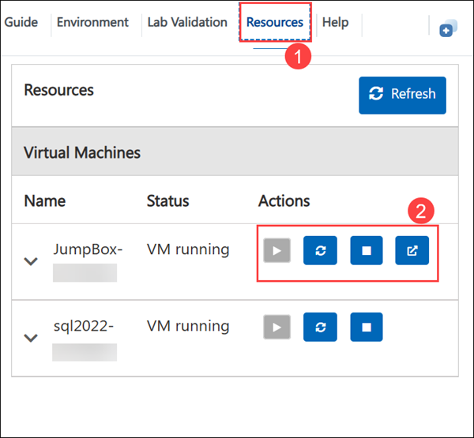
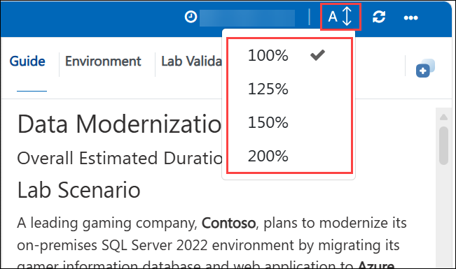
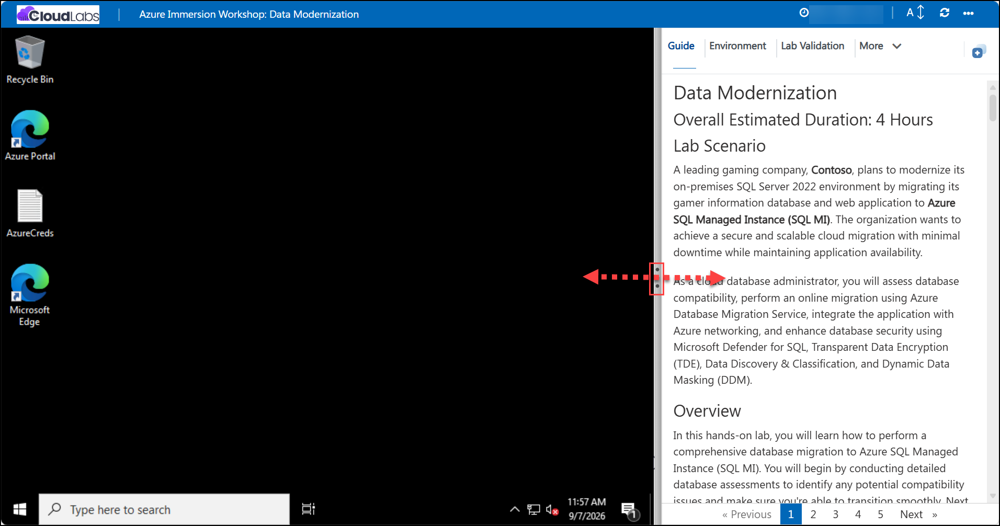
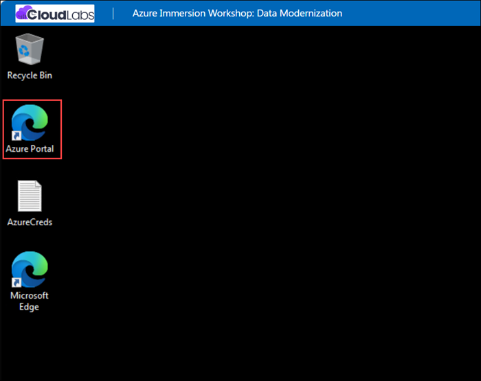
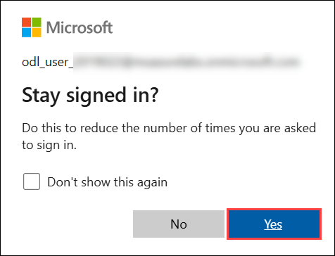

# Data Modernization

## Overall Estimated Duration: 4 Hours

## Lab Scenario

A leading gaming company, **Contoso**, plans to modernize its on-premises SQL Server 2022 environment by migrating its gamer information database and web application to **Azure SQL Managed Instance (SQL MI)**. The organization wants to achieve a secure and scalable cloud migration with minimal downtime while maintaining application availability. 

As a cloud database administrator, you will assess database compatibility, perform an online migration using Azure Database Migration Service, integrate the application with Azure networking.

## Overview

In this hands-on lab, you will learn how to perform a comprehensive database migration to Azure SQL Managed Instance (SQL MI). You will begin by conducting detailed database assessments to identify any potential compatibility issues and make sure you're able to transition smoothly. Next, you will be able to migrate the database to SQL MI, followed by updating the associated web application to use the new SQL MI database. By the end of this lab, you will have the skills to effectively migrate and modernize databases and applications using Azure’s robust cloud services.

## Objectives

Understand how to perform comprehensive database assessments, migrate databases to Azure SQL Managed Instance (SQL MI), update web applications to utilize the new SQL MI database, and integrate Azure App Service with a virtual network. By the end of this lab, you will be able to:

- **Perform Database Assessments:** Conduct detailed assessments to identify compatibility issues and ensure a smooth migration process.
- **Migrate the Database to SQL MI:** Execute the migration of an on-premises database to Azure SQL Managed Instance, ensuring minimal downtime and data integrity.
- **Update the Web Application:** Modify the web application to connect and interact with the newly migrated SQL MI database.
- **Integrate App Service with Virtual Network:** Configure Azure App Service to integrate with a virtual network, enhancing security and connectivity.

## Pre-requisites

- **Basic Knowledge of Azure Services:** Familiarity with Azure SQL Managed Instance, Azure App Service, and virtual networks.
- **SQL Server Experience:** Basic understanding of SQL Server management and database migration concepts
- **Web Application Development:** Experience in developing and managing web applications, particularly those that interact with SQL databases.

## Architecture

This architectural diagram illustrates a database migration and application integration scenario using Azure services. It begins with an on-premises SQL Server 2022 instance, which performs an online data migration through an SMB network share. This share feeds into a virtual network, where the Azure Database Migration Service, running in a dedicated migration subnet, transfers the data into an Azure SQL Managed Instance hosted in a separate MI subnet. In parallel, a web application built with Visual Studio 2022 is published to a VNet-integrated Web App, which connects back to the Azure SQL Managed Instance over regional VNet integration. This setup demonstrates a secure, network-isolated path for migrating an on-premises database to Azure while enabling a modern web application to access the migrated data privately within the same virtual network.

## Architectural Diagram

## Explanation of components

- **On-premises SQL Server 2022**: The source database platform running in the customer's own datacenter. It holds the production data that needs to be moved to Azure as part of the migration project.
- **SMB Network Share**: An intermediate file share used during online data migration. SQL Server backup files are staged here so the Azure Database Migration Service can read and apply them without requiring a direct connection to the on-premises server.
- **Migration Subnet**: A dedicated subnet within the virtual network that hosts the Azure Database Migration Service, isolating migration traffic from other workloads for better security and network control.
- **Azure Database Migration Service (DMS)**: This service performs the online migration, continuously replicating data from the SMB share into the target Azure SQL Managed Instance with minimal downtime.
- **MI Subnet**: A dedicated, delegated subnet that hosts the Azure SQL Managed Instance, meeting the networking requirements Managed Instance needs to operate inside a virtual network.
- **Azure SQL Managed Instance**: The migration target a fully managed SQL Server instance in Azure that provides near-100% compatibility with on-premises SQL Server, along with built-in high availability, automated patching, and backups.
- **Visual Studio 2022**: The development environment used to build and publish the web application that will consume the migrated data.
- **Web App (VNet Integrated)**: An Azure Web App configured with regional VNet integration, allowing it to securely reach the Azure SQL Managed Instance over the private virtual network rather than the public internet.
- **Regional VNet Integration**: The connectivity mechanism (shown by the dashed line) that lets the Web App route its outbound traffic into the virtual network, enabling private access to the Managed Instance in the MI subnet.

## Getting Started with the Lab
 
We've prepared a seamless environment for you to explore and learn about Azure services. Let's begin by making the most of this experience:

## Accessing Your Lab Environment
 
Once you're ready to dive in, your virtual machine and **Guide** will be right at your fingertips within your web browser.

   

## Virtual Machine & Lab Guide
 
Your virtual machine is your workhorse throughout the workshop. The lab guide is your roadmap to success.
 
## Exploring Your Lab Resources
 
To get a better understanding of your lab resources and credentials, navigate to the **Environment** tab.

   
 
## Utilizing the Split Window Feature
 
For convenience, you can open the lab guide in a separate window by selecting the **Split Window** button from the Top right corner.
 
   
 
## Managing Your Virtual Machine
 
Feel free to **Start, Stop, or Restart (2)** your virtual machine as needed from the **Resources (1)** tab. Your experience is in your hands!
 
  

## Lab Guide Zoom In/Zoom Out

To adjust the zoom level for the environment page, click the **A↕ : 100%** icon located next to the timer in the lab environment.

   

## Resize the Virtual Machine View

Use the **slider (three vertical dots)** located between the **Virtual Machine** and the **Guide** panes to adjust the display size, allowing you to customize the layout based on your preference.

   
 
## Let's Get Started with Azure Portal
 
1. On your **Lab VM**, click on the **Azure Portal** icon as shown below:
 
    
 
1. You'll see the **Sign into Microsoft Azure** tab. Here, enter your credentials and click on **Next**:
 
   - **Email/Username:** <inject key="AzureAdUserEmail"></inject>
 
      
 
1. Next, provide your password and click on **Sign in**:
 
   - **Password:** <inject key="AzureAdUserPassword"></inject>
 
      
   
1. If you see the pop-up **Stay Signed in?**, click **Yes**.

   

1. If a **Welcome to Microsoft Azure** popup window appears, click **Maybe Later** to skip the tour.

## Support Contact

The CloudLabs support team is available 24/7, 365 days a year, via email and live chat to ensure seamless assistance at any time. We offer dedicated support channels tailored specifically for both learners and instructors, ensuring that all your needs are promptly and efficiently addressed.

Learner Support Contacts:

- Email Support: cloudlabs-support@spektrasystems.com
- Live Chat Support: https://cloudlabs.ai/labs-support

Now, click on **Next >>** from the lower right corner to move on to the next page.

   

### Happy Learning!!
