# Lab 03: Perform database assessments

### Estimated Duration: 45 minutes

In this hands-on lab, you use the Azure Data Studio to perform assessments on the `WideWorldImporters` database. You create two assessments: one for SQL DB and a second for SQL MI. These assessments provide reports about any feature parity and compatibility issues between the on-premises database and the Azure managed SQL database service options.

> Azure Data Studio helps you upgrade to a modern data platform by detecting compatibility issues that can impact database functionality in your new version of SQL Server or Azure SQL Database. Azure Data Studio recommends performance and reliability improvements for your target environment and allows you to move your schema, data, and uncontained objects from your source server to your target server.

## Lab Objectives

In this lab, you will perform the following tasks:

- Task 1: Task 1: Connect to the WideWorldImporters database on the SQL 2019 VM
- Task 2: Task 2: Perform assessments for migration

## Task 1: Connect to the WideWorldImporters database on the SQL 2019 VM

In this task, you perform some configuration for the `WideWorldImporters` database on the SQL Server 2008 R2 instance to prepare it for migration.

1. Navigate to the [Azure portal](https://portal.azure.com) and select **Resource groups** from the Azure services list.

1. Select the **SQLMigrationRG** resource group from the list.

   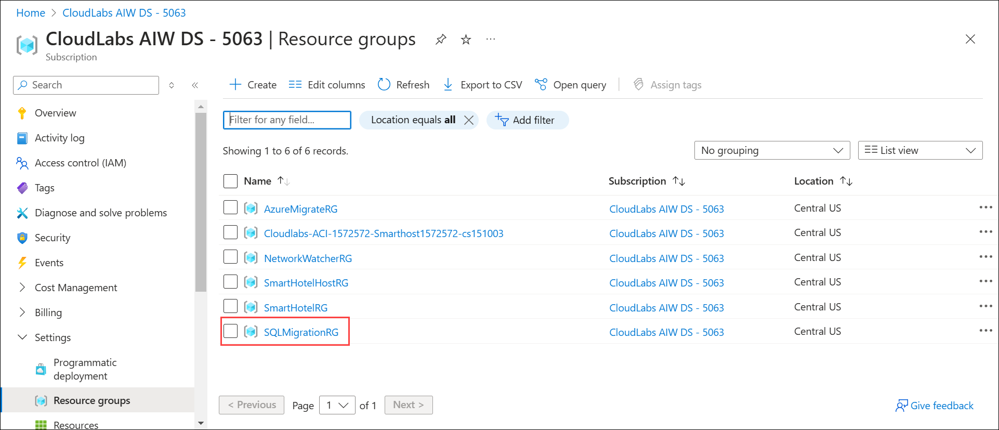

1. In the list of resources for your resource group, select the **sql2019-<inject key="DeploymentID" enableCopy="false"/>** VM.

   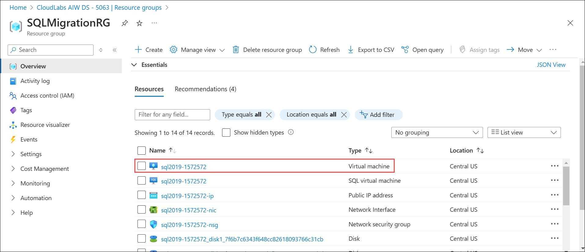

1. On the **sql2019-<inject key="DeploymentID" enableCopy="false"/>** VM blade in the Azure portal, select **Overview** from the left-hand menu, and then select **Connect**.

   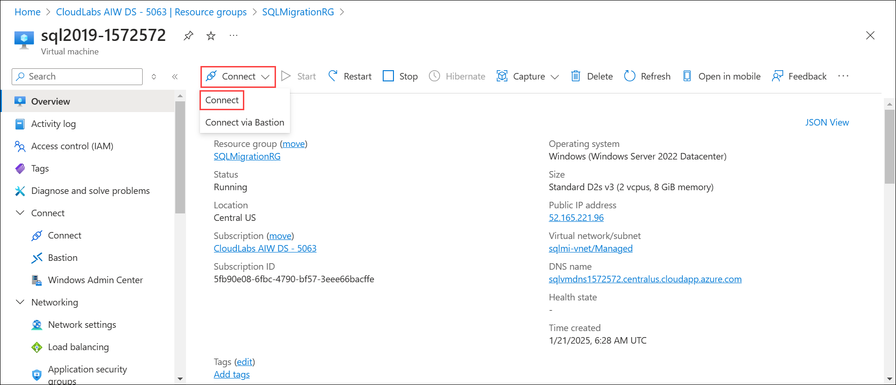 

1. On the Connect with RDP blade, select **Download RDP File**, then open the downloaded RDP file.

   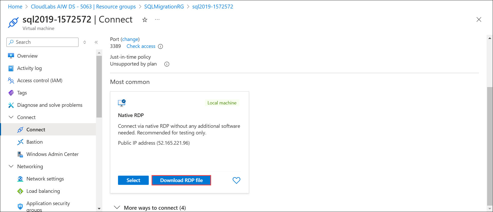

1. Open the downloaded RDP file, click on **More choices > Use a different account** and enter the following credentials when prompted, and then select **OK**:

   - **Username**: `.\sqlmiuser`
   - **Password**: `Password.1234567890`

   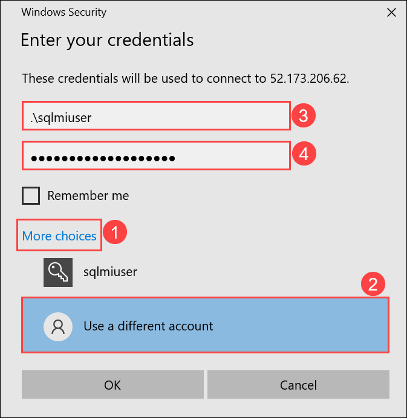 

1. Select **Yes** to connect if prompted that the remote computer's identity cannot be verified.

   

1. Open file explorer on your **sql2019-<inject key="DeploymentID" enableCopy="false"/>** virtual machine, naviagate to C:\ drive and double click on **IntegrationRuntime** installer.

   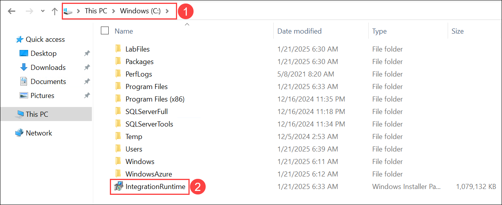

1. In **Welcome to the Microsoft Integration Runtime Setup Wizard**, click on **Next**.

   

1. In **End-User License Agreement**, select the checkbox **I accept the terms in the License Agreement**, and click on **Next**.

   

1. In **Destination Folder**, click on **Next**.

   

1. In **Ready to install Microsoft Integration Runtime**, click on **Install**.

   

1. Once the deployment is completed click on **Finish** and minimize the application.

   

1. Open Windows PowerShell and run the below command to create database named 'WideWorldImporters'.

   ```
   Invoke-Sqlcmd -Query "CREATE DATABASE WideWorldImporters;" -ServerInstance **sql2019-<inject key="DeploymentID" enableCopy="false"/>**
   ```

1. Next, open **Azure Data Studio** by entering "Azure Data Studio" into the search bar in the Windows Start menu and selecting **Azure Data Studio** from the search results.

   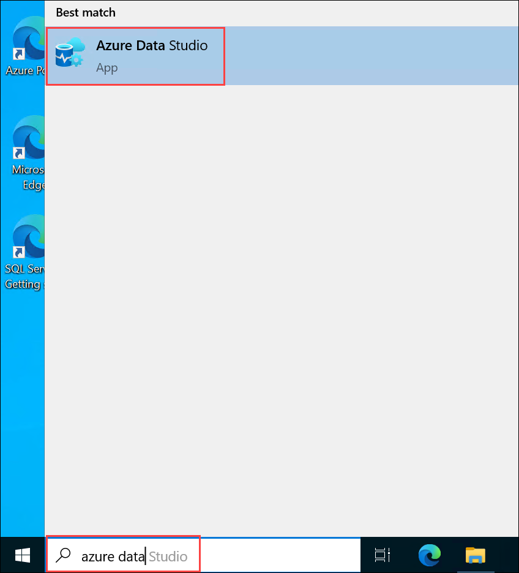
   
1. In the Azure Data Studio select **Extensions (1)** from the Activity Bar, enter **SQL Migration (2)** into the search bar, select **Azure SQL Migration (3)**, and click on **Install (4)**.  

   

1. In the Azure Data Studio select **Connections (1)** from the Activity Bar, click on **New Connection (2)** dialog, enter **sql2019-<inject key="DeploymentID" enableCopy="false"/>(3)** into the Server name box, ensure **Windows Authentication** is selected, and then select **Connect (4)**.
  
   
    
   > **Note**: If you see **Connection error** pop-up click on **Enable Trust server certificate**.

   

1. Once connected, verify you see the `WideWorldImporters`(1) database listed under databases. On the **sql2019-<inject key="DeploymentID" enableCopy="false"/>(1)** connection, navigate to **Home (2)**, and select **New Query (3)** from the Azure Data Studio toolbar.

   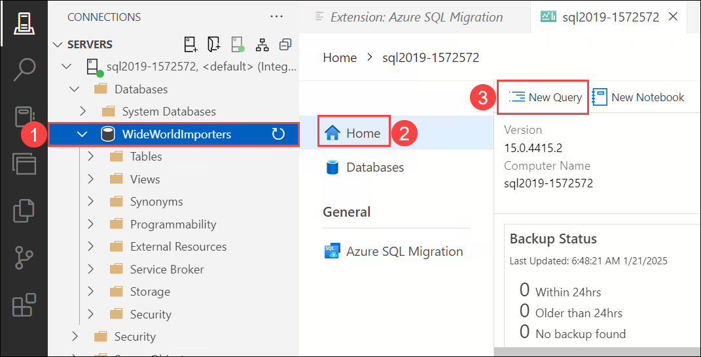

1. Next, copy and paste the SQL script below into the new query window. This script enables Service broker and changes the database recovery model to FULL.

   ```sql
   USE master;
   GO

   -- Update the recovery model of the database to FULL and enable Service Broker
   ALTER DATABASE WideWorldImporters SET
   RECOVERY FULL,
   ENABLE_BROKER WITH ROLLBACK IMMEDIATE;
   GO
   ```

1. To run the script, click on **Run (1)** from the Azure Data Studio toolbar and verify the results from **Messages (2)** tab.

   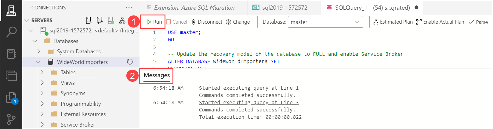 

## Task 2: Perform assessments for migration

In this task, you use the Microsoft Data Migration Assistant (DMA) to assess the `WideWorldImporters` database against Azure SQL Database (Azure SQL DB). The assessment provides a report about any feature parity and compatibility issues between the on-premises database and the Azure SQL DB service.

1. In Azure Data Studio click on **Azure SQL migration (1)** and click on **+ New migration (2)**

   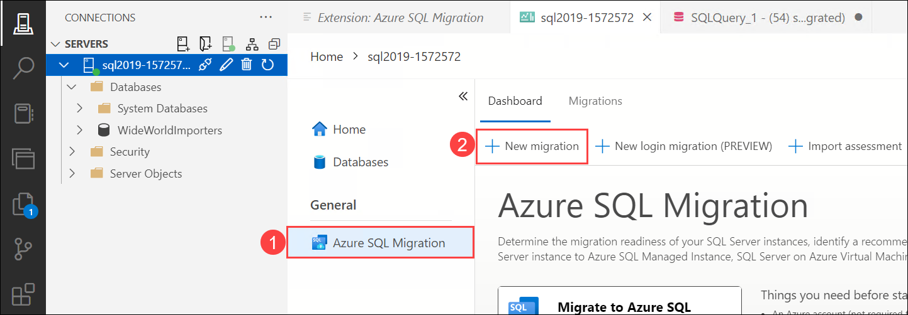 

1. In **Step 1: Database for assessment**, select **WideWordImporters**, click on **Next**. 

   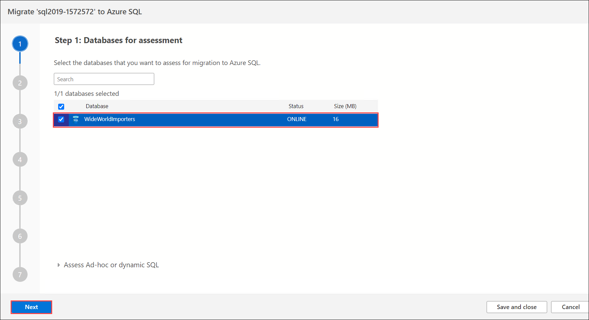  

1. In **Step 2: Assessment summary and SKU recommendations**, review the assessment summary and SKU recommendations and Azure SQL targets and click on **Next**. 

   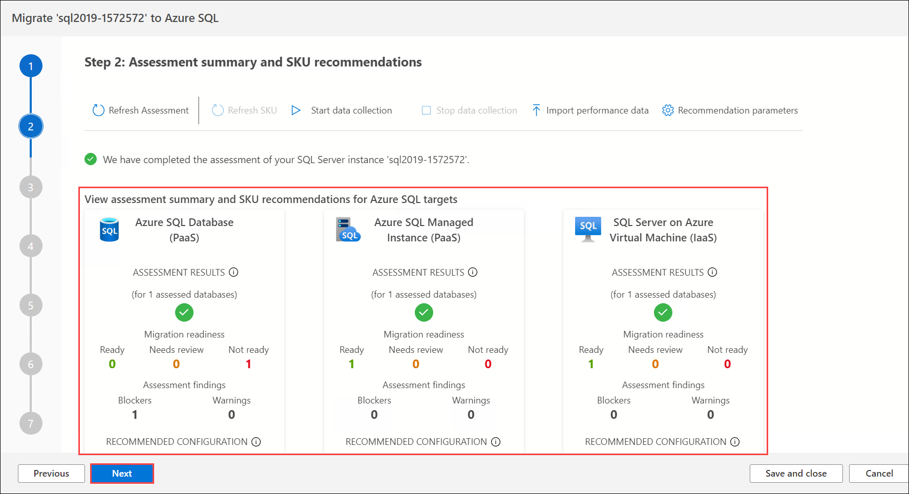 

1. In **Step 3: Target platform & assessment results**, select **Azure SQL Database** from the dropdowm for **Select target type**.

   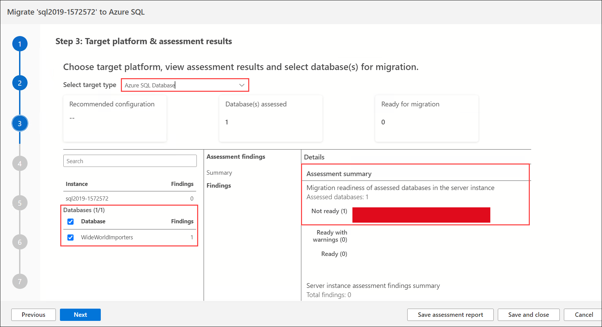 

   > The DMA assessment for migrating the `WideWorldImporters` database to a target platform of Azure SQL DB reveals features in use that are not supported. These features, including Service broker, prevent WWI from migrating to the Azure SQL DB PaaS offering without making changes to their database.

1. Now select **Azure SQL Managed Instance** from the dropdowm for **Select target type**. Notice that with one PaaS offering ruled out due to feature parity, the assessment against Azure SQL Managed Instance (SQL MI) provides a report about any feature parity and compatibility issues between the on-premises database and the SQL MI service.

   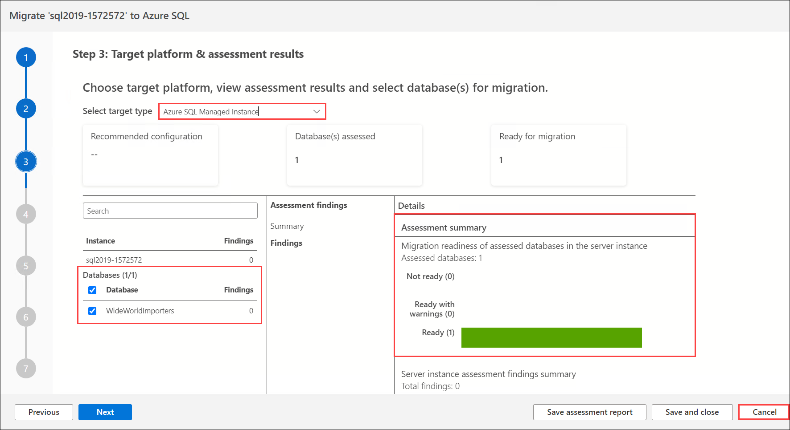

1. The database, including the Service Broker feature, can be migrated as is, providing an opportunity for WWI to have a fully managed PaaS database running in Azure. Previously, their only option for migrating a database using features incompatible with Azure SQL Database, such as Service Broker, was to deploy the database to a virtual machine running in Azure (IaaS) or modify the database and associated applications to remove the use of the unsupported features. The introduction of Azure SQL MI, however, provides the ability to migrate databases into a managed Azure SQL database service with _near 100% compatibility_, including the features that prevented them from using Azure SQL Database.

1. Once you have reviewed the migration possibilites for both Azure SQL Database and Azure SQL Managed Instance, cancel the migration process.

   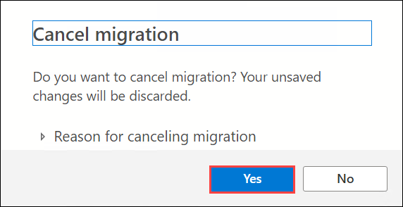
